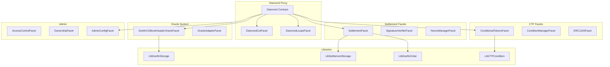

# Doefin V3 🔮⚡

> **Decentralized Bitcoin Prediction Markets on Base L2**

[](https://www.gnu.org/licenses/agpl-3.0)
[](https://hardhat.org/)
[](https://docs.soliditylang.org/)
[](https://eips.ethereum.org/EIPS/eip-2535)

Doefin V3 is a decentralized prediction market protocol on Base L2 that lets users trade
on Bitcoin network metrics. Built on the Diamond Standard (EIP-2535) for upgradeability and
modularity, it uses a **hybrid model**: an **off-chain orderbook** with **on-chain
settlement** (the Polymarket model). It features a trustless Bitcoin block header oracle
for condition resolution.

## 🚀 Features

### 🏗️ **Diamond Architecture**
- **Upgradeable Proxy**: EIP-2535 Diamond Standard for seamless upgrades
- **Modular Facets**: Compartmentalized functionality for maintainability
- **Gas Optimized**: Efficient storage patterns and minimal proxy overhead

### 🔗 **Bitcoin Block Header Oracle**
- **Trustless Verification**: Validates Bitcoin block headers using consensus rules
- **Reorg Protection**: Multi-block buffer ensures chain integrity
- **Automated Resolution**: Real-time difficulty adjustment tracking
- **Proof of Work Validation**: Full SHA-256 validation of block headers

### 📈 **Prediction Market Types**

| Market Type | Description | Example |
|-------------|-------------|---------|
| **Difficulty Threshold** | Binary outcome based on difficulty level | "Will Bitcoin difficulty exceed 85T at block 850,000?" |
| **Difficulty Range** | Multi-outcome difficulty brackets | "Bitcoin difficulty range at block 850,000: <85T, 85-90T, 90-95T, >95T" |
| **Block Count** | Blocks mined in time window | "Blocks mined between timestamps X and Y: <100, 100-150, 150-200, >200" |
| **Mining Duration** | Time to mine block range | "Time to mine 144 blocks from height X: <1hr, 1-2hr, 2-3hr, >3hr" |

### 💱 **Hybrid Exchange Model**
- **Off-Chain Orderbook**: Users sign EIP-712 orders off-chain; no gas to place or cancel
- **On-Chain Settlement**: An authorized operator submits matched orders for trustless,
  atomic settlement
- **Three Settlement Paths**: Complementary, Mint, and Merge — a single `matchOrders` call
  can mix match types
- **Operator-Supplied Fees**: Per-leg fee amounts bounded by an admin-set ceiling

### 🎯 **Conditional Token Framework**
- **Gnosis CTF Integration**: Battle-tested conditional token standard
- **Position Splitting**: Create outcome positions from collateral
- **Automated Redemption**: Trustless payout distribution
- **ERC1155 Compatible**: Full token standard compliance

## 📋 Prerequisites

- Node.js 16.0.0 or later
- npm or yarn package manager
- Git

## ⚡ Quick Start

### Installation

```bash
# Clone the repository
git clone https://github.com/your-org/doefin-v2.git
cd doefin-v2

# Install dependencies
npm install
```

### Environment Setup

```bash
# Copy environment variables
cp .env.example .env

# Edit with your configuration
# Required: PRIVATE_KEY, RPC URLs for target networks
```

### Development Commands

```bash
# Compile contracts
npx hardhat compile

# Run tests
npm test

# Run specific test suites
npx hardhat test test/unit/SettlementFacet/
npx hardhat test test/unit/SignatureVerifierFacet/
npx hardhat test test/unit/NonceManagerFacet/

# Get test coverage
npx hardhat coverage

# Deploy to local network
npx hardhat node
npm run deploy:local

# Deploy to Base Sepolia testnet
npm run deploy:baseSepolia
```

## 🏗️ Architecture Overview



## 📁 Contract Structure

```
contracts/
├── Diamond.sol                 # Main diamond proxy contract
├── facets/                     # Diamond facets
│   ├── SettlementFacet.sol            # On-chain settlement (matchOrders / fillOrder)
│   ├── SignatureVerifierFacet.sol     # EIP-712 signature verification
│   ├── NonceManagerFacet.sol          # Off-chain order cancellation
│   ├── ConditionalTokensFacet.sol     # CTF position management
│   ├── ConditionManagerFacet.sol      # Condition preparation / resolution
│   ├── DoefinV1BlockHeaderOracleFacet.sol  # Bitcoin block header oracle
│   ├── OracleAdapterFacet.sol         # Bitcoin question views
│   └── ...
├── interfaces/                 # Contract interfaces
├── libraries/                  # Shared logic libraries
│   ├── LibDoefinStorage.sol           # Shared AppStorage definitions
│   ├── LibSettlementStorage.sol       # Isolated v3 settlement storage
│   ├── LibDoefinOrder.sol             # DoefinOrder struct + EIP-712 hashing
│   ├── LibCTFCondition.sol            # CTF split / merge operations
│   └── ...
└── upgradeInitializers/       # Upgrade initialization scripts
```

## 🔧 Configuration

### Network Configuration

The protocol supports multiple networks with different configurations:

```javascript
// hardhat.config.js
networks: {
  baseSepolia: {
    url: process.env.BASE_SEPOLIA_RPC_URL,
    accounts: [process.env.PRIVATE_KEY],
    chainId: 84532
  },
  base: {
    url: process.env.BASE_RPC_URL,
    accounts: [process.env.PRIVATE_KEY],
    chainId: 8453
  }
}
```

### Oracle Configuration

```solidity
// Oracle parameters in LibDoefinStorage.sol
uint256 constant SETTLEMENT_DELAY = 6;        // 6-block settlement delay
uint256 constant NUM_OF_TIMESTAMPS = 11;      // Median timestamp calculation
uint256 constant NUM_OF_BLOCK_HEADERS = 17;   // Reorg protection buffer
uint256 constant TIMESTAMP_BUCKET = 600;      // 10-minute buckets
```

## 🧪 Testing

### Test Categories

- **Unit Tests**: Individual facet and library testing
- **Integration Tests**: Cross-facet functionality testing
- **Oracle Tests**: Bitcoin header validation testing
- **Market Tests**: End-to-end trading scenarios

### Running Tests

```bash
# All tests
npm test

# Specific test categories
npx hardhat test test/unit/
npx hardhat test test/integration/
npx hardhat test test/oracle/

# With gas reporting
REPORT_GAS=true npx hardhat test
```

### Test Coverage

The project maintains >90% test coverage across all critical paths:

- Oracle validation logic: 98%
- Market execution: 95%
- Settlement mechanisms: 97%
- Access control: 100%

## 🔐 Security

### Audit Status
- [ ] **Initial Audit**: Pending
- [ ] **Public Bug Bounty**: Planned for mainnet launch

### Security Features

- **Reentrancy Protection**: All external calls protected
- **Access Control**: Role-based permissions system
- **Integer Overflow**: Solidity 0.8.20+ built-in protection
- **Front-Running Protection**: Commit-reveal schemes where needed
- **Oracle Manipulation Resistance**: Multi-block validation windows

### Known Limitations

- Deep Bitcoin reorgs require manual intervention
- Oracle updates depend on external block header submission
- Settlement depends on the authorized off-chain operator submitting matched orders

## 📊 Gas Optimization

### Contract Size Management

```javascript
// Hardhat configuration for large contracts
settings: {
  optimizer: { enabled: true, runs: 1 },
  viaIR: true,
  metadata: { bytecodeHash: "none" }
}
```

### Typical Gas Costs

Order creation and cancellation are off-chain and cost no gas. On-chain operations:

| Operation | Notes |
|-----------|-------|
| `matchOrders` | Settle one taker against one or more makers (varies with maker count) |
| `fillOrder` | Settle a single order leg |
| `splitPosition` | CTF position creation |
| `mergePositions` | CTF position redemption to collateral |
| Block header submission | Bitcoin oracle update |
| `redeemPositions` | Redeem winning positions post-resolution |

Run `REPORT_GAS=true npx hardhat test` for current measured numbers.

## 🚀 Deployment

### Prerequisites

1. Set environment variables:
   ```bash
   PRIVATE_KEY=your_deployer_private_key
   SEPOLIA_RPC_URL=your_rpc_endpoint
   ETHERSCAN_API_KEY=your_etherscan_key  # For verification
   ```

2. Ensure sufficient ETH for deployment (~0.1 ETH on testnets)

### Deploy Script

```bash
# Deploy to Base Sepolia testnet
npm run deploy:baseSepolia

# Verify the deployment
npm run verify:baseSepolia
```

### Post-Deployment

1. **Initialize Oracle**: Upload initial Bitcoin block headers
2. **Configure Admin**: Set up access control roles
3. **Fund Protocol**: Add initial liquidity for gas subsidies
4. **Test Integration**: Verify all facets functional

## 🤝 Contributing

We welcome contributions! Please see our [Contributing Guidelines](CONTRIBUTING.md) for details.

### Development Workflow

1. **Fork & Clone**: Fork the repository and clone locally
2. **Branch**: Create feature branches from `v3/dev`
3. **Develop**: Write code with comprehensive tests
4. **Test**: Ensure all tests pass and maintain coverage
5. **PR**: Submit pull request with detailed description

### Code Style

- **Solidity**: Follow [Solidity Style Guide](https://docs.soliditylang.org/en/v0.8.20/style-guide.html)
- **JavaScript**: ESLint configuration included
- **Commits**: Use [Conventional Commits](https://www.conventionalcommits.org/)

## 📚 Documentation

### 🏗️ **System Architecture & Design**
- **Architecture Guide**: [System overview and design principles](./docs/ARCHITECTURE.md)
- **Diamond Contract Guide**: [Diamond pattern implementation and best practices](./docs/DIAMOND_CONTRACT_CONSIDERATIONS.md)
- **Deployment Guide**: [Network deployment procedures](./docs/DEPLOYMENT.md)

### 🔄 **System Flows & Operations**
- **Order Lifecycle Flow**: [Off-chain order creation through on-chain settlement](./docs/flows/ORDER_LIFECYCLE.md)
- **Matching Mechanisms**: [Off-chain matching algorithm and 1:many grouping](./docs/flows/MATCHING_MECHANISMS.md)
- **Settlement Flow**: [On-chain settlement and the three match types](./docs/flows/SETTLEMENT_FLOW.md)
- **Condition Lifecycle Flow**: [Condition creation to final resolution](./docs/flows/CONDITION_LIFECYCLE.md)

## 🔗 Links & Resources

- **Diamond Standard**: [EIP-2535](https://eips.ethereum.org/EIPS/eip-2535)
- **Conditional Tokens**: [Gnosis Documentation](https://docs.gnosis.io/conditionaltokens/)
- **Bitcoin Headers**: [Bitcoin Developer Reference](https://bitcoin.org/en/developer-reference#serialized-blocks)
- **Hardhat**: [Development Environment](https://hardhat.org/docs)

## ⚖️ License

This project is licensed under the **GNU Affero General Public License v3.0 (AGPL-3.0)**.

### Third-Party Components

- **Gnosis Conditional Tokens Framework**: AGPL-3.0
- **Diamond Standard Reference**: MIT License (Nick Mudge)
- **OpenZeppelin Contracts**: MIT License

## 🙋‍♀️ Support

- **Issues**: [GitHub Issues](https://github.com/your-org/doefin-v2/issues)
- **Discussions**: [GitHub Discussions](https://github.com/your-org/doefin-v2/discussions)
- **Discord**: [Community Server](https://discord.gg/your-server)
- **Email**: team@doefin.io

---

**⚠️ Disclaimer**: This protocol is experimental software. Use at your own risk. Past performance is not indicative of future results.