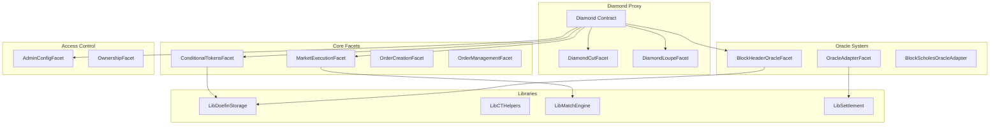

# Doefin V2 🔮⚡

> **Decentralized Bitcoin Prediction Markets on Ethereum**

[](https://www.gnu.org/licenses/agpl-3.0)
[](https://hardhat.org/)
[](https://docs.soliditylang.org/)
[](https://eips.ethereum.org/EIPS/eip-2535)

Doefin V2 is a decentralized prediction market protocol that enables users to create and trade on Bitcoin network metrics. Built on the Diamond Standard (EIP-2535) for maximum upgradeability and modularity, the protocol features a trustless Bitcoin block header oracle and supports diverse prediction market types.

## 🚀 Features

### 🏗️ **Diamond Architecture**
- **Upgradeable Proxy**: EIP-2535 Diamond Standard for seamless upgrades
- **Modular Facets**: Compartmentalized functionality for maintainability
- **Gas Optimized**: Efficient storage patterns and minimal proxy overhead

### 🔗 **Bitcoin Block Header Oracle**
- **Trustless Verification**: Validates Bitcoin block headers using consensus rules
- **Reorg Protection**: 17-block buffer ensures chain integrity
- **Automated Settlement**: Real-time difficulty adjustment tracking
- **Proof of Work Validation**: Full SHA-256 validation of block headers

### 📈 **Prediction Market Types**

| Market Type | Description | Example |
|-------------|-------------|---------|
| **Difficulty Threshold** | Binary outcome based on difficulty level | "Will Bitcoin difficulty exceed 85T at block 850,000?" |
| **Difficulty Range** | Multi-outcome difficulty brackets | "Bitcoin difficulty range at block 850,000: <85T, 85-90T, 90-95T, >95T" |
| **Block Count** | Blocks mined in time window | "Blocks mined between timestamps X and Y: <100, 100-150, 150-200, >200" |
| **Mining Duration** | Time to mine block range | "Time to mine 144 blocks from height X: <1hr, 1-2hr, 2-3hr, >3hr" |

### 💱 **Advanced Exchange Features**
- **Full Order Book**: Limit and market orders with partial fills
- **Cross-Currency Trading**: Multiple collateral token support (USDC, DAI, etc.)
- **MEV Protection**: Fill-or-kill orders and minimum fill amounts
- **Gas Optimization**: Batch order matching and settlement

### 🎯 **Conditional Token Framework**
- **Gnosis CTF Integration**: Battle-tested conditional token standard
- **Position Splitting**: Create outcome positions from collateral
- **Automated Redemption**: Trustless payout distribution
- **ERC1155 Compatible**: Full token standard compliance

## 📋 Prerequisites

- Node.js 16.0.0 or later
- npm or yarn package manager
- Git

## ⚡ Quick Start

### Installation

```bash
# Clone the repository
git clone https://github.com/your-org/doefin-v2.git
cd doefin-v2

# Install dependencies
npm install
```

### Environment Setup

```bash
# Copy environment variables
cp .env.example .env

# Edit with your configuration
# Required: PRIVATE_KEY, RPC URLs for target networks
```

### Development Commands

```bash
# Compile contracts
npx hardhat compile

# Run tests
npm test

# Run specific test file
npx hardhat test test/unit/MarketExecutionTest.js

# Get test coverage
npx hardhat coverage

# Deploy to local network
npx hardhat node
npx hardhat run scripts/deploy.js --network localhost

# Deploy to testnet
npx hardhat run scripts/deploy.js --network arbitrumSepolia
```

## 🏗️ Architecture Overview



## 📁 Contract Structure

```
contracts/
├── Diamond.sol                 # Main diamond proxy contract
├── facets/                     # Diamond facets
│   ├── ConditionalTokensFacet.sol     # CTF position management
│   ├── MarketExecutionFacet.sol       # Order matching engine
│   ├── OrderCreationFacet.sol         # Order creation logic
│   ├── DoefinV1BlockHeaderOracleFacet.sol  # Bitcoin oracle
│   └── ...
├── interfaces/                 # Contract interfaces
├── libraries/                  # Shared logic libraries
│   ├── LibDoefinStorage.sol           # Central storage definitions
│   ├── LibMatchEngine.sol            # Order matching algorithms
│   ├── LibSettlement.sol             # Trade settlement logic
│   └── ...
└── upgradeInitializers/       # Upgrade initialization scripts
```

## 🔧 Configuration

### Network Configuration

The protocol supports multiple networks with different configurations:

```javascript
// hardhat.config.js
networks: {
  arbitrumSepolia: {
    url: process.env.SEPOLIA_RPC_URL,
    accounts: [process.env.PRIVATE_KEY],
    chainId: 421614
  },
  // ... other networks
}
```

### Oracle Configuration

```solidity
// Oracle parameters in LibDoefinStorage.sol
uint256 constant SETTLEMENT_DELAY = 6;        // 6-block settlement delay
uint256 constant NUM_OF_TIMESTAMPS = 11;      // Median timestamp calculation
uint256 constant NUM_OF_BLOCK_HEADERS = 17;   // Reorg protection buffer
uint256 constant TIMESTAMP_BUCKET = 600;      // 10-minute buckets
```

## 🧪 Testing

### Test Categories

- **Unit Tests**: Individual facet and library testing
- **Integration Tests**: Cross-facet functionality testing
- **Oracle Tests**: Bitcoin header validation testing
- **Market Tests**: End-to-end trading scenarios

### Running Tests

```bash
# All tests
npm test

# Specific test categories
npx hardhat test test/unit/
npx hardhat test test/integration/
npx hardhat test test/oracle/

# With gas reporting
npx hardhat test --reporter gasReporter

# Debug specific test
npx hardhat test test/debug-market-order.js --verbose
```

### Test Coverage

The project maintains >90% test coverage across all critical paths:

- Oracle validation logic: 98%
- Market execution: 95%
- Settlement mechanisms: 97%
- Access control: 100%

## 🔐 Security

### Audit Status
- [ ] **Initial Audit**: Pending
- [ ] **Public Bug Bounty**: Planned for mainnet launch

### Security Features

- **Reentrancy Protection**: All external calls protected
- **Access Control**: Role-based permissions system
- **Integer Overflow**: Solidity 0.8.20+ built-in protection
- **Front-Running Protection**: Commit-reveal schemes where needed
- **Oracle Manipulation Resistance**: Multi-block validation windows

### Known Limitations

- Bitcoin reorgs beyond 17 blocks require manual intervention
- Oracle updates depend on external block header submission
- Cross-currency rates require external price feeds

## 📊 Gas Optimization

### Contract Size Management

```javascript
// Hardhat configuration for large contracts
settings: {
  optimizer: { enabled: true, runs: 1 },
  viaIR: true,
  metadata: { bytecodeHash: "none" }
}
```

### Typical Gas Costs

| Operation | Gas Cost | Notes |
|-----------|----------|-------|
| Create Order | ~150k | First-time position |
| Fill Order | ~180k | Including settlement |
| Split Position | ~120k | CTF position creation |
| Oracle Update | ~300k | Block header submission |
| Redeem Position | ~80k | Post-settlement |

## 🚀 Deployment

### Prerequisites

1. Set environment variables:
   ```bash
   PRIVATE_KEY=your_deployer_private_key
   SEPOLIA_RPC_URL=your_rpc_endpoint
   ETHERSCAN_API_KEY=your_etherscan_key  # For verification
   ```

2. Ensure sufficient ETH for deployment (~0.1 ETH on testnets)

### Deploy Script

```bash
# Deploy to testnet
npx hardhat run scripts/deploy.js --network arbitrumSepolia

# Verify on Etherscan (automatically included in deploy script)
```

### Post-Deployment

1. **Initialize Oracle**: Upload initial Bitcoin block headers
2. **Configure Admin**: Set up access control roles
3. **Fund Protocol**: Add initial liquidity for gas subsidies
4. **Test Integration**: Verify all facets functional

## 🤝 Contributing

We welcome contributions! Please see our [Contributing Guidelines](CONTRIBUTING.md) for details.

### Development Workflow

1. **Fork & Clone**: Fork the repository and clone locally
2. **Branch**: Create feature branches from `dev`
3. **Develop**: Write code with comprehensive tests
4. **Test**: Ensure all tests pass and maintain coverage
5. **PR**: Submit pull request with detailed description

### Code Style

- **Solidity**: Follow [Solidity Style Guide](https://docs.soliditylang.org/en/v0.8.20/style-guide.html)
- **JavaScript**: ESLint configuration included
- **Commits**: Use [Conventional Commits](https://www.conventionalcommits.org/)

## 📚 Documentation

### 📄 **Whitepaper & Protocol Overview**
- **Doefin V2 Whitepaper**: [Complete protocol specification, economics, and user guide](./docs/DOEFIN_V2_WHITEPAPER.md)

### 🏗️ **System Architecture & Design**
- **Architecture Guide**: [System overview and design principles](./docs/ARCHITECTURE.md)
- **Diamond Contract Guide**: [Diamond pattern implementation and best practices](./docs/DIAMOND_CONTRACT_CONSIDERATIONS.md)
- **Deployment Guide**: [Network deployment procedures](./docs/DEPLOYMENT.md)

### 🔄 **System Flows & Operations**
- **Order Lifecycle Flow**: [Complete order creation, matching, and settlement process](./docs/ORDER_LIFECYCLE_FLOW.md)
- **Cross-Currency Orders Flow**: [Multi-collateral trading with oracle integration](./docs/CROSS_CURRENCY_ORDERS_FLOW.md)
- **Matching Mechanisms**: [Order book matching algorithms and optimization](./docs/MATCHING_MECHANISMS.md)
- **Settlement Flow**: [Trade settlement and position management](./docs/SETTLEMENT_FLOW.md)
- **Condition Lifecycle Flow**: [Market creation to final resolution](./docs/CONDITION_LIFECYCLE_FLOW.md)

### 🔮 **Oracle Systems**
- **Price Feed Oracle System**: [Dynamic oracle adapter management with failover](./docs/PRICE_FEED_ORACLE_SYSTEM.md)
- **Bitcoin Block Header Oracle**: [Trustless Bitcoin network integration](./docs/QUESTIONS_TYPES.md)
- **Reorg Test Data Guide**: [Bitcoin reorganization testing scenarios](./docs/REORG_TEST_DATA_GUIDE.md)

## 🔗 Links & Resources

- **Diamond Standard**: [EIP-2535](https://eips.ethereum.org/EIPS/eip-2535)
- **Conditional Tokens**: [Gnosis Documentation](https://docs.gnosis.io/conditionaltokens/)
- **Bitcoin Headers**: [Bitcoin Developer Reference](https://bitcoin.org/en/developer-reference#serialized-blocks)
- **Hardhat**: [Development Environment](https://hardhat.org/docs)

## ⚖️ License

This project is licensed under the **GNU Affero General Public License v3.0 (AGPL-3.0)**.

### Third-Party Components

- **Gnosis Conditional Tokens Framework**: AGPL-3.0
- **Diamond Standard Reference**: MIT License (Nick Mudge)
- **OpenZeppelin Contracts**: MIT License

## 🙋‍♀️ Support

- **Issues**: [GitHub Issues](https://github.com/your-org/doefin-v2/issues)
- **Discussions**: [GitHub Discussions](https://github.com/your-org/doefin-v2/discussions)
- **Discord**: [Community Server](https://discord.gg/your-server)
- **Email**: team@doefin.io

---

**⚠️ Disclaimer**: This protocol is experimental software. Use at your own risk. Past performance is not indicative of future results.