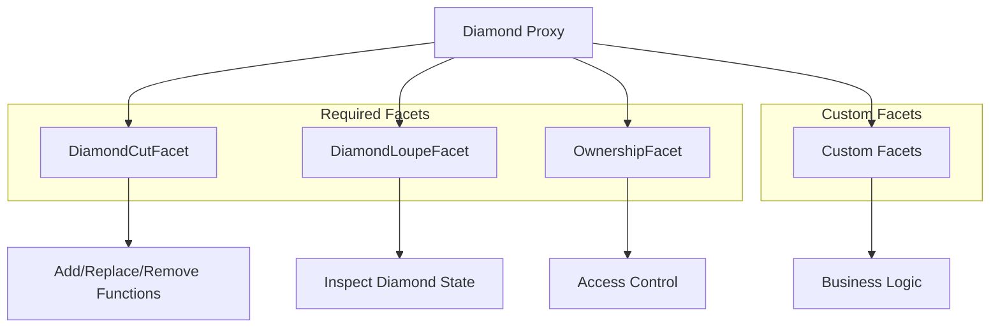

# Diamond Pattern Best Practices & Upgrade Considerations

This document provides comprehensive guidelines for developers working with the Diamond Standard (EIP-2535) in Doefin V2, covering best practices, upgrade procedures, storage management, and security considerations.

## Table of Contents

1. [Diamond Pattern Overview](#diamond-pattern-overview)
2. [Best Practices](#best-practices)
3. [Facet Management](#facet-management)
4. [Storage Management](#storage-management)
5. [Upgrade Procedures](#upgrade-procedures)
6. [Security Considerations](#security-considerations)
7. [Testing Guidelines](#testing-guidelines)
8. [Developer Checklists](#developer-checklists)
9. [Common Pitfalls](#common-pitfalls)
10. [Troubleshooting](#troubleshooting)

---

## Diamond Pattern Overview

### Architecture Benefits

- **Unlimited Contract Size**: Bypass 24KB contract size limit through modular facets
- **Upgradeable Logic**: Update specific functionality without changing the main contract address
- **Shared Storage**: All facets share the same storage space using diamond storage pattern
- **Gas Efficiency**: Only load required functionality, reducing deployment and execution costs

### Core Components



---

## Best Practices

### 1. Storage Pattern Design

#### ✅ **DO: Use Deterministic Storage Slots**

```solidity
// Good: Deterministic storage position
library LibDoefinStorage {
    bytes32 constant STORAGE_POSITION = keccak256("doefin.storage");
    
    struct AppStorage {
        mapping(uint256 => Order) orders;
        mapping(bytes32 => Condition) conditions;
        // ... other storage
    }
    
    function appStorage() internal pure returns (AppStorage storage ds) {
        bytes32 position = STORAGE_POSITION;
        assembly {
            ds.slot := position
        }
    }
}
```

#### ❌ **DON'T: Use Regular Contract Storage**

```solidity
// Bad: Will conflict between facets
contract BadFacet {
    mapping(uint256 => Order) orders; // This will cause storage collisions!
    uint256 orderCount;               // Unpredictable storage layout
}
```

### 2. Function Signature Management

#### ✅ **DO: Avoid Function Selector Collisions**

```solidity
// Good: Descriptive function names reduce collision risk
interface IOrderCreation {
    function createLimitOrder(uint256 positionId, ...) external;
    function createMarketOrder(uint256 positionId, ...) external;
    function cancelOrder(uint256 orderId) external;
}
```

#### ❌ **DON'T: Use Generic Function Names**

```solidity
// Bad: High collision risk
interface BadInterface {
    function add(...) external;     // bytes4(keccak256("add(...)"))
    function remove(...) external;  // Very common, likely to collide
    function get(...) external;     // Generic names are problematic
}
```

### 3. Access Control Patterns

#### ✅ **DO: Implement Role-Based Access Control**

```solidity
library LibAccessControl {
    bytes32 constant ACCESS_CONTROL_STORAGE_POSITION = keccak256("access.control.storage");
    
    struct AccessControlStorage {
        mapping(address => bool) marketMakers;
        mapping(address => bool) operators;
        address owner;
    }
    
    function enforceIsMarketMaker() internal view {
        require(isMarketMaker(msg.sender), "AccessControl: not market maker");
    }
    
    function enforceIsOwner() internal view {
        require(msg.sender == getOwner(), "AccessControl: not owner");
    }
}
```

### 4. Error Handling

#### ✅ **DO: Use Custom Errors for Gas Efficiency**

```solidity
// Good: Custom errors save gas
library Errors {
    error InvalidOrderId(uint256 orderId);
    error InsufficientBalance(address user, uint256 required, uint256 available);
    error OrderExpired(uint256 orderId, uint256 expiry, uint256 currentTime);
    error UnauthorizedAccess(address caller, bytes32 requiredRole);
}

// Usage in facets
function cancelOrder(uint256 orderId) external {
    if (!orderExists(orderId)) revert Errors.InvalidOrderId(orderId);
    if (orders[orderId].maker != msg.sender) revert Errors.UnauthorizedAccess(msg.sender, "ORDER_OWNER");
}
```

### 5. Event Emission Standards

#### ✅ **DO: Emit Events from Libraries for Consistency**

```solidity
library Events {
    event OrderCreated(
        uint256 indexed orderId,
        address indexed maker,
        uint256 indexed positionId,
        uint256 amount,
        uint256 price
    );
    
    event FacetAdded(address indexed facet, bytes4[] selectors);
    event FacetReplaced(address indexed oldFacet, address indexed newFacet, bytes4[] selectors);
}

// Usage ensures consistent event emission across all facets
contract OrderCreationFacet {
    function createOrder(...) external {
        // ... order creation logic
        Events.OrderCreated(orderId, msg.sender, positionId, amount, price);
    }
}
```

---

## Facet Management

### Adding New Facets

#### Step-by-Step Process

1. **Design the Facet Interface**
```solidity
interface INewFeatureFacet {
    function newFeatureFunction(uint256 param) external;
    function anotherFunction(address user) external view returns (uint256);
}
```

2. **Implement the Facet Contract**
```solidity
contract NewFeatureFacet is INewFeatureFacet {
    using LibDoefinStorage for LibDoefinStorage.AppStorage;
    
    function newFeatureFunction(uint256 param) external override {
        LibAccessControl.enforceIsMarketMaker();
        
        LibDoefinStorage.AppStorage storage ds = LibDoefinStorage.appStorage();
        // Implementation logic
        
        emit Events.NewFeatureUsed(msg.sender, param);
    }
}
```

3. **Deploy and Add to Diamond**
```javascript
// Deployment script
const NewFeatureFacet = await ethers.getContractFactory("NewFeatureFacet");
const newFeatureFacet = await NewFeatureFacet.deploy();

const diamondCut = [{
    facetAddress: newFeatureFacet.address,
    action: 0, // Add
    functionSelectors: getSelectors(newFeatureFacet)
}];

const diamondCutFacet = await ethers.getContractAt("IDiamondCut", diamondAddress);
await diamondCutFacet.diamondCut(diamondCut, ethers.constants.AddressZero, "0x");
```

### Replacing Existing Facets

#### Upgrade Workflow

```javascript
// Replace facet workflow
async function replaceFacet(diamondAddress, oldFacetName, newFacetName) {
    // 1. Deploy new facet
    const NewFacet = await ethers.getContractFactory(newFacetName);
    const newFacet = await NewFacet.deploy();
    await newFacet.deployed();
    
    // 2. Get function selectors
    const oldSelectors = getSelectors(await ethers.getContractFactory(oldFacetName));
    const newSelectors = getSelectors(NewFacet);
    
    // 3. Validate selector compatibility
    const removedSelectors = oldSelectors.filter(sel => !newSelectors.includes(sel));
    const addedSelectors = newSelectors.filter(sel => !oldSelectors.includes(sel));
    
    console.log(`Removing selectors: ${removedSelectors.length}`);
    console.log(`Adding selectors: ${addedSelectors.length}`);
    
    // 4. Execute diamond cut
    const diamondCut = [
        // Remove old selectors
        ...removedSelectors.length > 0 ? [{
            facetAddress: ethers.constants.AddressZero,
            action: 2, // Remove
            functionSelectors: removedSelectors
        }] : [],
        // Add new selectors
        ...addedSelectors.length > 0 ? [{
            facetAddress: newFacet.address,
            action: 0, // Add
            functionSelectors: addedSelectors
        }] : [],
        // Replace common selectors
        {
            facetAddress: newFacet.address,
            action: 1, // Replace
            functionSelectors: oldSelectors.filter(sel => newSelectors.includes(sel))
        }
    ].filter(operation => operation.functionSelectors.length > 0);
    
    const diamondCutFacet = await ethers.getContractAt("IDiamondCut", diamondAddress);
    await diamondCutFacet.diamondCut(diamondCut, ethers.constants.AddressZero, "0x");
    
    console.log(`✅ Facet ${oldFacetName} replaced with ${newFacetName}`);
}
```

### Removing Facets

```javascript
async function removeFacet(diamondAddress, facetAddress) {
    const diamondLoupe = await ethers.getContractAt("IDiamondLoupe", diamondAddress);
    const selectors = await diamondLoupe.facetFunctionSelectors(facetAddress);
    
    const diamondCut = [{
        facetAddress: ethers.constants.AddressZero,
        action: 2, // Remove
        functionSelectors: selectors
    }];
    
    const diamondCutFacet = await ethers.getContractAt("IDiamondCut", diamondAddress);
    await diamondCutFacet.diamondCut(diamondCut, ethers.constants.AddressZero, "0x");
    
    console.log(`✅ Removed facet: ${facetAddress}`);
}
```

---

## Storage Management

### Adding New Storage Variables

#### ✅ **DO: Extend AppStorage Struct**

```solidity
// Before upgrade
struct AppStorage {
    mapping(uint256 => Order) orders;
    mapping(bytes32 => Condition) conditions;
    uint256 nextOrderId;
}

// After upgrade - ADD ONLY at the end
struct AppStorage {
    mapping(uint256 => Order) orders;
    mapping(bytes32 => Condition) conditions;
    uint256 nextOrderId;
    
    // New storage variables - ALWAYS add at the end
    mapping(address => uint256) userReputationScores;  // ✅ Safe to add
    bool emergencyPaused;                               // ✅ Safe to add
    uint256 protocolFeeBps;                            // ✅ Safe to add
}
```

#### ❌ **DON'T: Modify Existing Storage Layout**

```solidity
// DANGEROUS: Never modify existing storage
struct AppStorage {
    mapping(uint256 => Order) orders;
    // uint256 nextOrderId;                    // ❌ DON'T delete
    // mapping(bytes32 => Condition) conditions; // ❌ DON'T reorder
    bool newFlag;                              // ❌ DON'T insert in middle
    mapping(bytes32 => Condition) conditions; // ❌ DON'T move existing vars
    uint256 nextOrderId;
}
```

### Storage Migration Patterns

#### Pattern 1: Versioned Storage

```solidity
struct AppStorage {
    // Existing storage (never modify)
    mapping(uint256 => Order) orders;
    uint256 nextOrderId;
    
    // Version tracking
    uint256 storageVersion;
    
    // New versioned storage
    mapping(uint256 => OrderV2) ordersV2;     // New enhanced order structure
    mapping(address => UserProfileV1) userProfiles;
}

library LibStorageMigration {
    function migrateToV2() internal {
        LibDoefinStorage.AppStorage storage ds = LibDoefinStorage.appStorage();
        
        if (ds.storageVersion < 2) {
            // Perform one-time migration logic
            ds.storageVersion = 2;
        }
    }
}
```

#### Pattern 2: Separate Storage Libraries

```solidity
// New feature gets its own storage space
library LibNewFeatureStorage {
    bytes32 constant NEW_FEATURE_STORAGE_POSITION = keccak256("newfeature.storage");
    
    struct NewFeatureStorage {
        mapping(address => uint256) featureUsageCount;
        bool featureEnabled;
        uint256 featureParameters;
    }
    
    function newFeatureStorage() internal pure returns (NewFeatureStorage storage nfs) {
        bytes32 position = NEW_FEATURE_STORAGE_POSITION;
        assembly {
            nfs.slot := position
        }
    }
}
```

---

## Upgrade Procedures

### Pre-Upgrade Checklist

#### 1. **Storage Compatibility Analysis**

```typescript
// Storage analysis script
interface StorageVariable {
    name: string;
    type: string;
    slot: number;
    offset: number;
}

async function analyzeStorageLayout(contractName: string): Promise<StorageVariable[]> {
    const artifact = await hre.artifacts.readArtifact(contractName);
    const storageLayout = artifact.storageLayout;
    
    return storageLayout.storage.map(variable => ({
        name: variable.label,
        type: variable.type,
        slot: variable.slot,
        offset: variable.offset
    }));
}

async function validateStorageCompatibility(oldContract: string, newContract: string) {
    const oldLayout = await analyzeStorageLayout(oldContract);
    const newLayout = await analyzeStorageLayout(newContract);
    
    // Check for conflicts
    for (const oldVar of oldLayout) {
        const newVar = newLayout.find(v => v.slot === oldVar.slot);
        if (newVar && newVar.type !== oldVar.type) {
            throw new Error(`Storage conflict at slot ${oldVar.slot}: ${oldVar.type} -> ${newVar.type}`);
        }
    }
    
    console.log("✅ Storage layouts are compatible");
}
```

#### 2. **Function Selector Analysis**

```typescript
function analyzeSelectorsConflict(facets: string[]): void {
    const allSelectors = new Map<string, string>();
    
    for (const facetName of facets) {
        const selectors = getSelectors(facetName);
        
        for (const selector of selectors) {
            if (allSelectors.has(selector)) {
                throw new Error(`Selector collision: ${selector} in ${facetName} and ${allSelectors.get(selector)}`);
            }
            allSelectors.set(selector, facetName);
        }
    }
    
    console.log(`✅ No selector collisions found across ${facets.length} facets`);
}
```

### Upgrade Execution

#### Safe Upgrade Script

```typescript
async function safeUpgrade(upgradePlan: UpgradePlan) {
    console.log("🔄 Starting Diamond upgrade...");
    
    // 1. Backup current state
    await backupDiamondState(upgradePlan.diamondAddress);
    
    // 2. Validate upgrade plan
    await validateUpgradePlan(upgradePlan);
    
    // 3. Deploy new facets
    const newFacets = await deployUpgradeFacets(upgradePlan.facetUpdates);
    
    // 4. Prepare diamond cut operations
    const diamondCut = prepareDiamondCut(upgradePlan, newFacets);
    
    // 5. Execute upgrade with emergency pause mechanism
    await executeUpgradeWithSafeguards(upgradePlan.diamondAddress, diamondCut, upgradePlan.initData);
    
    // 6. Post-upgrade validation
    await validateUpgradeSuccess(upgradePlan);
    
    console.log("✅ Diamond upgrade completed successfully");
}

async function executeUpgradeWithSafeguards(
    diamondAddress: string, 
    diamondCut: any[], 
    initData: string
) {
    const diamond = await ethers.getContractAt("IDiamondCut", diamondAddress);
    
    // Optional: Pause protocol during upgrade
    if (await supportsInterface(diamondAddress, "IPausable")) {
        const pausable = await ethers.getContractAt("IPausable", diamondAddress);
        await pausable.pause();
        console.log("⏸️ Protocol paused for upgrade");
    }
    
    try {
        // Execute the upgrade
        const tx = await diamond.diamondCut(diamondCut, diamondAddress, initData);
        const receipt = await tx.wait();
        
        console.log(`⛽ Upgrade gas used: ${receipt.gasUsed}`);
        
        // Unpause if was paused
        if (await supportsInterface(diamondAddress, "IPausable")) {
            const pausable = await ethers.getContractAt("IPausable", diamondAddress);
            await pausable.unpause();
            console.log("▶️ Protocol unpaused");
        }
        
    } catch (error) {
        console.error("❌ Upgrade failed:", error);
        
        // Emergency recovery procedures
        if (await supportsInterface(diamondAddress, "IPausable")) {
            try {
                const pausable = await ethers.getContractAt("IPausable", diamondAddress);
                await pausable.unpause();
            } catch (e) {
                console.error("⚠️ Failed to unpause after upgrade failure!");
            }
        }
        
        throw error;
    }
}
```

### Post-Upgrade Validation

```typescript
async function validateUpgradeSuccess(upgradePlan: UpgradePlan) {
    const diamond = await ethers.getContractAt("IDiamondLoupe", upgradePlan.diamondAddress);
    
    // 1. Verify all expected facets are present
    const facets = await diamond.facets();
    console.log(`📋 Active facets after upgrade: ${facets.length}`);
    
    // 2. Test critical functions
    for (const testCase of upgradePlan.postUpgradeTests) {
        try {
            await testCase.execute();
            console.log(`✅ ${testCase.name}: PASSED`);
        } catch (error) {
            console.error(`❌ ${testCase.name}: FAILED - ${error.message}`);
            throw new Error(`Post-upgrade validation failed: ${testCase.name}`);
        }
    }
    
    // 3. Verify storage integrity
    await validateStorageIntegrity(upgradePlan.diamondAddress);
    
    // 4. Check access controls
    await validateAccessControls(upgradePlan.diamondAddress);
}
```

---

## Security Considerations

### Access Control for Diamond Operations

```solidity
// Enhanced ownership with timelock for critical operations
contract TimelockDiamondOwnership {
    uint256 public constant UPGRADE_DELAY = 48 hours;
    
    mapping(bytes32 => uint256) public queuedOperations;
    
    event UpgradeQueued(bytes32 indexed operationHash, uint256 executeAfter);
    event UpgradeExecuted(bytes32 indexed operationHash);
    
    function queueDiamondCut(
        IDiamond.FacetCut[] memory cuts,
        address init,
        bytes memory initData
    ) external onlyOwner returns (bytes32) {
        bytes32 operationHash = keccak256(abi.encode(cuts, init, initData, block.timestamp));
        uint256 executeAfter = block.timestamp + UPGRADE_DELAY;
        
        queuedOperations[operationHash] = executeAfter;
        emit UpgradeQueued(operationHash, executeAfter);
        
        return operationHash;
    }
    
    function executeDiamondCut(
        IDiamond.FacetCut[] memory cuts,
        address init,
        bytes memory initData
    ) external onlyOwner {
        bytes32 operationHash = keccak256(abi.encode(cuts, init, initData, queuedOperations[operationHash]));
        
        require(queuedOperations[operationHash] != 0, "Operation not queued");
        require(block.timestamp >= queuedOperations[operationHash], "Operation still timelocked");
        
        delete queuedOperations[operationHash];
        
        IDiamondCut(diamond).diamondCut(cuts, init, initData);
        emit UpgradeExecuted(operationHash);
    }
}
```

### Upgrade Governance

```solidity
contract GovernedDiamond {
    struct UpgradeProposal {
        IDiamond.FacetCut[] cuts;
        address init;
        bytes initData;
        uint256 proposedAt;
        uint256 votesFor;
        uint256 votesAgainst;
        bool executed;
        mapping(address => bool) hasVoted;
    }
    
    mapping(uint256 => UpgradeProposal) public proposals;
    uint256 public proposalCount;
    
    uint256 public constant VOTING_PERIOD = 7 days;
    uint256 public constant EXECUTION_DELAY = 2 days;
    
    function proposeUpgrade(
        IDiamond.FacetCut[] memory cuts,
        address init,
        bytes memory initData
    ) external onlyGovernance returns (uint256) {
        uint256 proposalId = proposalCount++;
        
        UpgradeProposal storage proposal = proposals[proposalId];
        proposal.cuts = cuts;
        proposal.init = init;
        proposal.initData = initData;
        proposal.proposedAt = block.timestamp;
        
        emit UpgradeProposed(proposalId, msg.sender);
        return proposalId;
    }
}
```

---

## Testing Guidelines

### Comprehensive Test Suite Structure

```typescript
describe("Diamond Upgrade Tests", () => {
    describe("Storage Layout Tests", () => {
        it("should maintain storage compatibility after upgrade", async () => {
            // Test storage variable access before upgrade
            const beforeValue = await diamond.getSomeStorageValue();
            
            // Execute upgrade
            await upgradeFacet("OldFacet", "NewFacet");
            
            // Verify storage value unchanged
            const afterValue = await diamond.getSomeStorageValue();
            expect(afterValue).to.equal(beforeValue);
        });
        
        it("should allow access to new storage variables", async () => {
            await upgradeFacet("OldFacet", "NewFacet");
            
            // Test new functionality that uses new storage
            await diamond.setNewStorageValue(12345);
            expect(await diamond.getNewStorageValue()).to.equal(12345);
        });
    });
    
    describe("Function Selector Tests", () => {
        it("should not have selector collisions", async () => {
            const selectors = await getAllSelectors(diamond);
            const uniqueSelectors = new Set(selectors);
            expect(selectors.length).to.equal(uniqueSelectors.size);
        });
    });
    
    describe("Cross-Facet Integration Tests", () => {
        it("should maintain functionality across facets", async () => {
            // Test that facets can still call each other's logic through shared storage
            await diamond.functionFromFacetA();
            const result = await diamond.functionFromFacetB();
            expect(result).to.be.true;
        });
    });
});
```

### Upgrade Testing Framework

```typescript
class DiamondUpgradeTestFramework {
    constructor(private diamond: Contract) {}
    
    async testUpgrade(oldFacetName: string, newFacetName: string) {
        // 1. Pre-upgrade state capture
        const preState = await this.captureState();
        
        // 2. Execute upgrade
        await this.performUpgrade(oldFacetName, newFacetName);
        
        // 3. Post-upgrade validation
        await this.validateState(preState);
        await this.validateNewFunctionality();
    }
    
    private async captureState(): Promise<SystemState> {
        return {
            orderCount: await this.diamond.getOrderCount(),
            conditionCount: await this.diamond.getConditionCount(),
            userBalances: await this.captureUserBalances(),
            // ... other critical state
        };
    }
    
    private async validateState(preState: SystemState): Promise<void> {
        const postState = await this.captureState();
        
        expect(postState.orderCount).to.equal(preState.orderCount);
        expect(postState.conditionCount).to.equal(preState.conditionCount);
        // ... validate all critical state preserved
    }
}
```

---

## Developer Checklists

### Pre-Development Checklist

- [ ] **Storage Design Review**
  - [ ] New storage variables added only at end of AppStorage
  - [ ] No modification of existing storage layout
  - [ ] Deterministic storage positions used
  - [ ] Storage conflicts analyzed and resolved

- [ ] **Function Design Review**
  - [ ] Function selectors checked for collisions
  - [ ] Access control properly implemented
  - [ ] Error handling uses custom errors
  - [ ] Events emit from shared library

- [ ] **Interface Compatibility**
  - [ ] Breaking changes documented and approved
  - [ ] Backward compatibility maintained where possible
  - [ ] Integration impacts assessed

### Pre-Deployment Checklist

- [ ] **Code Review Complete**
  - [ ] Security review completed
  - [ ] Gas optimization implemented
  - [ ] Code follows project conventions

- [ ] **Testing Verification**
  - [ ] Unit tests pass for all facets
  - [ ] Integration tests validate cross-facet functionality
  - [ ] Upgrade path tested on testnet
  - [ ] Storage migration tested (if applicable)

- [ ] **Documentation Updated**
  - [ ] API documentation reflects changes
  - [ ] Upgrade notes prepared
  - [ ] Integration guide updated

### Pre-Upgrade Checklist

- [ ] **Technical Validation**
  - [ ] Storage layout compatibility verified
  - [ ] Function selector conflicts resolved
  - [ ] Gas costs analyzed and approved
  - [ ] Emergency procedures documented

- [ ] **Governance & Security**
  - [ ] Upgrade proposal submitted and approved (if applicable)
  - [ ] Timelock period observed
  - [ ] Emergency response team notified
  - [ ] Rollback plan prepared

- [ ] **Operational Readiness**
  - [ ] Monitoring alerts configured
  - [ ] Support team briefed
  - [ ] User communication prepared

### Post-Upgrade Checklist

- [ ] **Immediate Validation**
  - [ ] All functions accessible and working
  - [ ] Storage integrity maintained
  - [ ] Access controls functioning
  - [ ] Events emitting correctly

- [ ] **System Health Monitoring**
  - [ ] Performance metrics normal
  - [ ] Error rates within expected bounds
  - [ ] Gas costs as expected
  - [ ] User experience unimpacted

- [ ] **Documentation & Communication**
  - [ ] Upgrade completion announced
  - [ ] Documentation updated with new version
  - [ ] Team debriefing completed

---

## Common Pitfalls

### 1. Storage Slot Collisions

**Problem**: Different facets accidentally use the same storage slots.

```solidity
// Problematic pattern
contract FacetA {
    uint256 private valueA; // Slot 0
}

contract FacetB {
    uint256 private valueB; // Also Slot 0 - COLLISION!
}
```

**Solution**: Always use diamond storage pattern.

### 2. Function Selector Collisions

**Problem**: Two functions have the same bytes4 selector.

```solidity
// These could potentially collide:
function transfer(address to, uint256 amount) external;        // 0xa9059cbb
function transfer(address recipient, uint256 value) external;  // Same selector!
```

**Solution**: Use unique, descriptive function names and validate selectors.

### 3. Initialization Order Dependencies

**Problem**: Facets depend on other facets being initialized first.

**Solution**: Use initialization functions that handle dependencies properly.

```solidity
contract InitializationFacet {
    function initializeDiamond() external {
        LibAccessControl.initialize();  // First
        LibOrderbook.initialize();      // Depends on access control
        LibOracle.initialize();         // Can be independent
    }
}
```

### 4. State Inconsistency During Upgrades

**Problem**: Partial upgrade leaves system in inconsistent state.

**Solution**: Use atomic upgrades and proper error handling.

---

## Troubleshooting

### Common Issues and Solutions

#### Issue: "Function does not exist"

**Diagnosis:**
```javascript
// Check if function selector exists
const diamond = await ethers.getContractAt("IDiamondLoupe", diamondAddress);
const selectors = await diamond.facetFunctionSelectors(facetAddress);
console.log("Available selectors:", selectors);
```

**Solution:**
- Verify function was added in diamond cut
- Check for selector collision
- Ensure facet is properly deployed

#### Issue: "Storage appears corrupted"

**Diagnosis:**
```javascript
// Analyze storage layout
await analyzeStorageLayout("YourContract");
```

**Solution:**
- Review storage modifications for compatibility
- Check for storage slot overlaps
- Verify deterministic storage positions

#### Issue: "Upgrade reverts"

**Diagnosis:**
- Check function selector conflicts
- Verify access permissions
- Validate diamond cut parameters

#### Emergency Recovery Procedures

```solidity
contract EmergencyRecovery {
    function emergencyPause() external onlyEmergencyAdmin {
        // Pause all operations
        LibPausable.pause();
        
        emit EmergencyPause(msg.sender, block.timestamp);
    }
    
    function emergencyFacetRemoval(address facet) external onlyEmergencyAdmin {
        // Remove problematic facet
        bytes4[] memory selectors = IDiamondLoupe(address(this)).facetFunctionSelectors(facet);
        
        IDiamond.FacetCut[] memory cuts = new IDiamond.FacetCut[](1);
        cuts[0] = IDiamond.FacetCut({
            facetAddress: address(0),
            action: IDiamond.FacetCutAction.Remove,
            functionSelectors: selectors
        });
        
        IDiamondCut(address(this)).diamondCut(cuts, address(0), "");
    }
}
```

---

## Conclusion

The Diamond pattern provides powerful upgradeability but requires careful attention to storage management, function selection, and upgrade procedures. Following these best practices and checklists will help ensure safe and successful diamond implementations in the Doefin V2 protocol.

### Key Takeaways

1. **Always use deterministic storage positions** to avoid conflicts
2. **Test upgrades thoroughly** on testnet before mainnet deployment  
3. **Follow the checklists** to catch issues early
4. **Have emergency procedures** ready for recovery
5. **Document everything** for future maintainers

For additional support or questions about Diamond pattern implementation, refer to the EIP-2535 specification and the project's technical documentation.