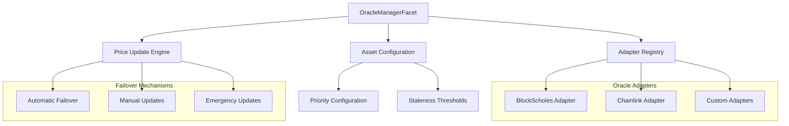
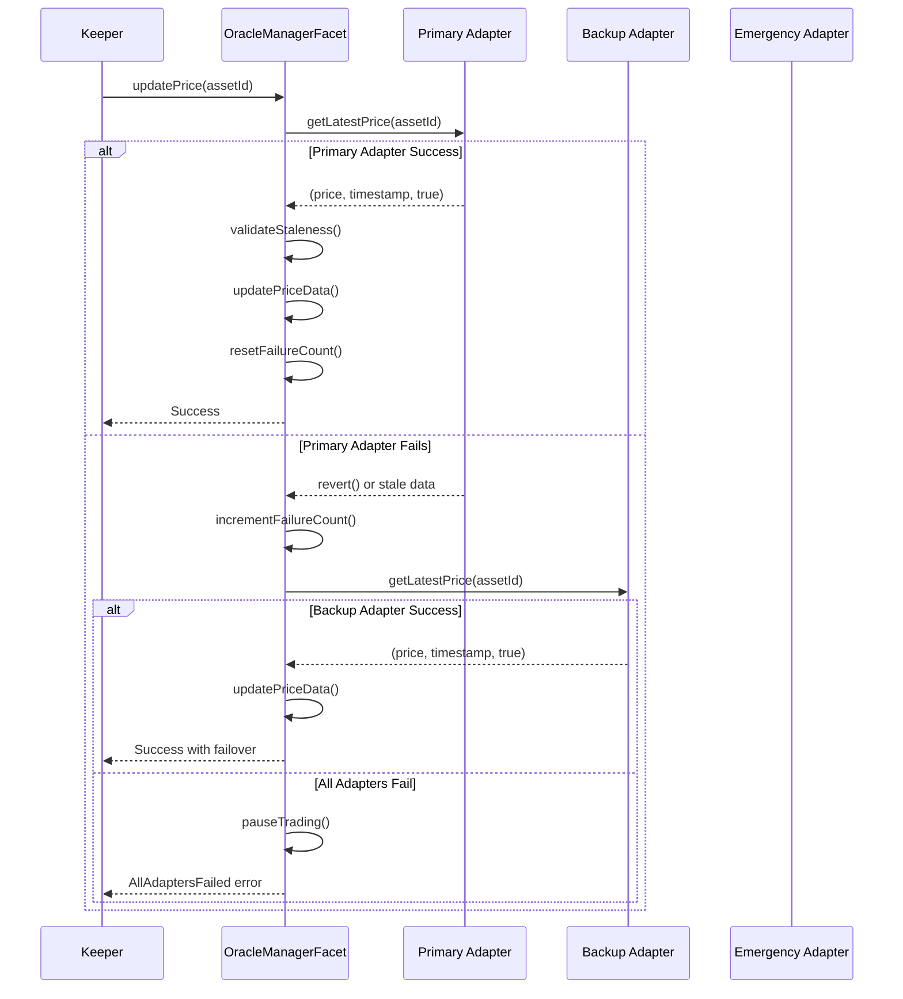

# Price Feed Oracle System

This document explains the comprehensive price feed oracle system in Doefin V2, which enables dynamic addition and removal of price feed sources with automatic failover mechanisms for robust cross-currency trading operations.

## Overview

The Doefin V2 oracle system is designed for maximum reliability and flexibility, supporting multiple oracle providers (Chainlink, BlockScholes, etc.) with automatic failover capabilities. The system ensures continuous price data availability even when individual oracle sources fail.



## System Architecture

### Core Components

#### 1. OracleManagerFacet
**Purpose**: Central coordinator for all oracle operations  
**Location**: [`contracts/facets/OracleManagerFacet.sol`](../contracts/facets/OracleManagerFacet.sol)  
**Responsibilities**:
- Oracle adapter registration and management
- Asset price configuration with priority-based failover
- Automatic price updates with staleness protection
- Manual and emergency price update capabilities

#### 2. IBaseOracleAdapter Interface
**Purpose**: Standardized interface for all oracle adapters  
**Location**: [`contracts/interfaces/IBaseOracleAdapter.sol`](../contracts/interfaces/IBaseOracleAdapter.sol)  
**Key Functions**:
- `getLatestPrice(bytes32 assetId)` - Retrieves latest price data
- `getSupportedAssets()` - Returns supported asset list
- `getAdapterMetadata()` - Provides adapter identification

#### 3. Storage Architecture

```solidity
struct OracleStorage {
    mapping(bytes32 => AdapterConfig) adapters;        // adapterId => config
    mapping(bytes32 => AssetConfig) assetConfigs;      // assetId => config  
    mapping(bytes32 => PriceData) priceData;           // assetId => latest price
    mapping(bytes32 => bool) usedNonces;               // nonce => used status
    address authorizedSigner;                          // EIP-712 signer
    uint256 maxManualUpdateAge;                        // Manual update validity
}

struct AdapterConfig {
    address adapterAddress;    // Adapter contract address
    uint256 maxStaleness;      // Max staleness threshold
    uint256 failureCount;      // Current failure count
    bool enabled;              // Adapter enabled status
}

struct AssetConfig {
    bytes32[] adapterPriority; // Ordered adapter priority list
    uint256 maxStaleness;      // Asset staleness threshold
    uint256 lastUpdateTimestamp; // Last successful update
    uint8 decimals;            // Price decimal precision
    bool tradingPaused;        // Trading pause status
}
```

## Oracle Adapter Management

### Adding New Oracle Adapters

#### Step 1: Implement IBaseOracleAdapter

```solidity
contract CustomOracleAdapter is IBaseOracleAdapter {
    function getLatestPrice(bytes32 assetId) 
        external view returns (uint256 price, uint256 timestamp, bool isValid) {
        // Custom oracle logic implementation
        // Must return price in correct decimals, current timestamp, and validity
    }
    
    function getSupportedAssets() external view returns (bytes32[] memory) {
        // Return array of supported asset IDs
    }
    
    function getAdapterMetadata() 
        external pure returns (string memory name, string memory version) {
        return ("CustomOracleV1", "1.0.0");
    }
}
```

#### Step 2: Register Adapter with OracleManager

```javascript
// Registration script
async function registerNewAdapter() {
    const customAdapter = await CustomOracleAdapter.deploy();
    await customAdapter.deployed();
    
    const adapterId = ethers.utils.keccak256(
        ethers.utils.toUtf8Bytes("CustomOracleV1")
    );
    
    const oracleManager = await ethers.getContractAt("IOracleManager", diamondAddress);
    
    // Register adapter with 1-hour staleness threshold
    await oracleManager.registerAdapter(
        adapterId, 
        customAdapter.address, 
        3600 // 1 hour in seconds
    );
    
    console.log(`✅ Adapter registered: ${adapterId}`);
}
```

### Removing Oracle Adapters

```javascript
async function removeAdapter(adapterId) {
    const oracleManager = await ethers.getContractAt("IOracleManager", diamondAddress);
    
    // Step 1: Remove adapter from all asset configurations first
    const assets = await getAssetsUsingAdapter(adapterId);
    for (const assetId of assets) {
        await updateAssetAdapterPriority(assetId, adapterId, "remove");
    }
    
    // Step 2: Remove adapter from registry
    await oracleManager.removeAdapter(adapterId);
    
    console.log(`✅ Adapter removed: ${adapterId}`);
}
```

### Updating Adapter Configuration

```javascript
async function updateAdapterConfig(adapterId, newConfig) {
    const oracleManager = await ethers.getContractAt("IOracleManager", diamondAddress);
    
    await oracleManager.updateAdapterConfig(adapterId, {
        adapterAddress: newConfig.address,
        maxStaleness: newConfig.staleness,
        failureCount: 0, // Reset failures
        enabled: newConfig.enabled
    });
}
```

## Asset Configuration

### Configuring Assets with Multiple Oracles

```javascript
async function configureAssetWithFailover(assetId, adapters) {
    const oracleManager = await ethers.getContractAt("IOracleManager", diamondAddress);
    
    // Configure asset with priority-ordered adapters
    const adapterPriority = [
        ethers.utils.keccak256(ethers.utils.toUtf8Bytes("BlockScholesV1")), // Primary
        ethers.utils.keccak256(ethers.utils.toUtf8Bytes("ChainlinkV1")),    // Backup
        ethers.utils.keccak256(ethers.utils.toUtf8Bytes("ManualFeed"))      // Emergency
    ];
    
    await oracleManager.configureAsset(
        assetId,
        adapterPriority,
        3600, // 1 hour staleness threshold
        8     // 8 decimal places for price
    );
    
    console.log(`✅ Asset configured with ${adapterPriority.length} adapters`);
}
```

### Updating Asset Adapter Priority

```javascript
// Reorder adapter priority for an asset
async function updateAssetPriority(assetId, newPriorityOrder) {
    const oracleManager = await ethers.getContractAt("IOracleManager", diamondAddress);
    
    await oracleManager.updateAssetAdapterPriority(assetId, newPriorityOrder);
    
    console.log(`✅ Updated adapter priority for ${assetId}`);
}
```

## Failover Mechanism

### Automatic Failover Process

The system implements a robust failover mechanism through the `updatePrice()` function:



### Failure Tracking and Recovery

```solidity
// Automatic failure tracking in updatePrice()
function updatePrice(bytes32 assetId) external override {
    // Try each adapter in priority order
    for (uint256 i = 0; i < assetConfig.adapterPriority.length; i++) {
        bytes32 adapterId = assetConfig.adapterPriority[i];
        
        try IBaseOracleAdapter(adapterAddress).getLatestPrice(assetId) 
            returns (uint256 price, uint256 timestamp, bool isValid) {
            
            if (isValid && isNotStale(timestamp)) {
                // Success: Reset failure count and update price
                adapterConfig.failureCount = 0;
                updateStoredPrice(price, timestamp, adapterId);
                resumeTradingIfPaused();
                return;
            }
        } catch {
            // Failure: Increment counter and continue to next adapter
            adapterConfig.failureCount++;
            emit Events.AdapterFailed(adapterId, assetId, adapterConfig.failureCount);
        }
    }
    
    // All adapters failed: Pause trading
    pauseTrading(assetId);
    revert Errors.AllOracleAdaptersFailed(assetId);
}
```

## Staleness Protection (Circuit Breaker)

### Automatic Staleness Detection

The system automatically pauses trading when price data becomes stale:

```solidity
function getPrice(bytes32 assetId) 
    external view returns (uint256 price, uint256 timestamp, bool isPaused) {
    
    LibDoefinStorage.AssetConfig storage assetConfig = 
        ds.oracleStorage.assetConfigs[assetId];
    LibDoefinStorage.PriceData storage priceData = 
        ds.oracleStorage.priceData[assetId];
    
    price = priceData.price;
    timestamp = priceData.timestamp;
    
    // Automatic staleness detection
    bool isStale = (block.timestamp - timestamp) > assetConfig.maxStaleness;
    isPaused = assetConfig.tradingPaused || isStale;
}
```

### Trading Integration

All trading functions must check oracle status before execution:

```solidity
// Example: Order creation with oracle validation
function createOrder(...) external {
    // Validate oracle status for cross-currency orders
    if (orderType != OrderType.Standard) {
        (uint256 price, uint256 timestamp, bool isPaused) = 
            oracleManager.getPrice(quoteCurrencyAsset);
            
        if (isPaused) {
            revert Errors.TradingPausedStaleOracle(quoteCurrencyAsset);
        }
    }
    
    // Proceed with order creation
    LibOrderbook.createOrder(...);
}
```

## Manual Price Updates

### EIP-712 Signed Updates

For situations where automatic adapters fail, authorized signers can provide manual updates:

```solidity
struct PriceData {
    bytes32 assetId;
    uint256 price;
    uint256 timestamp; 
    bytes32 nonce;
}
```

#### Creating Signed Price Updates

```javascript
// Off-chain price update signing
async function createSignedPriceUpdate(signer, assetId, price) {
    const domain = {
        name: "DoefinOracle",
        version: "1",
        chainId: await signer.getChainId(),
        verifyingContract: diamondAddress
    };
    
    const types = {
        PriceData: [
            { name: "assetId", type: "bytes32" },
            { name: "price", type: "uint256" },
            { name: "timestamp", type: "uint256" },
            { name: "nonce", type: "bytes32" }
        ]
    };
    
    const value = {
        assetId: assetId,
        price: price,
        timestamp: Math.floor(Date.now() / 1000),
        nonce: ethers.utils.randomBytes(32)
    };
    
    const signature = await signer._signTypedData(domain, types, value);
    
    return { value, signature };
}
```

#### Submitting Manual Updates

```javascript
async function submitManualPriceUpdate(signedUpdate) {
    const oracleManager = await ethers.getContractAt("IOracleManager", diamondAddress);
    
    await oracleManager.manualUpdatePrice(
        signedUpdate.value.assetId,
        signedUpdate.value.price,
        signedUpdate.value.timestamp,
        signedUpdate.value.nonce,
        signedUpdate.signature
    );
    
    console.log("✅ Manual price update submitted");
}
```

## Emergency Price Updates

For complete oracle failures, emergency multisig updates are available:

```javascript
async function emergencyPriceUpdate(multisig, assetId, price, justification) {
    const oracleManager = await ethers.getContractAt("IOracleManager", diamondAddress);
    
    // Requires multisig approval through governance
    const tx = await oracleManager.connect(multisig).emergencyUpdatePrice(
        assetId,
        price,
        justification // "All oracles failed, using Coinbase price"
    );
    
    console.log(`🚨 Emergency update: ${justification}`);
    return tx;
}
```

## Oracle Adapter Examples

### 1. BlockScholes Adapter

**Purpose**: Integration with BlockScholes push-based oracle  
**Location**: [`contracts/facets/BlockScholesOracleAdapter.sol`](../contracts/facets/BlockScholesOracleAdapter.sol)  

```solidity
contract BlockScholesOracleAdapter is IBaseOracleAdapter {
    struct BlockScholesFeedConfig {
        uint8 feedId;      // BlockScholes Feed ID
        uint8 exchange;    // Exchange enumeration  
        uint8 baseAsset;   // Asset enumeration
        uint8 decimals;    // Output decimal precision
    }
    
    function getLatestPrice(bytes32 assetId) 
        external view override returns (uint256 price, uint256 timestamp, bool isValid) {
        
        BlockScholesFeedConfig memory config = feedConfigs[assetId];
        
        // Query BlockScholes oracle
        IOracleBS.Feed memory feed = IOracleBS.Feed({
            feedId: config.feedId,
            exchange: config.exchange,
            baseAsset: config.baseAsset
        });
        
        (uint256 rawPrice, uint256 timestamp) = 
            IOracleBS(blockScholesOracle).getPrice(feed);
            
        // Convert from BlockScholes decimals to target decimals
        price = convertDecimals(rawPrice, BLOCKSCHOLES_DECIMALS, config.decimals);
        isValid = (price > 0 && timestamp <= block.timestamp);
    }
}
```

### 2. Chainlink Adapter (Conceptual)

```solidity
contract ChainlinkOracleAdapter is IBaseOracleAdapter {
    mapping(bytes32 => address) public priceFeeds; // assetId => Chainlink feed
    
    function getLatestPrice(bytes32 assetId) 
        external view override returns (uint256 price, uint256 timestamp, bool isValid) {
        
        address feedAddress = priceFeeds[assetId];
        require(feedAddress != address(0), "Feed not configured");
        
        AggregatorV3Interface priceFeed = AggregatorV3Interface(feedAddress);
        (
            uint80 roundID,
            int256 price,
            uint256 startedAt,
            uint256 updatedAt,
            uint80 answeredInRound
        ) = priceFeed.latestRoundData();
        
        price = uint256(price);
        timestamp = updatedAt;
        isValid = (price > 0 && updatedAt > 0);
    }
}
```

### 3. Pyth Adapter (Conceptual)

```solidity 
contract PythOracleAdapter is IBaseOracleAdapter {
    IPyth public pythContract;
    mapping(bytes32 => bytes32) public pythPriceIds; // assetId => Pyth price ID
    
    function getLatestPrice(bytes32 assetId) 
        external view override returns (uint256 price, uint256 timestamp, bool isValid) {
        
        bytes32 priceId = pythPriceIds[assetId];
        PythStructs.Price memory pythPrice = pythContract.getPrice(priceId);
        
        price = uint256(uint64(pythPrice.price));
        timestamp = pythPrice.publishTime;
        isValid = (pythPrice.conf > 0); // Confidence check
    }
}
```

## Monitoring and Health Checks

### Oracle Health Monitoring

```javascript
// Comprehensive oracle health check
async function checkOracleHealth() {
    const oracleManager = await ethers.getContractAt("IOracleManager", diamondAddress);
    
    const assets = ["BTC-USD", "ETH-USD", "USD-USDC"];
    const healthReport = {};
    
    for (const assetName of assets) {
        const assetId = ethers.utils.keccak256(ethers.utils.toUtf8Bytes(assetName));
        
        try {
            const [price, timestamp, isPaused] = await oracleManager.getPrice(assetId);
            const [assetConfig, priceData, isStale] = 
                await oracleManager.getAssetOracleStatus(assetId);
                
            healthReport[assetName] = {
                price: price.toString(),
                timestamp: timestamp.toNumber(),
                isPaused,
                isStale,
                adaptersCount: assetConfig.adapterPriority.length,
                lastUpdate: new Date(timestamp.toNumber() * 1000).toISOString()
            };
            
        } catch (error) {
            healthReport[assetName] = { error: error.message };
        }
    }
    
    console.log("🔍 Oracle Health Report:", JSON.stringify(healthReport, null, 2));
    return healthReport;
}
```

### Adapter Failure Monitoring

```javascript
async function monitorAdapterFailures() {
    const oracleManager = await ethers.getContractAt("IOracleManager", diamondAddress);
    
    const adapters = [
        ethers.utils.keccak256(ethers.utils.toUtf8Bytes("BlockScholesV1")),
        ethers.utils.keccak256(ethers.utils.toUtf8Bytes("ChainlinkV1"))
    ];
    
    for (const adapterId of adapters) {
        const adapterInfo = await oracleManager.getAdapterInfo(adapterId);
        
        console.log(`Adapter ${adapterId}:`);
        console.log(`  - Enabled: ${adapterInfo.enabled}`);
        console.log(`  - Failure Count: ${adapterInfo.failureCount}`);
        console.log(`  - Max Staleness: ${adapterInfo.maxStaleness}s`);
        
        if (adapterInfo.failureCount > 5) {
            console.warn(`⚠️ High failure count for adapter ${adapterId}`);
        }
    }
}
```

## Best Practices

### 1. Adapter Registration
- **Test thoroughly** on testnet before mainnet registration
- **Set appropriate staleness thresholds** based on update frequency
- **Monitor failure rates** and adjust configurations as needed
- **Have backup adapters** ready for immediate deployment

### 2. Asset Configuration
- **Order adapters by reliability** in priority array (most reliable first)
- **Set conservative staleness thresholds** for critical assets
- **Include multiple adapter types** (push, pull, manual) for redundancy
- **Test failover scenarios** regularly

### 3. Failure Recovery
- **Monitor adapter health** continuously
- **Set up alerts** for high failure counts
- **Prepare manual update procedures** for emergency scenarios
- **Maintain authorized signer** infrastructure for manual updates

### 4. Security Considerations
- **Validate adapter contracts** thoroughly before registration
- **Use reliable oracle providers** with good track records
- **Implement rate limiting** for manual updates
- **Audit signature verification** regularly

### 5. Operational Excellence
- **Automate price updates** with reliable keeper infrastructure
- **Monitor staleness** and set appropriate alerts
- **Plan for oracle downtime** scenarios
- **Document emergency procedures** clearly

## Integration Examples

### Adding a New Chainlink Feed

```javascript
async function addChainlinkFeed() {
    // Step 1: Deploy Chainlink adapter if not exists
    const chainlinkAdapter = await ChainlinkOracleAdapter.deploy();
    await chainlinkAdapter.deployed();
    
    // Step 2: Configure asset in adapter
    const assetId = ethers.utils.keccak256(ethers.utils.toUtf8Bytes("ETH-USD"));
    const chainlinkFeed = "0x5f4eC3Df9cbd43714FE2740f5E3616155c5b8419"; // ETH/USD
    
    await chainlinkAdapter.configureFeed(assetId, chainlinkFeed);
    
    // Step 3: Register adapter with OracleManager
    const adapterId = ethers.utils.keccak256(ethers.utils.toUtf8Bytes("ChainlinkV1"));
    const oracleManager = await ethers.getContractAt("IOracleManager", diamondAddress);
    
    await oracleManager.registerAdapter(adapterId, chainlinkAdapter.address, 3600);
    
    // Step 4: Configure asset with new adapter
    await oracleManager.configureAsset(
        assetId,
        [adapterId], // Can add more adapters for failover
        3600, // 1 hour staleness
        8     // 8 decimals
    );
    
    console.log("✅ Chainlink feed added successfully");
}
```

This comprehensive oracle system ensures reliable price data for cross-currency operations while maintaining flexibility to adapt to changing oracle provider landscapes and failure scenarios.