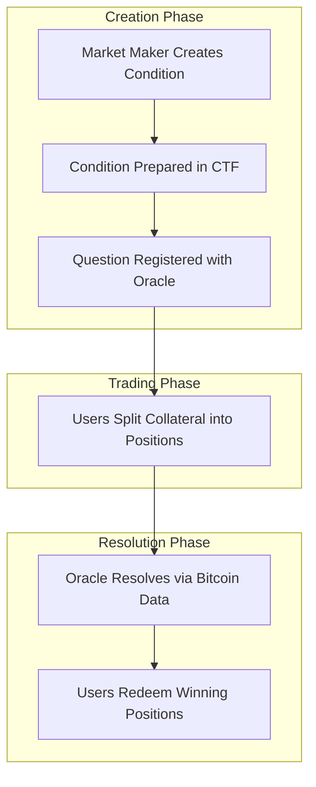
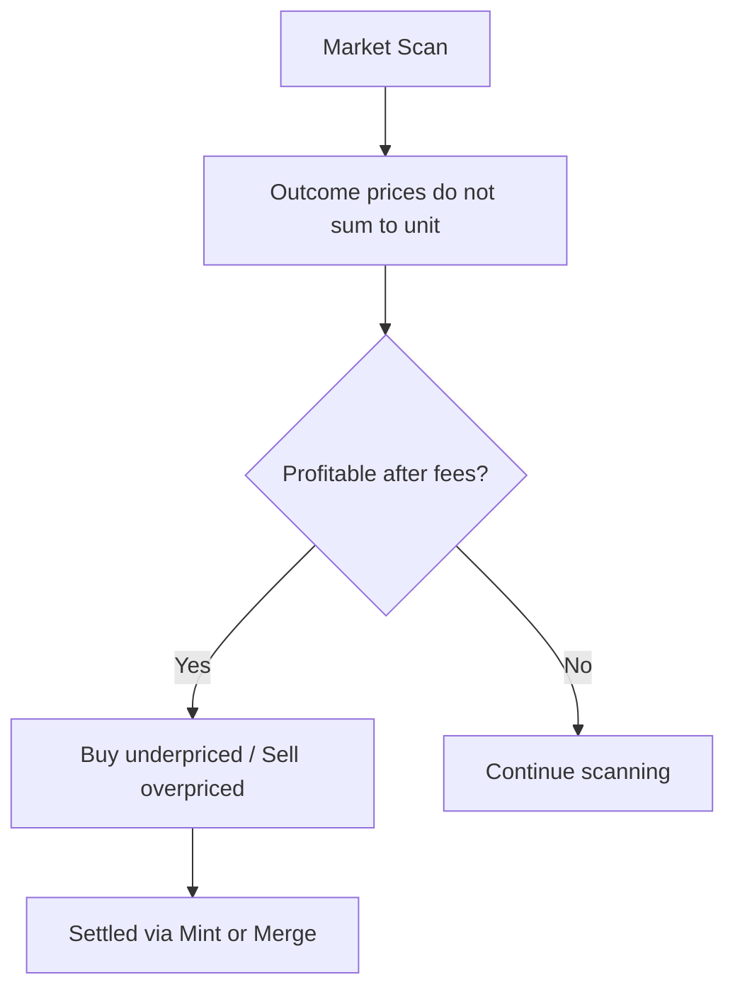
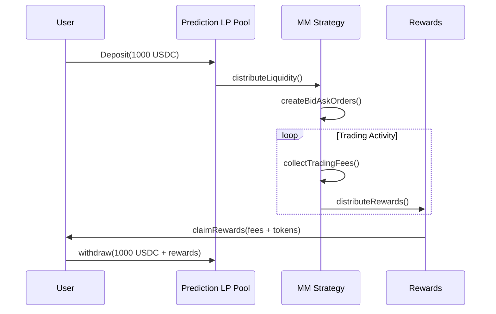
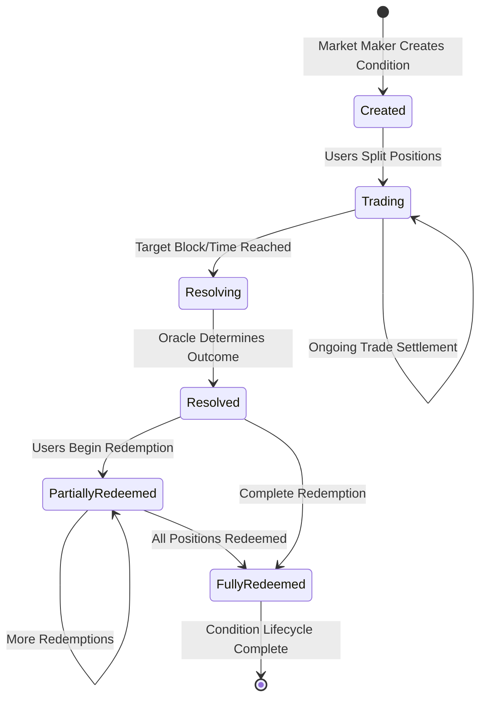
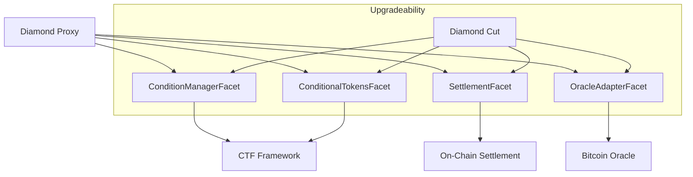

# Condition Full Life Cycle Flow

This document explains the complete lifecycle of prediction market conditions in Doefin V3, from creation through resolution to position redemption.

## Overview

The condition lifecycle consists of four main stages:
1. **Condition Creation** - Market makers create new prediction questions
2. **Position Splitting** - Users split collateral into position tokens  
3. **Oracle Resolution** - Bitcoin oracle automatically resolves conditions
4. **Position Redemption** - Users redeem winning positions for collateral



## Stage 1: Condition Creation

### Entry Point
- **Function**: [`ConditionManagerFacet.createConditionWithMetadata`](../contracts/facets/ConditionManagerFacet.sol#L45)
- **Access Control**: Only addresses with `MARKET_MAKER_ROLE` can create conditions
- **Gas Cost**: ~150,000 gas (varies by question complexity)

### Process Flow

#### 1. Access Control Validation
```solidity
LibAccessControl.enforceIsMarketMaker();
```
- Validates caller has market maker privileges
- Prevents unauthorized condition creation
- Part of the role-based access control system

#### 2. Question Parameter Validation
```solidity
if (outcomeSlotCount <= 1) revert InvalidOutcomeCount();
if (questionType == QuestionType.INVALID) revert InvalidQuestionType();
```
- Ensures valid binary or multi-choice questions (outcomeSlotCount > 1)
- Validates question type matches supported formats
- Prevents malformed condition configurations

#### 3. Deterministic Question ID Generation
```solidity
bytes32 questionId = LibConditionMetadata.generateQuestionId(
    questionType,
    questionData,
    salt
);
```
- Creates unique question identifier using keccak256 hash
- Combines question parameters with provided salt
- Enables deterministic question ID reconstruction

#### 4. CTF Condition Preparation
```solidity
bytes32 conditionId = LibCTFCondition.prepareCondition(
    oracle,
    questionId, 
    outcomeSlotCount
);
```
- Generates unique condition ID: `keccak256(oracle, questionId, outcomeSlotCount)`
- Initializes empty payout numerators array
- Registers condition in Gnosis CTF framework
- Sets initial state: unresolved condition

#### 5. Oracle Question Registration
Based on question type, routes to appropriate oracle adapter function:

##### **Difficulty Threshold Questions**
```solidity
LibOracleAdapter.createDifficultyThresholdQuestion(
    questionId,
    targetBlockHeight,
    thresholdDifficulty
);
```
- Tests if Bitcoin difficulty exceeds specific threshold
- Resolved when target block height is reached
- Binary outcome: YES (exceeds) or NO (below threshold)

##### **Difficulty Range Questions**
```solidity
LibOracleAdapter.createDifficultyRangeQuestion(
    questionId,
    targetBlockHeight,
    minDifficulty,
    maxDifficulty
);
```
- Tests if Bitcoin difficulty falls within specified range
- Resolved at target block height
- Binary outcome: YES (within range) or NO (outside range)

##### **Block Count Questions**
```solidity
LibOracleAdapter.createBlockCountQuestion(
    questionId,
    targetTimestamp,
    expectedBlockCount
);
```
- Predicts number of blocks mined by specific timestamp
- Resolved when target timestamp is reached
- Binary outcome based on block count comparison

##### **Mining Duration Questions**
```solidity
LibOracleAdapter.createMiningDurationQuestion(
    questionId,
    startBlockHeight,
    blockCount,
    expectedDuration
);
```
- Predicts time to mine specific number of blocks
- Resolved when block range is complete
- Binary outcome based on duration comparison

#### 6. Storage Updates
```solidity
// Register question for automated resolution
ds.oracleAdapterStorage.blockToThresholdQuestions[targetBlock].push(question);

// Update statistics
ds.oracleAdapterStorage.totalQuestionsCreated++;
```

#### 7. Event Emission
```solidity
emit ConditionCreated(conditionId, oracle, questionId, outcomeSlotCount);
emit ThresholdQuestionCreated(questionId, targetBlockHeight, thresholdDifficulty);
```

### Validation Requirements

- **Market Maker Role**: Caller must have appropriate access control
- **Valid Parameters**: All question parameters must pass validation
- **Unique Question**: Question ID must not already exist
- **Oracle Configuration**: Oracle address must be valid and configured
- **Question Type Support**: Question type must be supported by oracle adapter

### Common Error Conditions

- `Errors.NotMarketMaker()` - Insufficient privileges
- `Errors.InvalidOutcomeCount()` - Invalid outcome slot count
- `Errors.InvalidQuestionType()` - Unsupported question type
- `Errors.QuestionAlreadyExists()` - Duplicate question ID
- `Errors.InvalidOracleAddress()` - Invalid or unconfigured oracle

---

## Stage 2: Position Splitting

### Entry Point
- **Function**: [`ConditionalTokensFacet.splitPosition`](../contracts/facets/ConditionalTokensFacet.sol#L112)
- **Access**: Open to all users
- **Gas Cost**: ~120,000 gas (varies by partition complexity)

### Process Flow

#### 1. Position Splitting Validation
```solidity
LibCTFCondition._splitPosition(
    collateralToken,
    parentCollectionId, 
    conditionId,
    partition,
    amount
);
```

##### **Partition Validation**
```solidity
if (partition.length <= 1) revert InvalidPartition();
```
- Partition must define multiple disjoint outcome sets
- Each index set represents different position outcomes
- Example: `[[0], [1]]` for binary YES/NO positions

##### **Collateral Token Validation**
```solidity
LibAccessControl.enforceIsCollateralTokenAllowed(collateralToken);
```
- Only whitelisted collateral tokens accepted
- Prevents unauthorized or malicious token usage
- Part of admin-controlled token allowlist

##### **Disjoint Index Sets Validation**
```solidity
// Validates partition represents disjoint outcome sets
for (uint i = 0; i < partition.length; i++) {
    for (uint j = 0; j < partition[i].length; j++) {
        if (usedIndexes[partition[i][j]]) revert OverlappingPartition();
        usedIndexes[partition[i][j]] = true;
    }
}
```

#### 2. Position Registration
```solidity
uint256[] memory positionIds = LibPositionRegistry.registerPositionPairs(
    conditionId,
    collateralToken,
    parentCollectionId,
    partition
);
```

##### **Position ID Generation**
```solidity
bytes32 collectionId = CTHelpers.getCollectionId(
    parentCollectionId,
    conditionId, 
    indexSet
);
uint256 positionId = CTHelpers.getPositionId(collateralToken, collectionId);
```
- Each position gets unique ID based on collection and collateral
- Collection ID incorporates condition and outcome information
- Position ID is `uint256(keccak256(abi.encodePacked(collateralToken, collectionId)))`

##### **Market Metadata Registration**
```solidity
LibDoefinStorage.MarketMetadata storage metadata = ds.positionRegistry.marketsByKey[marketKey];
metadata.conditionId = conditionId;
metadata.collateralToken = collateralToken;
metadata.parentCollectionId = parentCollectionId;
metadata.positionIds = positionIds;
metadata.partitions = partition;
```

##### **Position Relationships**
```solidity
// Register complement relationships for binary markets
if (partition.length == 2) {
    ds.positionRegistry.complementPosition[positionIds[0]] = positionIds[1];
    ds.positionRegistry.complementPosition[positionIds[1]] = positionIds[0];
}
```

#### 3. Collateral Transfer and Token Minting

##### **Collateral Transfer**
```solidity
IERC20(collateralToken).safeTransferFrom(
    msg.sender,
    address(this),
    amount
);
```
- Transfers user's collateral to diamond proxy
- Uses OpenZeppelin SafeERC20 for secure transfers
- Requires prior approval from user

##### **Position Token Minting**
```solidity
for (uint i = 0; i < positionIds.length; i++) {
    LibERC1155._mint(
        msg.sender,
        positionIds[i],
        amount,
        ""
    );
}
```
- Mints ERC1155 position tokens to user
- Each position token represents claim on specific outcome
- Token amount equals collateral amount (1:1 backing)

#### 4. Escrow Balance Updates
```solidity
LibCollateralManager.updateEscrowBalance(
    msg.sender,
    collateralToken,
    amount,
    true // increase balance
);
```

#### 5. Event Emission
```solidity
emit PositionSplit(
    msg.sender,
    collateralToken,
    conditionId,
    partition,
    amount,
    positionIds
);
```

### Validation Requirements

- **Whitelisted Collateral**: Token must be approved for use
- **Valid Condition**: Condition must exist and be unresolved  
- **Valid Partition**: Must define disjoint outcome sets
- **Sufficient Allowance**: User must approve collateral transfer
- **Sufficient Balance**: User must own enough collateral

---

## Stage 3: Oracle Resolution

### Entry Point
- **Function**: [`DoefinV1BlockHeaderOracleFacet.submitNextBlock`](../contracts/facets/DoefinV1BlockHeaderOracleFacet.sol#L75)
- **Access**: Open to all users (with valid block data)
- **Gas Cost**: ~200,000-400,000 gas (varies by number of resolved questions)

### Process Flow

#### 1. Bitcoin Block Validation
```solidity
LibDoefinBlockHeaderOracle.validateAndStoreBlock(
    blockHeight,
    newBlockHeader,
    prevBlockHeaderHash
);
```

##### **Block Header Validation**
- Validates proof-of-work difficulty target
- Verifies block header hash meets difficulty requirement
- Confirms proper chaining from previous block
- Validates timestamp consistency and consensus rules

##### **Reorg Protection** 
```solidity
if (blockHeight <= ds.latestConfirmedBlock + CONFIRMATION_BLOCKS) {
    revert InsufficientConfirmations();
}
```
- Requires 6+ block confirmations before acceptance
- Protects against blockchain reorganizations
- Ensures data finality for question resolution

#### 2. Question Processing Trigger
```solidity
LibOracleAdapter.processSettlements(blockHeight, blockTimestamp);
```

#### 3. Question Resolution by Type

##### **Difficulty Threshold Questions**
```solidity
function _resolveDifficultyThreshold(
    DifficultyThresholdQuestion memory question
) internal returns (bool outcome) {
    uint256 actualDifficulty = currentBlock.difficulty;
    outcome = actualDifficulty >= question.thresholdDifficulty;
    
    uint256[] memory payouts = new uint256[](2);
    payouts[0] = outcome ? 1 : 0; // YES outcome
    payouts[1] = outcome ? 0 : 1; // NO outcome
    
    LibCTFCondition._reportPayouts(question.conditionId, payouts);
}
```

##### **Difficulty Range Questions**
```solidity
function _resolveDifficultyRange(
    DifficultyRangeQuestion memory question  
) internal returns (bool outcome) {
    uint256 actualDifficulty = currentBlock.difficulty;
    outcome = actualDifficulty >= question.minDifficulty 
           && actualDifficulty <= question.maxDifficulty;
    // Set payouts and report...
}
```

##### **Block Count Questions**
```solidity
function _resolveBlockCount(
    BlockCountQuestion memory question
) internal returns (bool outcome) {
    uint256 actualBlockCount = blockHeight - question.startBlockHeight;
    outcome = actualBlockCount >= question.expectedBlockCount;
    // Set payouts and report...
}
```

##### **Mining Duration Questions**
```solidity
function _resolveMiningDuration(
    MiningDurationQuestion memory question  
) internal returns (bool outcome) {
    uint256 actualDuration = endTimestamp - question.startTimestamp;
    outcome = actualDuration <= question.expectedDuration;
    // Set payouts and report...
}
```

#### 4. CTF Condition Resolution
```solidity
function _reportPayouts(
    bytes32 conditionId,
    uint256[] memory payouts
) internal {
    LibDoefinStorage.AppStorage storage ds = LibDoefinStorage.appStorage();
    
    // Calculate total payout denominator
    uint256 denominator = 0;
    for (uint i = 0; i < payouts.length; i++) {
        denominator += payouts[i];
    }
    
    // Store payout ratios
    ds.payoutNumerators[conditionId] = payouts;
    ds.payoutDenominator[conditionId] = denominator;
    
    emit ConditionResolution(conditionId, payouts, denominator);
}
```

#### 5. Statistics Updates
```solidity
ds.oracleAdapterStorage.totalQuestionsResolved++;
```

#### 6. Event Emission
```solidity
emit ConditionResolution(conditionId, payoutNumerators, payoutDenominator);
emit ThresholdQuestionResolved(questionId, outcome, actualDifficulty);
```

### Resolution Logic

#### **Binary Outcomes (Most Common)**
- Winning outcome gets full payout (numerator = denominator)
- Losing outcome gets zero payout (numerator = 0)
- Example: YES wins → `[1, 0]`, NO wins → `[0, 1]`

#### **Multi-Choice Outcomes** 
- Single winning outcome gets full payout
- All other outcomes get zero payout
- Example: Option B wins → `[0, 1, 0, 0]`

#### **Invalid Questions**
- In case of invalid or unanswerable questions
- All outcomes may receive equal payouts
- Example: Technical issue → `[1, 1]` (50/50 split)

### Validation Requirements

- **Valid Block Data**: Block headers must pass Bitcoin consensus validation
- **Confirmation Depth**: Must have sufficient confirmations (6+ blocks)
- **Question Existence**: Questions must be registered for the block height
- **Resolution Timing**: Questions can only be resolved once at appropriate time

---

## Stage 4: Position Redemption

### Entry Point
- **Function**: [`ConditionalTokensFacet.redeemPositions`](../contracts/facets/ConditionalTokensFacet.sol#L150)
- **Access**: Open to all position holders
- **Gas Cost**: ~80,000-150,000 gas (varies by number of positions)

### Process Flow

#### 1. Resolution Validation
```solidity
LibCTFCondition._redeemPositions(
    collateralToken,
    parentCollectionId,
    conditionId,
    indexSets
);
```

##### **Condition Resolution Check**
```solidity
uint256 denominator = ds.payoutDenominator[conditionId];
if (denominator == 0) revert ConditionNotResolved();
```
- Validates condition has been resolved by oracle
- Prevents redemption of unresolved positions
- Ensures payout ratios are available

##### **Position Ownership Validation**
```solidity
for (uint i = 0; i < positionIds.length; i++) {
    uint256 balance = LibERC1155.balanceOf(msg.sender, positionIds[i]);
    if (balance == 0) revert NoPositionsToRedeem();
}
```

#### 2. Payout Calculation
```solidity
function calculatePayout(
    uint256 positionId,
    uint256 positionAmount,
    bytes32 conditionId
) internal view returns (uint256 payout) {
    uint256[] memory numerators = ds.payoutNumerators[conditionId];
    uint256 denominator = ds.payoutDenominator[conditionId];
    uint256 outcomeIndex = ds.positionToOutcome[positionId];
    
    payout = (positionAmount * numerators[outcomeIndex]) / denominator;
}
```

#### 3. Token Operations

##### **Position Token Burning**
```solidity
for (uint i = 0; i < positionIds.length; i++) {
    uint256 balance = LibERC1155.balanceOf(msg.sender, positionIds[i]);
    
    LibERC1155._burn(
        msg.sender,
        positionIds[i], 
        balance
    );
}
```

##### **Collateral Transfer**
```solidity
uint256 totalPayout = calculateTotalPayout(positions);

IERC20(collateralToken).safeTransfer(
    msg.sender,
    totalPayout  
);
```

#### 4. Escrow Balance Updates
```solidity
LibCollateralManager.updateEscrowBalance(
    msg.sender,
    collateralToken,
    totalPayout,
    false // decrease protocol balance
);
```

#### 5. Event Emission
```solidity
emit PayoutRedemption(
    msg.sender,
    collateralToken,
    conditionId, 
    positionIds,
    payouts,
    totalPayout
);
```

### Payout Examples

#### **Binary Question: "Will BTC difficulty exceed 50T at block 800000?"**

**If YES wins** (difficulty = 52T):
- YES position holders receive full collateral (1:1)
- NO position holders receive nothing (0:1)

**If NO wins** (difficulty = 48T):  
- NO position holders receive full collateral (1:1)
- YES position holders receive nothing (0:1)

#### **Multi-Choice Question: "Which range will BTC difficulty fall in?"**
Options: A) <45T, B) 45-50T, C) 50-55T, D) >55T

**If actual difficulty = 52T (Option C wins)**:
- Option C holders receive full collateral (1:1)
- All other option holders receive nothing (0:1)

### Validation Requirements

- **Resolved Condition**: Condition must be resolved by oracle
- **Position Ownership**: User must own positions to redeem
- **Valid Position IDs**: Position IDs must correspond to the condition
- **Non-Zero Positions**: Must have position tokens to burn

### Common Error Conditions

- `Errors.ConditionNotResolved()` - Condition not yet resolved
- `Errors.NoPositionsToRedeem()` - User owns no positions
- `Errors.InvalidPositionId()` - Position doesn't exist or match condition
- `Errors.TransferFailed()` - Collateral transfer failed

## Advanced Question Types & Examples

### Real-World Question Scenarios

#### **1. Bitcoin Halving Prediction**
```solidity
// "Will Bitcoin difficulty exceed 90T within 100 blocks of the 2028 halving?"
DifficultyThresholdQuestion({
    questionId: keccak256("btc_halving_2028_difficulty"),
    conditionId: 0x...,
    threshold: 90_000_000_000_000, // 90T difficulty
    targetBlockHeight: 1_050_000   // Estimated halving block + 100
});
```

#### **2. Network Congestion Analysis**
```solidity
// "How many blocks will be mined in the next 24 hours?"
BlockCountQuestion({
    questionId: keccak256("daily_block_count_apr2026"),
    conditionId: 0x...,
    startTimestamp: 1745875200, // April 1, 2026 00:00 UTC
    endTimestamp: 1745961600,   // April 2, 2026 00:00 UTC  
    countBuckets: [140, 150, 160] // Creates outcomes: <140, 140-150, 150-160, >160
});
```

#### **3. Mining Duration Prediction**
```solidity
// "How long to mine the next difficulty adjustment (2016 blocks)?"
MiningDurationQuestion({
    questionId: keccak256("difficulty_adjustment_duration"),
    conditionId: 0x...,
    startBlockHeight: 840_000,    // Current block
    blockCount: 2016,             // Full difficulty period
    durationBuckets: [1_209_600, 1_360_800, 1_512_000] // 2, 2.25, 2.5 weeks in seconds
});
```

### Question Creation Strategies

#### **Market Maker Considerations**
```typescript
// TypeScript example: Strategic question creation
interface QuestionStrategy {
  questionType: QuestionType;
  timeToResolution: number;      // Days until resolution
  expectedVolume: BigNumber;     // Anticipated trading volume
  riskLevel: 'LOW' | 'MEDIUM' | 'HIGH';
  competitorQuestions: string[]; // Similar existing questions
}

const estrategia: QuestionStrategy = {
  questionType: QuestionType.DifficultyThreshold,
  timeToResolution: 30, // One month
  expectedVolume: parseEther("10000"), // 10K USDC
  riskLevel: 'MEDIUM',
  competitorQuestions: []
};
```

#### **Liquidity Bootstrapping**
```solidity
// Market makers can pre-seed liquidity
function createConditionWithInitialLiquidity(
    QuestionType questionType,
    bytes calldata questionData,
    bytes32 salt,
    address collateralToken,
    uint256 initialLiquidityAmount
) external {
    // 1. Create the condition
    bytes32 conditionId = createConditionWithMetadata(questionType, questionData, salt);
    
    // 2. Split initial position for market making
    LibCTFCondition.splitPosition(
        collateralToken,
        0x0, // Parent collection ID
        conditionId,
        getFullPartition(conditionId),
        initialLiquidityAmount
    );
    
    // 3. Create initial bid/ask orders across all outcomes
    _seedInitialOrders(conditionId, initialLiquidityAmount);
}
```

## Arbitrage Opportunities

### Outcome-Set Arbitrage

When the prices of complementary outcomes do not sum to `unit`, an arbitrageur can buy the
underpriced side and sell the overpriced side. The Mint and Merge settlement paths capture
this directly: a Mint settles two buyers whose prices sum above `unit`, and a Merge
settles two sellers whose prices sum below `unit`.



### Resolution Timing Arbitrage

Different question types resolve at different times, creating temporal arbitrage:

```solidity
// Example: Correlated questions with different resolution timing
struct ArbitrageOpportunity {
    bytes32 earlyQuestionId;     // Resolves in 1 week
    bytes32 lateQuestionId;      // Resolves in 1 month
    uint256 correlationStrength; // How related the outcomes are
    uint256 expectedSpread;      // Price difference opportunity
}
```

## Advanced Trading Patterns

### 1. Conditional Positions

Users can create complex positions based on multiple conditions:

```typescript
// Create a "basket" position across multiple Bitcoin questions
const basketTrade = {
  difficultyPlay: {
    conditionId: "difficulty_above_90T",
    positionId: outcomeYes,
    allocation: 0.4 // 40% of capital
  },
  timingPlay: {
    conditionId: "blocks_in_24h",
    positionId: outcome140to150,
    allocation: 0.3 // 30% of capital
  },
  hedgePlay: {
    conditionId: "difficulty_range_apr",
    positionId: outcomeHigh,
    allocation: 0.3 // 30% of capital
  }
};
```

### 2. Dynamic Hedging Strategies

```solidity
// Automated hedging based on market conditions
contract DynamicHedger {
    mapping(address => HedgeStrategy) strategies;
    
    struct HedgeStrategy {
        bytes32 primaryCondition;    // Main exposure
        bytes32[] hedgeConditions;   // Hedge positions
        uint256[] hedgeRatios;       // Optimal hedge ratios
        uint256 rebalanceThreshold;  // When to rebalance
    }
    
    function autoRebalance(address user) external {
        HedgeStrategy storage strategy = strategies[user];
        
        // Check if rebalancing is needed
        if (_calculatePositionDelta(strategy) > strategy.rebalanceThreshold) {
            _executeRebalance(strategy);
        }
    }
}
```

### 3. Yield Farming with Predictions

Users can earn yields by providing liquidity while maintaining position exposure:



## Integration Points

### Cross-Component Interactions

#### **CTF Integration**
- Uses Gnosis Conditional Token Framework for position token standard
- Maintains compatibility with broader CTF ecosystem  
- Enables interoperability with other prediction market platforms
- Position tokens are fully transferable ERC1155 tokens

#### **Oracle System Integration**
- **[`DoefinV1BlockHeaderOracleFacet`](../contracts/facets/DoefinV1BlockHeaderOracleFacet.sol)** provides automated Bitcoin data
- Supports multiple question types with deterministic resolution
- Multi-block confirmation requirement for reorg protection
- Real-time validation of submitted block headers

#### **Settlement Integration**
- Position tokens are immediately tradeable upon creation
- Orders are signed off-chain and settled on-chain via `SettlementFacet`
- Three settlement paths — Complementary, Mint, Merge — with mint/merge using CTF
  `splitPosition` / `mergePositions`

### State Dependencies and Transitions



### External System Integrations

#### **Bitcoin Network Monitoring**
- Real-time block header submissions
- Difficulty adjustment tracking
- Timestamp validation and reorg detection

#### **DeFi Ecosystem**
- ERC20 collateral token support (allow-listed by the admin)
- Gnosis CTF-compatible ERC1155 position tokens

## Performance Considerations

### Gas Optimization Strategies

#### **Batch Operations**
```solidity
// Optimized batch redemption for multiple positions
function batchRedeemPositions(
    address collateralToken,
    uint256[] calldata positionIds,
    uint256[] calldata amounts
) external {
    uint256 totalCollateral = 0;
    
    // Batch validate and calculate total redemption
    for (uint256 i = 0; i < positionIds.length; i++) {
        totalCollateral += _validateAndCalculateRedemption(positionIds[i], amounts[i]);
    }
    
    // Single transfer for all redemptions
    IERC20(collateralToken).safeTransfer(msg.sender, totalCollateral);
}
```

#### **Storage Efficiency**
```solidity
// Packed structs to minimize storage costs
struct PackedCondition {
    address oracle;           // 20 bytes
    uint8 outcomeSlotCount;   // 1 byte  
    bool active;              // 1 byte
    uint32 creationTime;      // 4 bytes
    // Total: 26 bytes (fits in single 32-byte slot with 6 bytes padding)
}
```

#### **Event-Based Architecture**
- Critical data stored in events for off-chain indexing
- Minimal on-chain storage for gas efficiency
- Event-driven market data updates

### Scalability Solutions

#### **Layer 2 Deployment**
- Deployed on Base L2 for low-cost transactions
- EVM-compatible — the Diamond design is portable to other EVM chains

#### **Modular Architecture**


### Monitoring and Analytics

#### **Market Health Metrics**
```typescript
interface MarketMetrics {
  totalValueLocked: BigNumber;      // Across all conditions
  activeConditions: number;         // Currently tradeable  
  averageResolutionTime: number;    // Days from creation to resolution
  redemptionRate: number;           // % of resolved positions redeemed
  tradingVolume24h: BigNumber;      // 24-hour volume
  uniqueTraders: number;            // Active participants
}
```

#### **Oracle Performance Tracking**
```solidity
struct OracleMetrics {
    uint256 questionsCreated;        // Total questions ever created
    uint256 questionsResolved;       // Successfully resolved questions  
    uint256 averageResolutionBlocks; // Blocks from target to resolution
    uint256 failedResolutions;       // Oracle failure count
    uint256 reorgCount;              // Blockchain reorganizations handled
}
```

This comprehensive condition lifecycle enables trustless, automated prediction markets backed by Bitcoin's blockchain data, providing users with transparent and verifiable outcome resolution while supporting sophisticated trading strategies.