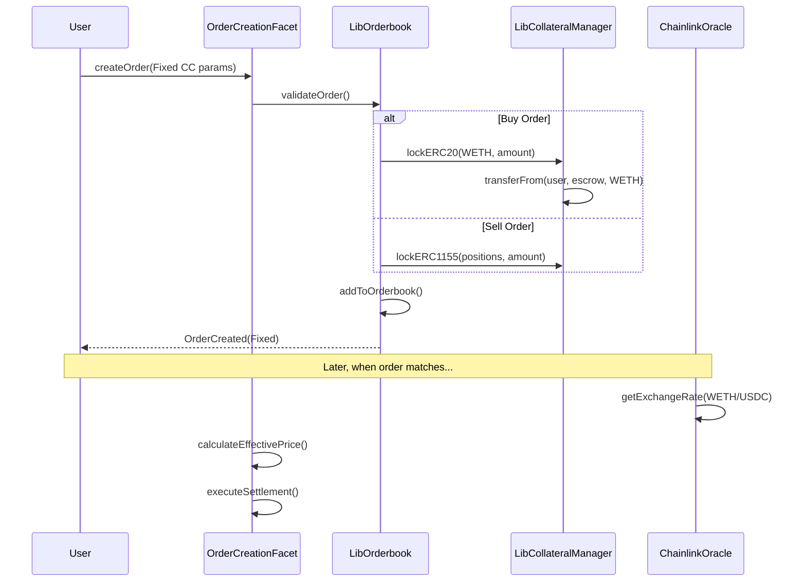
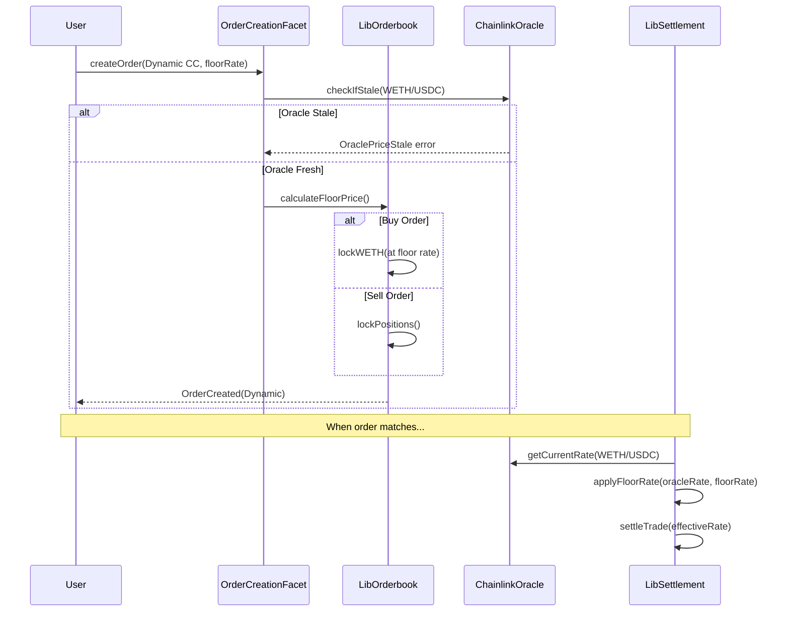
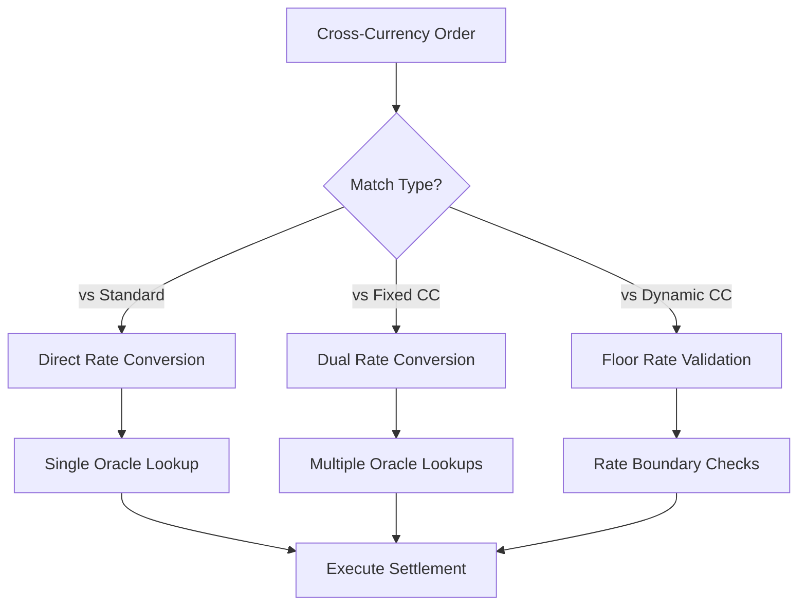

# Cross Currency Orders Flow

This document explains the cross-currency trading mechanism in Doefin V2, which allows users to place orders in different currencies while maintaining efficient settlement and risk management.

## Overview

Cross-currency orders enable users to:
1. **Trade with different base currencies** - Place orders priced in ETH while the market uses USDC
2. **Hedge currency risk** - Lock in exchange rates or set floor rates for dynamic pricing
3. **Access global liquidity** - Participate in markets regardless of native token holdings

```mermaid
graph TD
    A[User Wants to Trade] --> B{Has Collateral Token?}
    B -->|Yes| C[Standard Order]
    B -->|No| D{Cross-Currency Available?}
    D -->|Yes| E[Choose Order Type]
    D -->|No| F[Must Acquire Collateral]
    
    E --> G{Quote Currency Type?}
    G -->|Fixed Rate| H[Fixed Cross-Currency Order]
    G -->|Dynamic Rate| I[Dynamic Cross-Currency Order]
    
    H --> J[Oracle Rate at Settlement]
    I --> K[Floor Rate Protection]
    
    both H and I --> L[Execute with Exchange Rate]
    L --> M[Settlement in Target Currency]
    
    subgraph "Order Types"
        C
        H
        I  
    end
    
    subgraph "Rate Management"
        J
        K
    end
```

## Cross-Currency Order Types

### 1. Standard Orders (Reference)
- **Quote Currency**: Same as collateral token (quoteCurrencyToken = address(0))
- **Pricing**: Direct pricing in collateral token
- **Settlement**: No currency conversion needed

### 2. Fixed Cross-Currency Orders  
- **Quote Currency**: Different from collateral token (quoteCurrencyToken ≠ address(0))
- **Floor Rate**: Always 0 (floorRate = 0)
- **Pricing**: Order priced in quote currency 
- **Settlement**: Exchange rate determined at settlement time via oracle

### 3. Dynamic Cross-Currency Orders
- **Quote Currency**: Different from collateral token 
- **Floor Rate**: Non-zero protective rate (floorRate > 0)
- **Pricing**: Order priced in collateral token with rate protection
- **Settlement**: Uses oracle rate bounded by floor rate

## Order Type Determination

The system automatically determines order type based on [`CrossCurrencyData`](../contracts/libraries/LibDoefinStorage.sol) parameters:

```solidity
function _getOrderType(CrossCurrencyData memory crossCurrencyData) 
    internal pure returns (OrderType) {
    
    if (crossCurrencyData.quoteCurrencyToken == address(0)) {
        return OrderType.Standard;  // Standard order
    }
    
    if (crossCurrencyData.floorRate == 0) {
        return OrderType.Fixed;     // Fixed cross-currency
    }
    
    return OrderType.Dynamic;       // Dynamic cross-currency
}
```

## Fixed Cross-Currency Orders

### Use Case
User wants to buy Bitcoin prediction outcomes but only has ETH, with the market denominated in USDC.

### Configuration
```solidity
CrossCurrencyData({
    quoteCurrencyToken: 0x... // WETH address  
    floorRate: 0              // No floor rate protection
})
```

### Process Flow



### Pricing Example

**Scenario**: User wants to buy 100 outcome tokens priced at $0.60 each
- **Market Collateral**: USDC (6 decimals)
- **User Quote Currency**: WETH (18 decimals)  
- **Current ETH/USD Rate**: $2,400 (from Chainlink)

```solidity
// Order placed at this rate
uint256 priceInQuote = 0.60e6 * 1e18 / 2400e8;  // ~0.00025 WETH per token

// At settlement, if ETH/USD = $2,500
uint256 effectivePrice = 0.60e6 * 1e18 / 2500e8;  // ~0.00024 WETH per token
// User benefits from ETH appreciation
```

### Advantages
- ✅ **Flexible**: Automatic rate adjustment at settlement
- ✅ **No Rate Lock**: Benefits from favorable rate movements
- ✅ **Oracle Based**: Uses reliable Chainlink price feeds

### Disadvantages  
- ❌ **Rate Risk**: Exposed to adverse exchange rate movements
- ❌ **Oracle Dependency**: Settlement depends on oracle availability  

## Dynamic Cross-Currency Orders

### Use Case
User wants rate protection while still using cross-currency trading - willing to trade in WETH but wants protection against ETH price drops.

### Configuration
```solidity
CrossCurrencyData({
    quoteCurrencyToken: 0x... // WETH address
    floorRate: 2200e8         // Minimum $2,200 per ETH
})
```

### Floor Rate Protection

The floor rate acts as insurance against adverse price movements:

- **Buy Orders**: Floor rate is the **maximum** exchange rate (worst case for buyer)
- **Sell Orders**: Floor rate is the **minimum** exchange rate (worst case for seller)

```solidity
function calculateEffectiveRate(
    uint256 oracleRate,
    uint256 floorRate, 
    OrderDirection direction
) internal pure returns (uint256) {
    
    if (direction == OrderDirection.Buy) {
        // Buyer protected against quote currency appreciation
        return Math.min(oracleRate, floorRate);
    } else {
        // Seller protected against quote currency depreciation  
        return Math.max(oracleRate, floorRate);
    }
}
```

### Process Flow



### Floor Rate Calculation Example

**Buy Order Example:**
```solidity
// User wants 100 tokens at $0.60 each
// Market: USDC, User currency: WETH
// Current rate: $2,400/ETH, Floor: $2,200/ETH

// Collateral locked = amount * worstCasePrice  
uint256 collateralLocked = 100 * (0.60e6 * 1e18 / 2200e8); // More WETH locked for protection

// At settlement with different rates:
if (currentRate >= 2200e8) {
    // Use current rate (better for user)
    effectivePrice = 0.60e6 * 1e18 / currentRate;
} else {
    // Use floor rate (protection activated)  
    effectivePrice = 0.60e6 * 1e18 / 2200e8;
}
```

**Sell Order Example:**
```solidity
// User selling 100 tokens at $0.60 each
// Market: USDC, User currency: WETH  
// Current rate: $2,400/ETH, Floor: $2,200/ETH

// At settlement:
if (currentRate <= 2200e8) {
    // Use floor rate (protection activated)
    payout = 60e6 * 1e18 / 2200e8;  // Get more WETH
} else {
    // Use current rate  
    payout = 60e6 * 1e18 / currentRate;
}
```

### Advantages
- ✅ **Rate Protection**: Bounded downside risk from rate movements
- ✅ **Upside Participation**: Benefits from favorable rate changes
- ✅ **Predictable Costs**: Known worst-case scenario

### Disadvantages
- ❌ **Opportunity Cost**: May miss extreme favorable movements
- ❌ **Complexity**: More complex pricing and settlement logic

## Oracle Integration

### Price Feed Requirements

Cross-currency orders rely on Chainlink price feeds:

```solidity
struct OracleFeed {
    address feedAddress;     // Chainlink aggregator address
    uint8 decimals;         // Feed decimal precision  
    uint256 heartbeat;      // Maximum age for fresh data
    uint256 deviation;      // Price deviation threshold
}
```

### Staleness Checks

Before order creation or settlement, the system validates oracle freshness:

```solidity
function isOracleStale(
    address quoteCurrency, 
    address collateralCurrency
) internal view returns (bool) {
    
    bytes32 pathKey = keccak256(abi.encodePacked(quoteCurrency, collateralCurrency));
    bytes32[] memory oracleAssetIds = getConversionPath(pathKey);
    
    for (uint256 i = 0; i < oracleAssetIds.length; i++) {
        OracleFeed memory feed = getOracleFeed(oracleAssetIds[i]);
        
        (,, uint256 updatedAt,,) = AggregatorV3Interface(feed.feedAddress).latestRoundData();
        
        if (block.timestamp - updatedAt > feed.heartbeat) {
            return true; // Stale data detected
        }
    }
    
    return false; // All feeds are fresh  
}
```

### Exchange Rate Calculation

For complex currency pairs, the system supports multi-hop conversions:

```solidity
// Example: WBTC → ETH → USD conversion path
function getExchangeRate(address fromToken, address toToken) 
    internal view returns (uint256 rate) {
    
    bytes32 pathKey = keccak256(abi.encodePacked(fromToken, toToken));
    bytes32[] memory assetIds = getConversionPath(pathKey);
    
    uint256 cumulativeRate = 1e18; // Start with 1.0
    
    for (uint256 i = 0; i < assetIds.length; i++) {
        uint256 feedRate = getLatestPrice(assetIds[i]);
        cumulativeRate = (cumulativeRate * feedRate) / 1e18;
    }
    
    return cumulativeRate;
}
```

## Cross-Currency Matching and Settlement

### Enhanced Matching Logic

Cross-currency orders can match with both standard and other cross-currency orders:



### Settlement Dispatcher

The settlement system automatically handles cross-currency complexity:

```solidity
function _isCrossCurrencySettlement(
    SettlementExecutionContext memory ctx
) internal view returns (bool) {
    
    // Check if either order involves cross-currency
    (OrderType takerType,) = LibQuoteCurrency.getOrderTypeAndCCData(ctx.takerOrder.orderId);
    (OrderType makerType,) = LibQuoteCurrency.getOrderTypeAndCCData(ctx.makerOrder.orderId);  
    
    return (takerType != OrderType.Standard) || (makerType != OrderType.Standard);
}

function _handleCrossCurrencySettlement(
    SettlementExecutionContext memory ctx  
) internal {
    // Get effective exchange rates for both orders
    uint256 takerRate = calculateEffectiveRate(ctx.takerOrder);
    uint256 makerRate = calculateEffectiveRate(ctx.makerOrder);
    
    // Convert amounts to common denomination  
    uint256 normalizedTakerAmount = convertToCommon(ctx.takerOrder, takerRate);
    uint256 normalizedMakerAmount = convertToCommon(ctx.makerOrder, makerRate);
    
    // Execute settlement with rate-adjusted amounts
    executeConversionSettlement(ctx, takerRate, makerRate);
}
```

### Fee Calculation in Cross-Currency Context

Fees are calculated in the order's native quote currency then converted:

```solidity
function computeCrossCurrencyFees(
    Order memory order,
    uint256 fillAmount,
    uint256 exchangeRate
) internal view returns (uint256 feeInQuote, uint256 feeInCollateral) {
    
    // Calculate base fee in order's quote currency
    feeInQuote = (fillAmount * order.takerFeeBps) / 10000;
    
    // Convert to collateral token if needed
    if (order.quoteCurrencyToken != order.collateralToken) {
        feeInCollateral = (feeInQuote * exchangeRate) / 1e18;
    } else {
        feeInCollateral = feeInQuote;
    }
}
```

## Risk Management

### Oracle Risk Mitigation

1. **Heartbeat Monitoring**: Rejects stale price feeds
2. **Circuit Breakers**: Halts trading on extreme price movements  
3. **Multi-Source Validation**: Cross-references multiple oracles when available
4. **Deviation Limits**: Flags unusual price changes for review

### Collateral Management 

```solidity
function lockCrossCurrencyCollateral(
    address user,
    address quoteCurrency, 
    uint256 amount,
    uint256 worstCaseRate,
    OrderDirection direction
) internal {
    
    uint256 requiredCollateral;
    
    if (direction == OrderDirection.Buy) {
        // Lock more collateral to handle worst-case rate movement
        requiredCollateral = (amount * worstCaseRate) / 1e18;
    } else {
        // For sells, positions are locked regardless of rate
        requiredCollateral = amount;
    }
    
    LibCollateralManager.lockERC20(user, quoteCurrency, requiredCollateral);
}
```

### Liquidation Protection

Dynamic orders include built-in liquidation protection:

```solidity
function validateOrderAffordability(
    Order memory order,
    uint256 currentRate,
    uint256 floorRate  
) internal view returns (bool) {
    
    uint256 worstCaseRate = (order.direction == OrderDirection.Buy) 
        ? Math.min(currentRate, floorRate)
        : Math.max(currentRate, floorRate);
    
    uint256 requiredCollateral = calculateRequiredCollateral(order, worstCaseRate);
    uint256 availableBalance = getUserBalance(order.maker, order.quoteCurrencyToken);
    
    return availableBalance >= requiredCollateral;
}
```

## Integration Examples

### Fixed Cross-Currency Order Creation

```typescript
// TypeScript example: ETH user buying USDC-denominated predictions
const crossCurrencyOrder = {
  positionId: "123456",
  collateralToken: "0xUSDC...", // Market's base currency
  amount: parseUnits("100", 6),  // 100 USDC worth
  pricePerToken: parseUnits("0.65", 6), // $0.65 per token
  minFillAmount: 0,
  expiry: 0, // No expiry
  fillOrKill: false,
  direction: 0, // Buy
  executionType: 1, // Limit
  crossCurrencyData: {
    quoteCurrencyToken: "0xWETH...", // User's preferred currency
    floorRate: 0 // Fixed order, no protection
  }
};

const tx = await diamond.createOrder(...Object.values(crossCurrencyOrder));
```

### Dynamic Cross-Currency with Protection

```typescript
// User wants ETH rate protection when selling positions for USDC
const protectedOrder = {
  // ... other params ...
  direction: 1, // Sell
  crossCurrencyData: {
    quoteCurrencyToken: "0xWETH...", // Want to receive ETH
    floorRate: parseUnits("2200", 8) // Protected at $2,200/ETH minimum
  }
};

const tx = await diamond.createOrder(...Object.values(protectedOrder));
```

### Rate Simulation

```typescript
// Simulate market order with cross-currency to check rates
const simulation = await diamond.simulateMarketOrder(
  "123456", // positionId
  parseUnits("50", 6), // 50 USDC budget
  0, // Buy direction
  {
    quoteCurrencyToken: "0xWETH...",
    floorRate: parseUnits("2000", 8) // $2,000 floor
  }
);

console.log("Effective rate:", simulation.effectiveRate);
console.log("ETH required:", simulation.totalInputAmount);
console.log("Tokens received:", simulation.totalOutputAmount);
```

## Monitoring and Analytics

### Cross-Currency Metrics

The system emits specialized events for cross-currency tracking:

```solidity
event CrossCurrencyTradeFilled(
    uint256 indexed takerId,
    uint256 indexed makerId, 
    uint256 fillAmount,
    uint256 effectiveRate,
    uint256 oracleRate,
    uint256 floorRate,
    OrderType takerOrderType,
    OrderType makerOrderType
);
```

### Rate Impact Analysis

```typescript
// Track rate movements and their impact on settlements
interface RateImpact {
  orderId: string;
  expectedRate: BigNumber;
  actualRate: BigNumber;
  rateDifference: number; // percentage
  userBenefit: BigNumber; // positive = user benefited
}
```

This cross-currency system enables global participation in prediction markets while maintaining strong risk management and efficient settlement mechanisms.