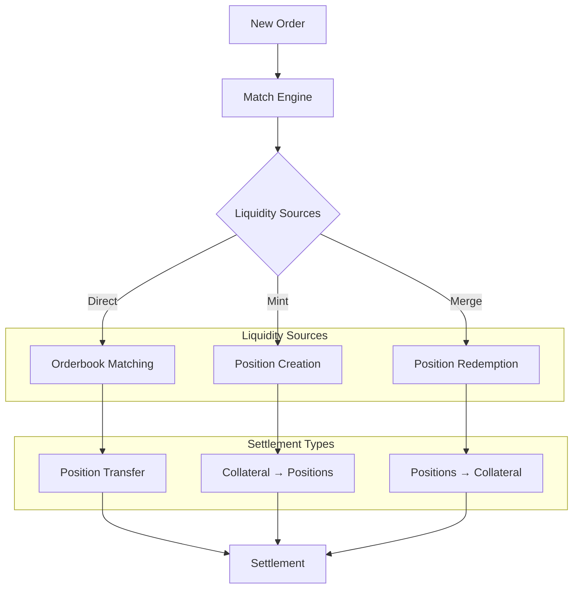
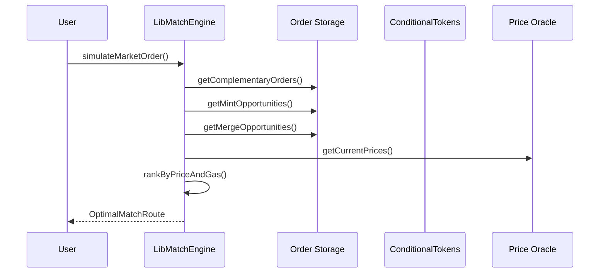
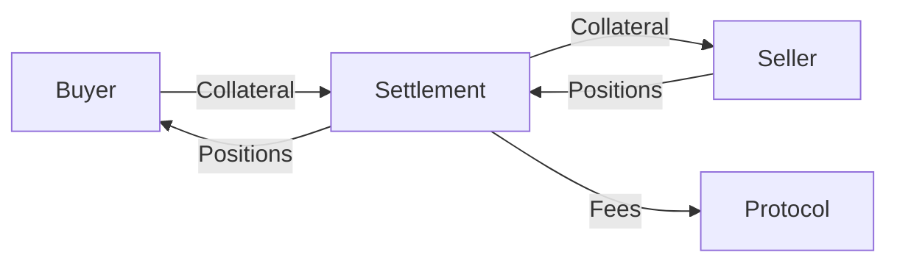
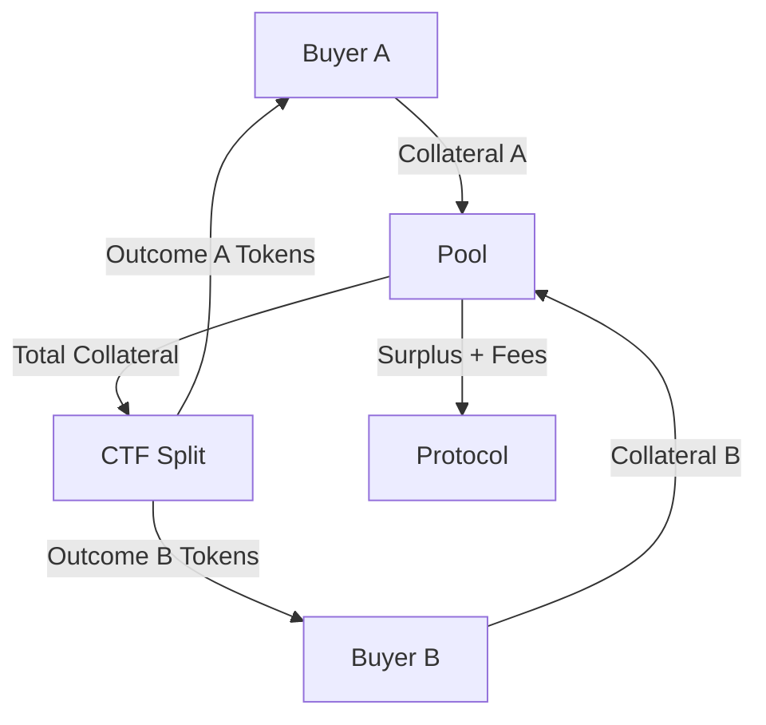
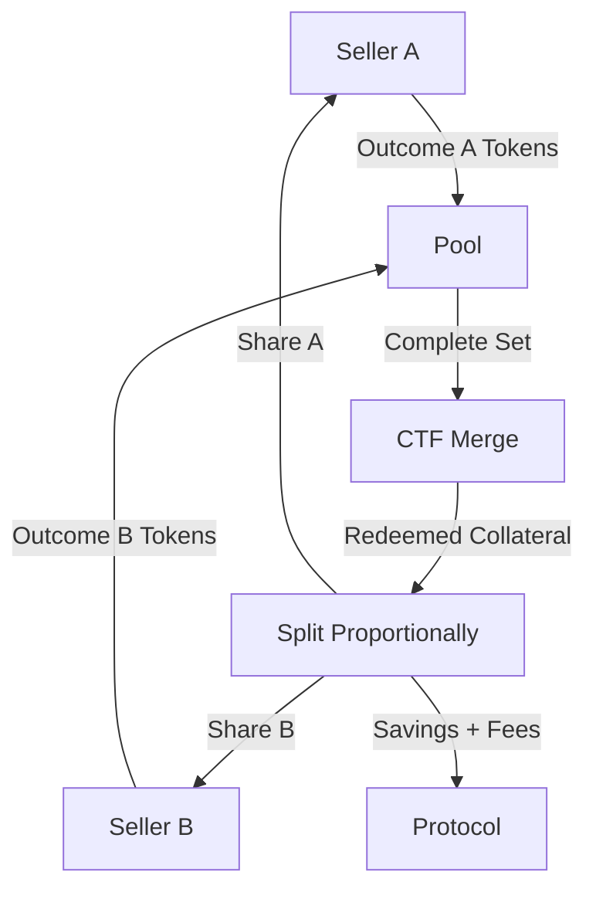
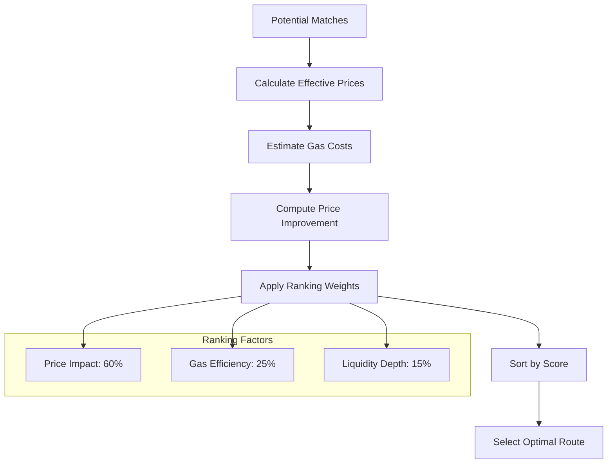
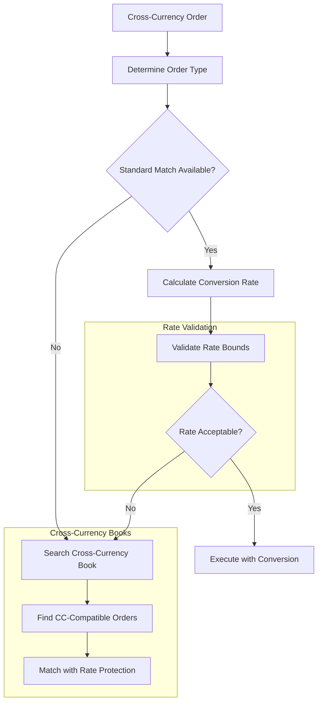

# Matching Mechanisms

This document explains the sophisticated matching engine in Doefin V2, which efficiently discovers and executes optimal trades across multiple liquidity sources including direct order matching, conditional token minting, and position merging.

## Overview

The Doefin V2 matching engine operates on three core principles:
1. **Multi-Source Liquidity** - Matches orders against orderbook, mint opportunities, and merge opportunities
2. **Optimal Price Discovery** - Finds the best execution path for each trade
3. **Gas Efficiency** - Minimizes on-chain operations through intelligent batching



## Core Matching Engine Architecture

The matching engine is implemented in [`LibMatchEngine`](../contracts/libraries/LibMatchEngine.sol) with the following key components:

### 1. Match Types

```solidity  
enum MatchType {
    Complementary, // Direct order-to-order matching
    Mint,         // Creating new positions via CTF split
    Merge         // Redeeming positions via CTF merge
}
```

### 2. Liquidity Discovery

The engine searches for matches across multiple sources simultaneously:



## Matching Algorithm Deep Dive

### 1. Complementary Matching

**Use Case**: Direct trading between orders on the same outcome with opposite directions.

**Example**: 
- Order A: Buy 100 "Bitcoin Above $100K" tokens at $0.60
- Order B: Sell 50 "Bitcoin Above $100K" tokens at $0.58
- **Match**: 50 tokens at $0.59 (average or taker price)

```solidity
function findComplementaryMatches(
    uint256 positionId,
    OrderDirection direction,
    uint256 maxAmount
) internal view returns (uint256[] memory matchingOrders) {
    
    LibDoefinStorage.AppStorage storage ds = LibDoefinStorage.appStorage();
    
    if (direction == OrderDirection.Buy) {
        // Find sell orders for the same position
        uint256[] storage sellOrders = ds.orderbookStorage.sellOrderIdsByPosition[positionId];
        return _filterCompatibleOrders(sellOrders, maxAmount);
    } else {
        // Find buy orders for the same position  
        uint256[] storage buyOrders = ds.orderbookStorage.buyOrderIdsByPosition[positionId];
        return _filterCompatibleOrders(buyOrders, maxAmount);
    }
}
```

**Settlement Process**:


### 2. Mint Matching

**Use Case**: Creating new position tokens when complementary demand exists.

**Example**:
- Order A: Buy 100 "Bitcoin Above $100K" tokens at $0.60
- Order B: Buy 100 "Bitcoin Below $100K" tokens at $0.45
- **Total Price**: $1.05 > $1.00
- **Mint Opportunity**: Split 100 USDC → 100 each of both outcomes
- **Settlement**: Each buyer gets their desired outcome

```solidity
function findMintOpportunities(
    uint256 positionId,
    OrderDirection direction,
    uint256 maxAmount
) internal view returns (uint256[] memory mintableOrders) {
    
    // Find the sibling position (complementary outcome)
    uint256 siblingPositionId = LibPositionRegistry.getSiblingPosition(positionId);
    
    if (direction == OrderDirection.Buy) {
        // Look for buy orders on the sibling position
        return ds.orderbookStorage.buyOrderIdsByPosition[siblingPositionId];
    } else {
        // For sell orders, look for sell orders on sibling (rare case)
        return ds.orderbookStorage.sellOrderIdsByPosition[siblingPositionId];
    }
}
```

**Economic Logic**:
```solidity
function validateMintProfitability(
    Order memory orderA,
    Order memory orderB,
    uint256 collateralUnit
) internal pure returns (bool profitable, uint256 surplus) {
    
    uint256 totalPrice = orderA.pricePerToken + orderB.pricePerToken;
    
    if (totalPrice > collateralUnit) {
        // Profitable mint - buyers willing to pay more than cost
        profitable = true;
        surplus = totalPrice - collateralUnit;
    } else {
        profitable = false;
        surplus = 0;
    }
}
```

**Settlement Process**:


### 3. Merge Matching

**Use Case**: Redeeming complementary positions back to collateral.

**Example**:
- Order A: Sell 100 "Bitcoin Above $100K" tokens at $0.65
- Order B: Sell 100 "Bitcoin Below $100K" tokens at $0.30  
- **Total Received**: $0.95 < $1.00
- **Merge Opportunity**: Combine outcomes → redeem 100 USDC
- **Settlement**: Each seller gets proportional collateral

```solidity
function findMergeOpportunities(
    uint256 positionId,
    OrderDirection direction,
    uint256 maxAmount
) internal view returns (uint256[] memory mergeableOrders) {
    
    uint256 siblingPositionId = LibPositionRegistry.getSiblingPosition(positionId);
    
    if (direction == OrderDirection.Sell) {
        // Look for sell orders on the sibling position
        return ds.orderbookStorage.sellOrderIdsByPosition[siblingPositionId];
    } else {
        // For buy orders, look for buy orders on sibling (rare case)
        return ds.orderbookStorage.buyOrderIdsByPosition[siblingPositionId];  
    }
}
```

**Economic Logic**:
```solidity
function validateMergeProfitability(
    Order memory orderA,
    Order memory orderB,
    uint256 collateralUnit
) internal pure returns (bool profitable, uint256 savings) {
    
    uint256 totalPayouts = orderA.pricePerToken + orderB.pricePerToken;
    
    if (totalPayouts < collateralUnit) {
        // Profitable merge - sellers accept less than redemption value
        profitable = true;
        savings = collateralUnit - totalPayouts;
    } else {
        profitable = false;
        savings = 0;
    }
}
```

**Settlement Process**:


## Price Discovery and Ranking

### Multi-Criteria Optimization

The matching engine ranks potential matches using multiple criteria:

```solidity
struct MatchCandidate {
    uint256 orderId;
    MatchType matchType;
    uint256 effectivePrice;    // Price after considering all costs
    uint256 gasEstimate;       // Estimated gas cost
    uint256 liquidity;         // Available amount
    uint256 priceImprovement;  // Benefit vs worst case
}
```

### Ranking Algorithm



### Effective Price Calculation

Different match types have different cost structures:

```solidity
function calculateEffectivePrice(
    MatchCandidate memory candidate,
    uint256 fillAmount,
    uint256 collateralUnit
) internal view returns (uint256) {
    
    if (candidate.matchType == MatchType.Complementary) {
        // Direct match - only trading fees
        return candidate.price + calculateTradingFees(fillAmount);
        
    } else if (candidate.matchType == MatchType.Mint) {
        // Mint match - includes minting costs and fees
        uint256 mintingFee = calculateMintingFee(fillAmount);
        uint256 tradingFee = calculateTradingFees(fillAmount);
        return candidate.price + mintingFee + tradingFee;
        
    } else { // Merge
        // Merge match - includes redemption costs
        uint256 redemptionFee = calculateRedemptionFee(fillAmount);
        return candidate.price - redemptionFee; // Negative cost = better price
    }
}
```

## Order Book Structure and Storage

### Sorted Order Lists

Orders are maintained in price-sorted lists for efficient discovery:

```solidity
struct OrderbookStorage {
    // Buy orders sorted by price (highest first)
    mapping(uint256 => uint256[]) buyOrderIdsByPosition;  // positionId => orderIds[]
    
    // Sell orders sorted by price (lowest first)  
    mapping(uint256 => uint256[]) sellOrderIdsByPosition; // positionId => orderIds[]
    
    // Order details
    mapping(uint256 => Order) orders;                     // orderId => Order
    
    // Cross-currency order data
    mapping(uint256 => CrossCurrencyData) crossCurrencyData; // orderId => CCData
    
    uint256 nextOrderId;
}
```

### Insertion and Maintenance

```solidity
function _insertSorted(Order memory order) internal {
    LibDoefinStorage.AppStorage storage ds = LibDoefinStorage.appStorage();
    
    uint256[] storage orderList = (order.direction == OrderDirection.Buy)
        ? ds.orderbookStorage.buyOrderIdsByPosition[order.positionId]
        : ds.orderbookStorage.sellOrderIdsByPosition[order.positionId];
    
    // Binary search for insertion point
    uint256 insertIndex = _findInsertionIndex(orderList, order.pricePerToken, order.direction);
    
    // Insert maintaining sort order
    orderList.push(order.orderId);
    for (uint256 i = orderList.length - 1; i > insertIndex; i--) {
        orderList[i] = orderList[i - 1];
    }
    orderList[insertIndex] = order.orderId;
}
```

## Cross-Currency Matching

### Enhanced Discovery for Cross-Currency Orders

Cross-currency orders require additional matching logic to handle exchange rates:



### Rate-Aware Matching

```solidity
function findCrossCurrencyMatches(
    uint256 orderId,
    CrossCurrencyData memory ccData,
    OrderType orderType
) internal view returns (uint256[] memory matches) {
    
    Order storage takerOrder = ds.orderbookStorage.orders[orderId]; 
    
    // Get current exchange rate
    uint256 currentRate = LibQuoteCurrency.getExchangeRate(
        ccData.quoteCurrencyToken,
        takerOrder.collateralToken
    );
    
    // Apply floor rate protection for Dynamic orders
    uint256 effectiveRate = (orderType == OrderType.Dynamic)
        ? _applyFloorRate(currentRate, ccData.floorRate, takerOrder.direction)
        : currentRate;
    
    // Find compatible orders considering exchange rates
    return _findRateCompatibleOrders(takerOrder, effectiveRate);
}
```

## Gas Optimization Strategies

### Batch Execution

The matching engine optimizes gas usage through intelligent batching:

```solidity
function executeBatchedMatches(
    Order memory takerOrder,
    MatchCandidate[] memory candidates
) internal {
    
    // Group matches by type for batch processing
    uint256[] memory complementaryMatches;
    uint256[] memory mintMatches;
    uint256[] memory mergeMatches;
    
    (complementaryMatches, mintMatches, mergeMatches) = _groupByMatchType(candidates);
    
    // Execute each group in batch
    if (complementaryMatches.length > 0) {
        _batchComplementarySettlement(takerOrder, complementaryMatches);
    }
    
    if (mintMatches.length > 0) {
        _batchMintSettlement(takerOrder, mintMatches);
    }
    
    if (mergeMatches.length > 0) {
        _batchMergeSettlement(takerOrder, mergeMatches);
    }
}
```

### Position Registry Optimization

The position registry enables O(1) lookups for position relationships:

```solidity
struct PositionRegistryStorage {
    // Position metadata
    mapping(uint256 => PositionToken) positionTokens;      // positionId => tokenInfo
    
    // Market relationships  
    mapping(uint256 => bytes32) marketKeyByPositionId;     // positionId => marketKey
    mapping(bytes32 => Market) marketsByKey;               // marketKey => marketInfo
    
    // Sibling position lookups (for mint/merge detection)
    mapping(uint256 => uint256) siblingPositions;          // positionId => siblingId
    
    // Collection hierarchy (for CTF operations)
    mapping(uint256 => uint256) positionToCollectionId;    // positionId => collectionId
}
```

## Market Order Simulation

### Pre-Execution Analysis

Before executing market orders, the engine simulates the full execution path:

```solidity
function simulateMarketOrder(
    uint256 positionId,         // Target position to trade
    uint256 sharesOrBudgetAmount, // Amount to trade or budget to spend
    OrderDirection direction,   // Buy or Sell  
    CrossCurrencyData memory crossCurrencyData // CC configuration
) internal view returns (MatchOrderRoute memory route) {
    
    // Initialize simulation context
    SimulationContext memory simCtx = _createSimulationContext(
        positionId, 
        direction, 
        sharesOrBudgetAmount,
        crossCurrencyData
    );
    
    // Discover all available liquidity sources
    _discoverLiquiditySources(simCtx);
    
    // Simulate execution against each source
    return _simulateOptimalExecution(simCtx);
}
```

### Route Optimization

The simulation returns detailed execution information:

```solidity
struct MatchOrderRoute {
    Match[] matches;            // Ordered list of matches to execute
    uint256 totalInputAmount;   // Total input required
    uint256 totalOutputAmount;  // Total output received
    uint256 totalFees;          // Total fees paid
    uint256 gasEstimate;        // Estimated gas cost
    uint256 averagePrice;       // Volume-weighted average price
    uint256 priceImpact;        // Price impact percentage
}
```

### Slippage Protection

```solidity
function validateSlippageTolerance(
    MatchOrderRoute memory route,
    uint256 maxSlippageBps      // Maximum acceptable slippage in basis points
) internal pure returns (bool) {
    
    if (route.matches.length == 0) return false;
    
    // Calculate price impact
    uint256 priceImpactBps = (route.priceImpact * 10000) / 1e18;
    
    return priceImpactBps <= maxSlippageBps;
}
```

## Advanced Matching Scenarios

### Multi-Leg Arbitrage Detection

The engine can detect and execute arbitrage opportunities:

```mermaid
graph TD
    A[Market Scan] --> B[Price Inconsistency Detected]
    B --> C[Calculate Arbitrage Path]
    C --> D{Profitable After Fees?}
    D -->|Yes| E[Execute Multi-Leg Trade]
    D -->|No| F[Continue Scanning]
    
    E --> G[Buy Underpriced Outcome]
    G --> H[Sell Overpriced Complement]
    H --> I[Capture Price Difference]
    
    subgraph "Example"
        J["'Yes' @ $0.40"]
        K["'No' @ $0.55"]  
        L[="Total: $0.95 < $1.00"]
    end
```

### Liquidity Fragmentation Handling

When orders can't be filled by a single match, the engine discovers optimal combinations:

```solidity
function handleFragmentedLiquidity(
    Order memory takerOrder,
    uint256 remainingAmount
) internal view returns (MatchCandidate[] memory) {
    
    MatchCandidate[] memory allCandidates = _discoverAllMatches(takerOrder);
    
    // Use dynamic programming to find optimal combination
    return _findOptimalCombination(allCandidates, remainingAmount);
}
```

### Cross-Market Matching

For conditions with multiple collateral markets:

```solidity
function findCrossMarketMatches(
    uint256 positionId,
    address preferredCollateral
) internal view returns (uint256[] memory) {
    
    bytes32 conditionId = LibPositionRegistry.getConditionId(positionId);
    
    // Find all markets for this condition
    address[] memory collateralTokens = _getMarketCollaterals(conditionId);
    
    uint256[] memory crossMarketMatches;
    
    for (uint256 i = 0; i < collateralTokens.length; i++) {
        if (collateralTokens[i] != preferredCollateral) {
            // Find matches in alternate collateral markets
            uint256 altPositionId = _getPositionInMarket(conditionId, collateralTokens[i]);
            uint256[] memory altMatches = _findMatchesInMarket(altPositionId);
            crossMarketMatches = _mergeArrays(crossMarketMatches, altMatches);
        }
    }
    
    return crossMarketMatches;
}
```

## Performance Metrics and Monitoring

### Matching Efficiency Metrics

```solidity
struct MatchingMetrics {
    uint256 totalOrdersMatched;      // Total successful matches
    uint256 averageMatchTime;        // Average time to find matches
    uint256 liquidityUtilization;    // Percentage of available liquidity used
    uint256 arbitrageOpportunities;  // Number of arbitrage trades executed
    uint256 gasEfficiencyScore;      // Gas used vs optimal theoretical minimum
}
```

### Quality of Execution Tracking

```typescript
interface ExecutionQuality {
  orderId: string;
  requestedAmount: BigNumber;
  filledAmount: BigNumber;
  fillRatio: number; // Percentage filled
  averagePrice: BigNumber;
  benchmarkPrice: BigNumber; // Mid-market at order time
  priceImprovement: number; // Basis points vs benchmark
  executionTime: number; // Milliseconds
  gasUsed: number;
}
```

This sophisticated matching mechanism enables efficient price discovery and optimal execution while maintaining low gas costs and high liquidity utilization across all market conditions.