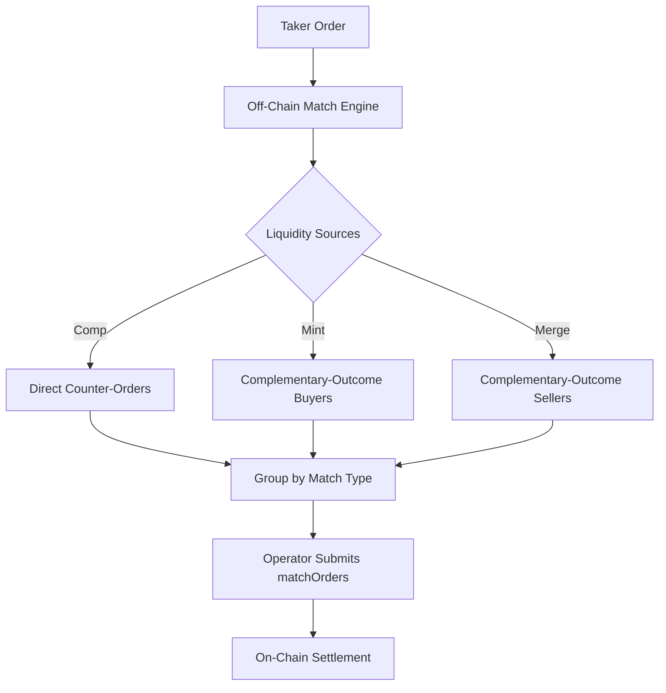
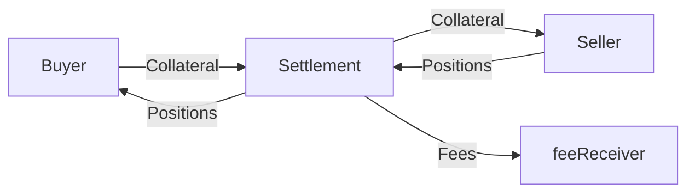
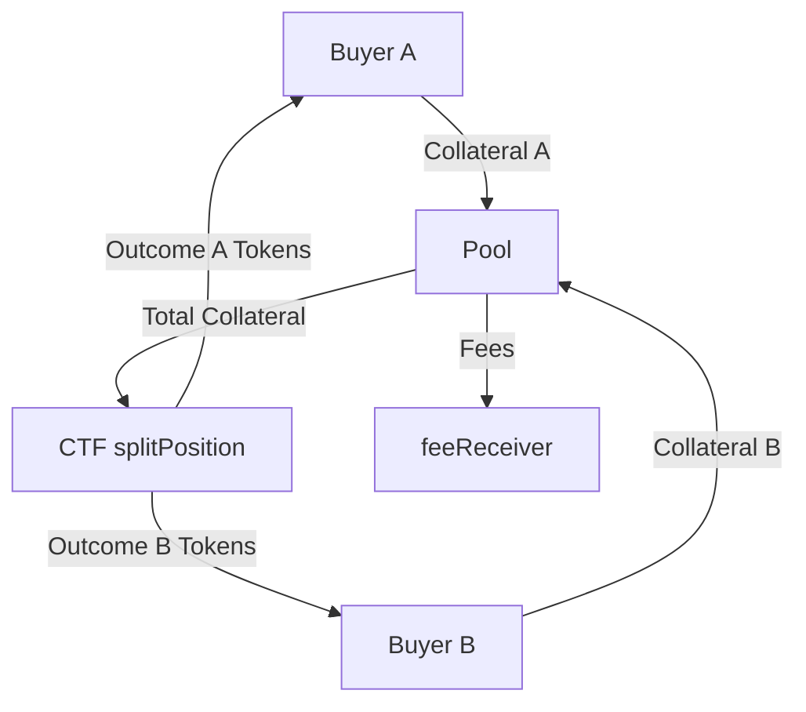
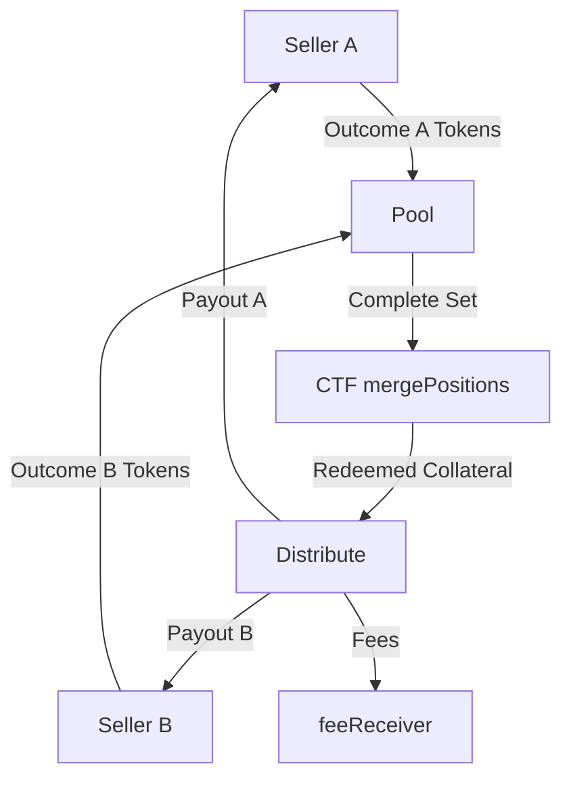

# Matching Mechanisms

This document explains how orders are matched in Doefin V3. Matching happens **off-chain**;
the resulting matched groups are settled **on-chain** by the authorized operator. There is
no on-chain matching engine in v3 — the v2.0 `LibMatchEngine` and the on-chain orderbook
have been removed.

## Overview

The off-chain match engine operates on three principles:

1. **Multi-source liquidity** — a taker can be filled against direct counter-orders
   (Complementary), against complementary-outcome buyers (Mint), or against
   complementary-outcome sellers (Merge).
2. **1:many grouping** — one taker is grouped against multiple makers so a large order
   fills in a single on-chain transaction.
3. **Effective-price priority** — all candidate makers are ranked by effective price so
   the cheapest fills are taken first; price improvement flows to the taker.



## Match Types

```solidity
// SettlementFacet match-type constants
uint8 internal constant MATCH_COMPLEMENTARY = 1;
uint8 internal constant MATCH_MINT          = 2;
uint8 internal constant MATCH_MERGE         = 3;
```

The match type is determined **per maker** by the settlement contract. A single
`matchOrders()` call **can settle one taker against a mix of these match types** — the
maker list passed to `matchOrders()` may contain makers of different match types, and the
contract routes each leg independently.

## The Effective-Price Abstraction

Every match type reduces to a single abstraction. With `unit` = collateral units per
complete outcome pair:

| Taker side | Match type | Maker order | Effective price / return |
|-----------|-----------|-------------|--------------------------|
| BUY YES | Complementary | SELL YES @ P_m | P_m |
| BUY YES | Mint | BUY NO @ P_m | unit - P_m |
| SELL YES | Complementary | BUY YES @ P_m | P_m |
| SELL YES | Merge | SELL NO @ P_m | unit - P_m |

Crossing condition (the same rule for all match types):

- **BUY**: `effective_price <= taker.pricePerToken`
- **SELL**: `effective_return >= taker.pricePerToken`

`pricePerToken` is the only enforcement bound the matcher needs: the maximum average price
for a BUY, or the minimum average return for a SELL.

## The 1:Many Walk

```
Input:  taker order (pricePerToken = P_t, amount = Q, side = BUY or SELL)
Output: one or more match groups (one per match type, each with multiple makers)

1. Gather all crossing makers across the relevant match types:

   BUY taker:
     Complementary: SELL YES makers where P_m <= P_t      -> effective = P_m
     Mint:          BUY NO   makers where P_m >= unit-P_t -> effective = unit - P_m

   SELL taker:
     Complementary: BUY YES  makers where P_m >= P_t      -> effective = P_m
     Merge:         SELL NO  makers where P_m <= unit-P_t -> effective = unit - P_m

2. Sort all candidates together by effective price ascending (BUY) or
   effective return descending (SELL). Break ties by created_at ascending.

3. Walk the sorted list:
   - fill_i = min(taker_remaining, maker_i_remaining)
   - Accumulate makers into per-match-type lists
   - taker_remaining -= fill_i
   - Stop when taker_remaining == 0 or the list is exhausted

4. Emit a match group per match type that received fills. The operator can submit
   makers of mixed match types in a single matchOrders call.

VWAP invariant: since every effective_price <= P_t (BUY) or >= P_t (SELL),
any weighted average also satisfies the bound. No separate VWAP check is needed.
```

There is no minimum-fill enforcement: the last partial fill of a walk is legitimately
allowed to be small.

## Settlement Per Match Type

### Complementary

Direct trade on the same outcome. The buyer pays collateral and receives positions; the
seller delivers positions and receives collateral. Settled at the maker's `pricePerToken`.



### Mint

Two buyers of complementary outcomes pool collateral; the contract calls CTF
`splitPosition` to mint a complete outcome set and distributes one outcome to each party.



The maker pays exactly `maker.pricePerToken`; the taker pays the effective price
`unit - maker.pricePerToken`. A 1-wei integer-division rounding surplus flows to the
taker by construction.

### Merge

Two sellers of complementary outcomes deliver position tokens; the contract calls CTF
`mergePositions` to redeem a complete set back to collateral and distributes the proceeds.



The maker receives exactly `maker.pricePerToken`; the taker receives the remainder
`unit - maker.pricePerToken`.

## Worked Example — Mixed Complementary + Mint

**Taker:** BUY YES at `P_t = 600,000`, amount = 2,000,000 tokens, `unit = 1,000,000`.

| Maker | Type | P_m | Effective price | Available |
|-------|------|-----|-----------------|-----------|
| A | Comp (SELL YES) | 520,000 | 520,000 | 500,000 |
| B | Mint (BUY NO) | 470,000 | 530,000 | 800,000 |
| C | Comp (SELL YES) | 560,000 | 560,000 | 700,000 |

Walk (effective price ascending):

| Step | Maker | Fill | Taker pays |
|------|-------|------|------------|
| 1 | A (Comp, 520k) | 500,000 | 260,000 |
| 2 | B (Mint, eff 530k) | 800,000 | 424,000 |
| 3 | C (Comp, 560k) | 700,000 | 392,000 |

Total: 2,000,000 YES tokens for 1,076,000 collateral — average 538,000 per token, below
the 600,000 ceiling. Makers A and C are Complementary, maker B is Mint. The operator can
submit this taker with a maker list mixing both match types in one `matchOrders` call;
the contract routes each leg by its match type.

For more worked examples (mixed Complementary + Merge, partial fills, race-condition
handling) see `docs/proposal-budget-model-and-1-to-many-matching-v1.2.md`.

## Why Off-Chain Matching

- **Gas-free order placement** — users sign orders off-chain; no transaction is needed to
  post or cancel an order.
- **Rich matching logic** — the off-chain engine can run cross-type sorting and 1:many
  grouping without on-chain gas constraints.
- **Trustless settlement** — although matching is off-chain, every order is EIP-712
  signed, and the contract independently re-verifies signatures, order validity, fill
  caps, and the fee ceiling before any transfer. The operator cannot fabricate fills or
  overcharge fees.
