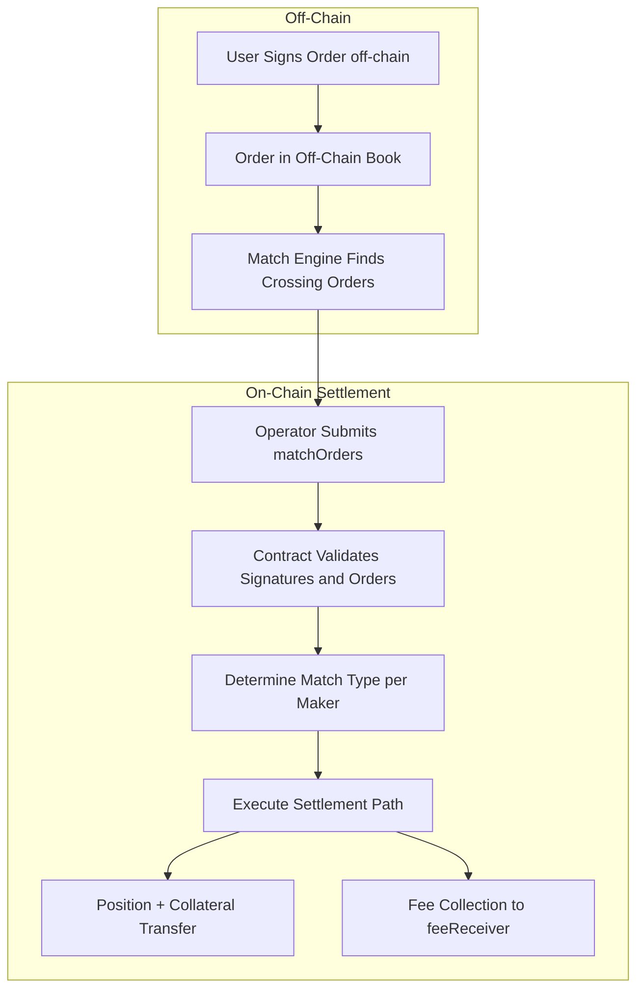
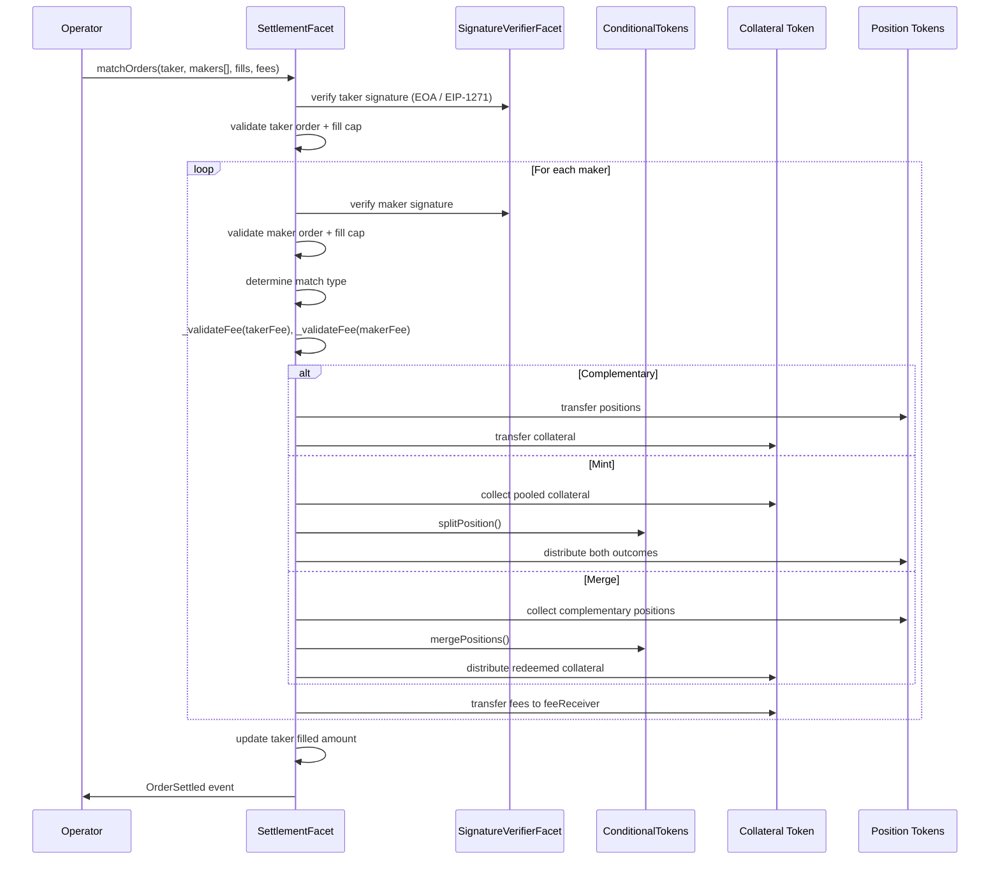

# Order Lifecycle Flow

This document explains the complete lifecycle of orders in Doefin V3, which uses an
**off-chain orderbook with on-chain settlement** (the Polymarket hybrid model).

## Overview

The order lifecycle has three stages:

1. **Order Creation** — a user signs an order off-chain (EIP-712). No collateral is locked.
2. **Order Matching** — the off-chain match engine finds crossing orders and groups one
   taker against one or more makers.
3. **On-Chain Settlement** — the authorized operator submits the matched orders to the
   Diamond, which validates and atomically settles them.



## Stage 1: Order Creation (Off-Chain)

Orders are **never created on-chain**. A user signs a `DoefinOrder` struct using EIP-712
and submits the signed payload to the off-chain orderbook service.

### The DoefinOrder Struct

`DoefinOrder` is defined in `contracts/libraries/LibDoefinOrder.sol` and has **10 fields**:

```solidity
struct DoefinOrder {
    uint256 salt;            // Uniqueness salt
    address maker;           // SCW (Safe) address holding funds
    address signer;          // EOA that signed the order
    bytes32 positionId;      // CTF ERC1155 position ID
    address collateralToken; // ERC20 collateral token
    uint8   side;            // 0 = BUY, 1 = SELL
    uint128 amount;          // Total outcome tokens to trade
    uint128 pricePerToken;   // Price per outcome token, in collateral units
    uint64  expiration;      // Expiry timestamp (0 = no expiry)
    uint256 nonce;           // Maker nonce for bulk cancellation
}
```

The fields `minFillAmount`, `orderType`, `quoteCurrency`, `exchangeRate`, and `feeRateBps`
that existed in the old 15-field struct have been removed. `signature` and
`signatureType` are NOT part of the struct hash — they are passed alongside the order as
separate function parameters.

### EIP-712 Domain

```
EIP712Domain("Doefin Exchange", "3", chainId, diamondAddress)
```

The domain separator is recomputed against the current `block.chainid` so a chain fork
cannot leave stale signatures valid.

### Order Parameters

- **`pricePerToken`** — the maker's signed commitment: the price per outcome token in
  collateral units. For a BUY this is the maximum price; for a SELL the minimum return.
- **`amount`** — the total outcome tokens the order is willing to trade.
- **`expiration`** — a UNIX timestamp; `0` means no expiry.
- **`nonce`** — used by `NonceManagerFacet` for bulk cancellation.

There is no on-chain order-type field. There is no on-chain minimum-fill enforcement.

### Fees Are Not Signed

Trading fees are **not** part of the signed order. The off-chain operator computes the fee
(a symmetric bell-curve formula, `fee ∝ min(price, 1-price) * fillAmount`) and supplies the
per-leg fee amount at settlement time. The contract enforces only an admin-set ceiling
(see Stage 3).

## Stage 2: Order Matching (Off-Chain)

The off-chain match engine discovers crossing orders and groups one taker against one or
more makers. For each maker it determines the settlement match type:

- **Complementary** — taker and maker trade the same outcome on opposite sides.
- **Mint** — taker BUY A vs maker BUY B (complementary outcomes), settled by minting both
  outcomes from pooled collateral via CTF `splitPosition`.
- **Merge** — taker SELL A vs maker SELL B (complementary outcomes), settled by merging a
  complete set back to collateral via CTF `mergePositions`.

A single match group can contain **a mix of match types** — see
`MATCHING_MECHANISMS.md` for the matching algorithm and worked examples.

### Crossing Rule

Using `unit` as the collateral units per complete outcome pair:

- **BUY taker**: a maker is crossing when `effective_price <= taker.pricePerToken`.
- **SELL taker**: a maker is crossing when `effective_return >= taker.pricePerToken`.

Where the effective price/return per match type is:

| Taker side | Match type | Maker order | Effective price/return |
|-----------|-----------|-------------|------------------------|
| BUY | Complementary | SELL same outcome @ P_m | P_m |
| BUY | Mint | BUY complement @ P_m | unit - P_m |
| SELL | Complementary | BUY same outcome @ P_m | P_m |
| SELL | Merge | SELL complement @ P_m | unit - P_m |

## Stage 3: On-Chain Settlement

The authorized operator submits matched orders to `SettlementFacet`. There are two entry
points:

- **`matchOrders()`** — settle one taker against one or more makers.
- **`fillOrder()`** — settle a single order leg.

Both are `onlyOperator`, `notPaused`, and `nonReentrant`.

### matchOrders Signature

```solidity
function matchOrders(
    LibDoefinOrder.DoefinOrder calldata takerOrder,
    bytes calldata takerSignature,
    uint8 takerSignatureType,
    LibDoefinOrder.DoefinOrder[] calldata makerOrders,
    bytes[] calldata makerSignatures,
    uint8[] calldata makerSignatureTypes,
    uint128 takerFillAmount,
    uint128[] calldata makerFillAmounts,
    uint128[] calldata takerFees,
    uint128[] calldata makerFees
) external onlyOperator notPaused nonReentrant;
```

`takerFees` and `makerFees` are the operator-supplied per-leg fee amounts (one entry per
maker order).

### Settlement Process



### Validation

For the taker once, and for every maker:

- **Signature** — EIP-712 hash verified via `ecrecover` (EOA) or EIP-1271 (SCW).
- **Order validity** — collateral token on the allow-list, non-zero `unit`,
  `pricePerToken <= unit`, not expired, not cancelled.
- **Fill cap** — the new fill must not overfill the order's remaining capacity.
- **Aggregate invariant** — `sum(makerFillAmounts) == takerFillAmount`.

### Fee Enforcement

The fee is operator-supplied. `SettlementFacet._validateFee` enforces, for each leg:

```
fee <= cashValue * maxFeeRateBps / 10000
fee <= proceeds
```

- `maxFeeRateBps` is the admin-set ceiling (`AdminConfigFacet.setMaxFeeRate`), bounded by
  the hard constant `MAX_FEE_RATE_BPS_CAP = 1000` (10%).
- The check is **fail-closed**: a `maxFeeRateBps` of 0 forbids any non-zero fee.
- Fees go to the admin-configurable `feeReceiver`, never to the operator.

## Settlement Paths

### 1. Complementary Settlement

Taker and maker trade the same outcome on opposite sides. The buyer pays collateral and
receives position tokens; the seller delivers positions and receives collateral. The fill
price is the maker's `pricePerToken`. Each party's own fee is transferred to `feeReceiver`
from their side of the trade.

### 2. Mint Settlement

Taker BUY A vs maker BUY B, where A and B are complementary outcomes of one condition.
Both parties contribute collateral; the contract calls CTF `splitPosition` to mint a
complete outcome set, then distributes outcome A to the taker and outcome B to the maker.
The maker pays exactly their committed price; the taker pays the effective price
`unit - maker.pricePerToken`, so price improvement flows to the taker.

### 3. Merge Settlement

Taker SELL A vs maker SELL B (complementary outcomes). Both parties deliver position
tokens; the contract calls CTF `mergePositions` to redeem the complete set back to
collateral, then distributes the proceeds. The maker receives exactly their committed
price; the taker receives the remainder `unit - maker.pricePerToken`.

## Order Cancellation

Because orders live off-chain, cancellation is a nonce / hash operation handled by
`NonceManagerFacet`:

- **`cancelOrder()`** — invalidates a specific signed order by its hash.
- **`cancelOrdersForPosition()`** — invalidates all of a maker's open orders for a
  position.
- **`incrementNonce()`** — bumps the maker nonce, invalidating every order signed under
  the previous nonce.

A cancelled order fails the order-validity check at settlement and reverts the leg.

## Error Conditions

Common settlement reverts (`Errors.sol`):

- `TradingIsPaused` — settlement is globally paused.
- `UnauthorizedOperator` — caller is not the authorized operator.
- `MismatchedInputLengths` — per-leg array lengths disagree, or the aggregate fill
  invariant fails.
- `InvalidOrderSignature` — signature does not recover to the order signer.
- `OrderCancelled` — the order was cancelled off-chain.
- `OrderOverfilled` — the requested fill exceeds remaining capacity.
- `InvalidMatch` — the match type or crossing condition is invalid.
- `ZeroAmount` — a fill amount is zero.
- `FeeExceedsMaxRate` — an operator-supplied fee exceeds the admin ceiling.
- `FeeExceedsProceeds` — a fee exceeds the leg's proceeds.

This lifecycle gives users gas-free order creation and cancellation while keeping
settlement fully trustless and atomic on-chain.
