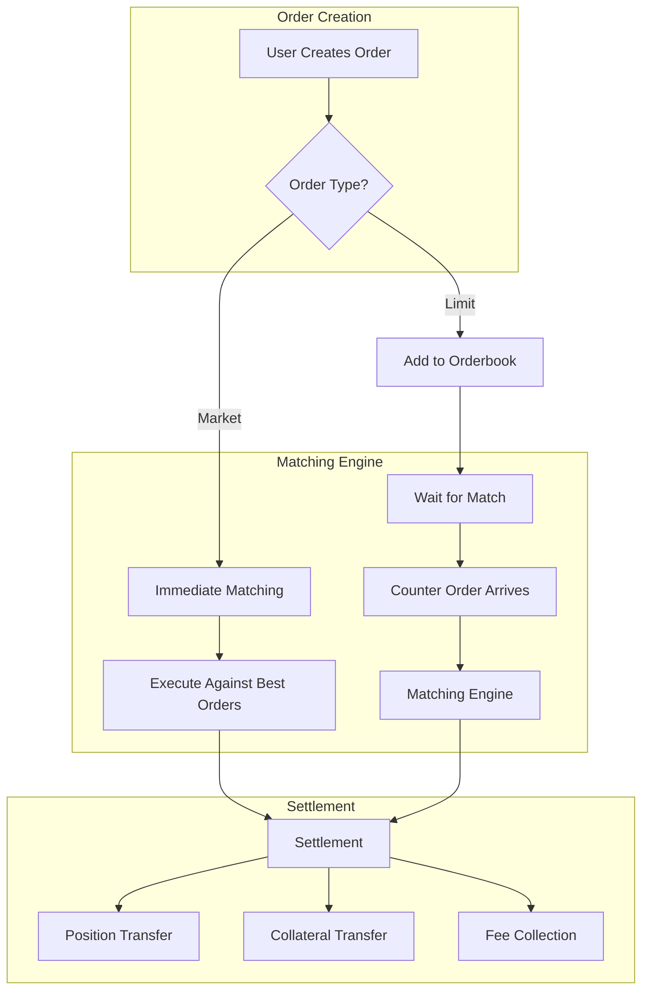
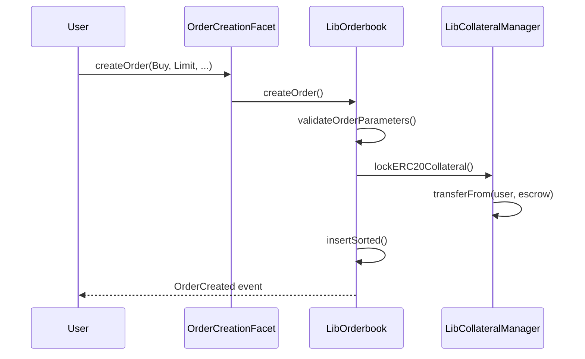
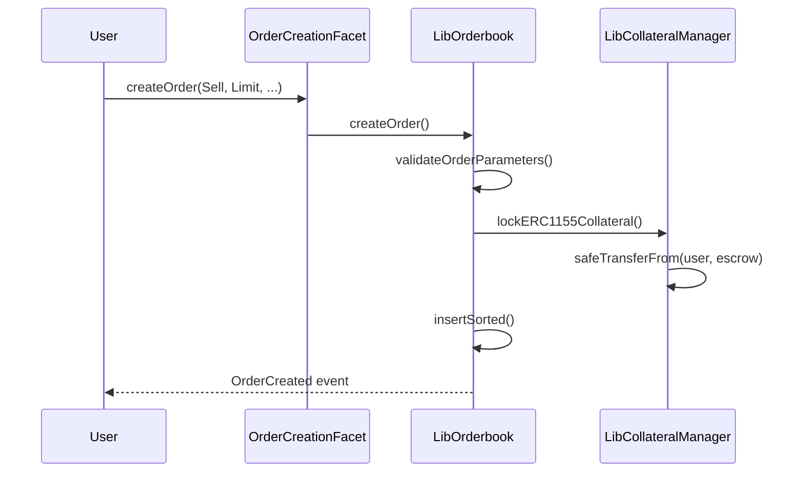
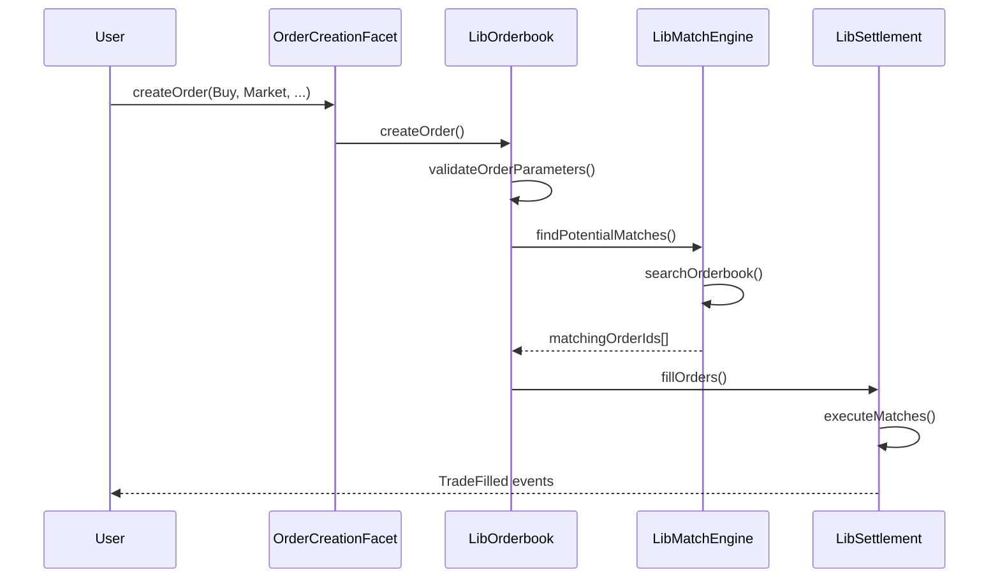
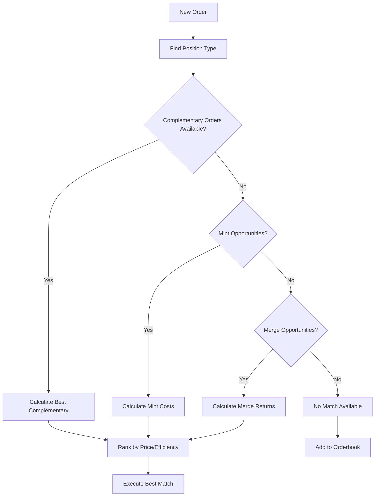
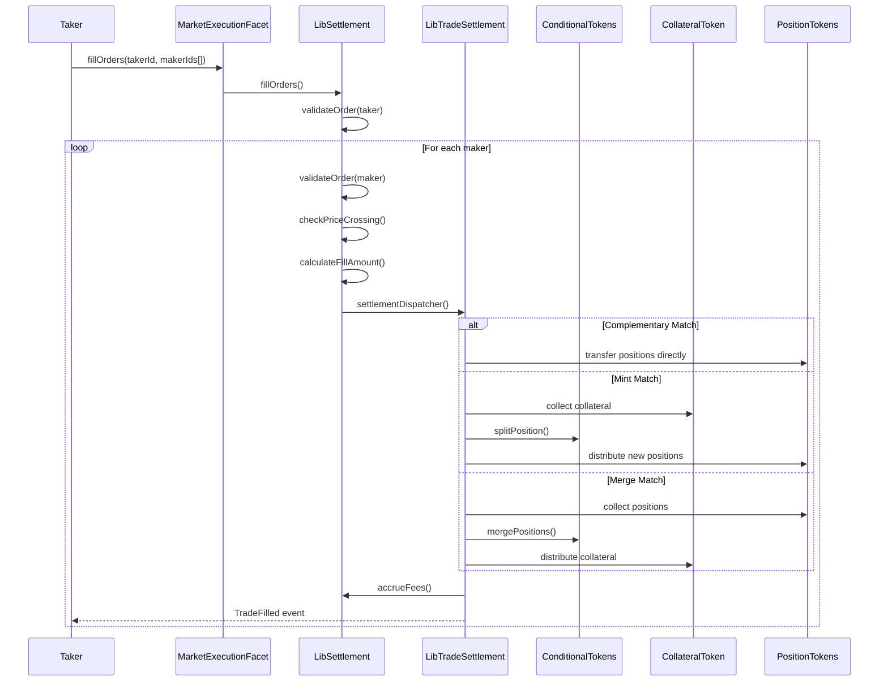
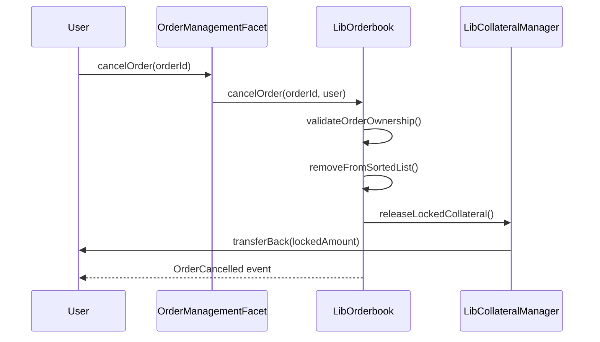

# Order Lifecycle Flow

This document explains the complete lifecycle of orders in Doefin V2, covering both limit and market orders from creation through execution to settlement.

## Overview

The order lifecycle consists of three main stages:
1. **Order Creation** - Users create limit or market orders with specific parameters
2. **Order Matching** - The matching engine finds compatible opposing orders
3. **Order Settlement** - Positions and collateral are transferred to complete trades



## Stage 1: Order Creation

### Entry Points
- **Limit Orders**: [`OrderCreationFacet.createOrder`](../contracts/facets/OrderCreationFacet.sol) with `ExecutionType.Limit`
- **Market Orders**: [`OrderCreationFacet.createOrder`](../contracts/facets/OrderCreationFacet.sol) with `ExecutionType.Market`

### Order Parameters

```solidity
function createOrder(
    uint256 positionId,           // ERC1155 token ID for the outcome position
    address collateralToken,      // ERC20 token used as collateral (USDC, WETH, etc.)
    uint256 amount,              // Total outcome tokens to trade
    uint256 pricePerToken,       // Price per outcome token in collateral units
    uint256 minFillAmount,       // Minimum fill size (0 = no minimum)
    uint32 expiry,              // Expiration timestamp (0 = no expiry)
    bool fillOrKill,            // Must fill completely or cancel
    OrderDirection direction,    // Buy or Sell
    ExecutionType executionType, // Market or Limit
    CrossCurrencyData memory crossCurrencyData // Cross-currency config
) external;
```

### Order Types

#### 1. Limit Orders
- **Purpose**: Passive orders that wait in the orderbook for matching
- **Collateral Handling**: Collateral is locked immediately upon creation
- **Gas Cost**: ~200,000-300,000 gas
- **Execution**: Added to sorted orderbook structure for efficient matching

**Buy Limit Order Process:**


**Sell Limit Order Process:**


#### 2. Market Orders
- **Purpose**: Immediate execution orders that match against existing orderbook
- **Collateral Handling**: Collateral validated but not pre-locked
- **Gas Cost**: ~300,000-800,000 gas (varies by number of matches)
- **Execution**: Immediately seeks matches via [`LibMatchEngine.findPotentialMatches`](../contracts/libraries/LibMatchEngine.sol)

**Market Order Process:**


### Order Validation

All orders undergo comprehensive validation in [`LibOrderbook.createOrder`](../contracts/libraries/LibOrderbook.sol):

```solidity
// Amount validation
if (amount < minFillAmount || amount == 0) revert InvalidAmounts();

// Expiry validation  
if (expiry != 0 && expiry <= block.timestamp) revert OrderCreatedWithPastExpiry();

// Price validation for standard orders
if (pricePerToken >= unitsPerPair || pricePerToken == 0) revert InvalidPrice();

// Token allowlist validation
if (unitsPerPair == 0) revert TokenNotAllowed();

// Cross-currency specific validation
if (orderType == OrderType.Dynamic) {
    if (LibQuoteCurrency.isOracleStale(quoteCurrencyToken, collateralToken)) {
        revert OraclePriceStale();
    }
}
```

### Collateral Management

#### Buy Orders
- **Standard**: Locks `amount * pricePerToken + fees` in collateral token
- **Cross-Currency**: Locks appropriate amount in quote currency based on order type

#### Sell Orders  
- **All Types**: Locks `amount` of position tokens (ERC1155)

### Fee Structure

Fees are determined at order creation and stored with each order:

```solidity
struct OrderFeeConfig {
    uint16 makerFeeBps;  // Fee for liquidity providers (typically lower)
    uint16 takerFeeBps;  // Fee for liquidity takers (typically higher)  
}
```

## Stage 2: Order Matching

### Matching Engine Architecture

The matching engine uses a sophisticated multi-source approach implemented in [`LibMatchEngine`](../contracts/libraries/LibMatchEngine.sol):

#### 1. Complementary Matching
- **Use Case**: Orders on opposite sides of the same outcome
- **Example**: Buy outcome A vs Sell outcome A  
- **Efficiency**: Direct position transfer, no CTF operations needed

#### 2. Mint Matching
- **Use Case**: Buy order vs compatible position that requires minting
- **Example**: Buy outcome A vs Sell outcome B (when A+B = complete set)
- **Process**: Uses CTF `splitPosition` to mint new tokens

#### 3. Merge Matching  
- **Use Case**: Sell order vs compatible position that allows merging
- **Example**: Sell outcome A vs Buy outcome B (when A+B = complete set)
- **Process**: Uses CTF `mergePositions` to redeem collateral

### Matching Algorithm



### Order Book Structure

Orders are stored in sorted lists for efficient matching:

```solidity
struct OrderbookStorage {
    // Sorted by price (ascending for buys, descending for sells)
    mapping(uint256 => uint256[]) buyOrderIdsByPosition;   // positionId => orderIds
    mapping(uint256 => uint256[]) sellOrderIdsByPosition;  // positionId => orderIds
    
    // Order details
    mapping(uint256 => Order) orders;                      // orderId => Order
    mapping(uint256 => CrossCurrencyData) crossCurrencyData; // orderId => CrossCurrencyData
    
    uint256 nextOrderId;
}
```

### Price Crossing Logic

Orders can only match when there's a price crossing:

- **Buy orders** match when `takerPrice >= makerPrice`
- **Sell orders** match when `takerPrice <= makerPrice`  
- **Cross-currency orders** require additional exchange rate validation

## Stage 3: Order Execution and Settlement

### Settlement Entry Point

All matches are settled through [`MarketExecutionFacet.fillOrders`](../contracts/facets/MarketExecutionFacet.sol):

```solidity
function fillOrders(uint256 takerId, uint256[] calldata makerIds) external;
```

### Settlement Process Flow



### Settlement Types

#### 1. Complementary Settlement
**When**: Orders on the same outcome with opposite directions
**Process**: Direct position token transfer with fee collection

```solidity
// Simplified complementary settlement
function _handleComplementaryMatch(SettlementExecutionContext memory ctx) internal {
    // Calculate fees
    (uint256 makerFee, uint256 takerFee) = LibFeeManager.computeComplementaryFees(ctx);
    
    // Transfer positions
    LibERC1155.safeTransferFromInternalPositions(
        ctx.makerOrder.maker, 
        ctx.takerOrder.maker, 
        ctx.takerOrder.positionId, 
        ctx.fillableAmount
    );
    
    // Collect fees and transfer collateral
    LibCollateralManager.transferCollateralWithFees(ctx, makerFee, takerFee);
}
```

#### 2. Mint Settlement
**When**: Orders require new position token creation
**Process**: Collect collateral, execute CTF split, distribute positions

```solidity
function _handleMintMatch(SettlementExecutionContext memory ctx) internal {
    // Calculate contributions and fees
    (uint256 makerFee, uint256 takerFee, uint256 makerContrib, uint256 takerContrib) = 
        LibFeeManager.computeMintFees(ctx.makerOrder, ctx.fillableAmount);
        
    // Collect total collateral needed
    uint256 totalCollateral = makerContrib + takerContrib;
    
    // Execute CTF split to mint positions
    LibCTFCondition.splitPosition(
        ctx.makerOrder.collateralToken,
        parentCollectionId,
        conditionId, 
        partition,
        totalCollateral
    );
    
    // Distribute newly minted positions to each party
    _distributePositionTokens(ctx);
}
```

#### 3. Merge Settlement
**When**: Orders allow merging positions back to collateral
**Process**: Collect positions, execute CTF merge, distribute collateral

```solidity
function _handleMergeMatch(SettlementExecutionContext memory ctx) internal {
    // Collect the complementary positions from both parties
    LibERC1155.burnPositionsForMerge(ctx);
    
    // Execute CTF merge to redeem collateral
    LibCTFCondition.mergePositions(
        ctx.makerOrder.collateralToken,
        parentCollectionId,
        conditionId,
        partition,
        ctx.fillableAmount  
    );
    
    // Calculate fees and distribute collateral
    (uint256 makerPayout, uint256 takerPayout) = LibFeeManager.computePayouts(ctx);
    LibCollateralManager.distributeCollateral(ctx, makerPayout, takerPayout);
}
```

## Order Management Operations

### Order Cancellation

Users can cancel their active limit orders via [`OrderManagementFacet.cancelOrder`](../contracts/facets/OrderManagementFacet.sol):



### Order Modification

Limit orders can be modified through [`OrderManagementFacet.modifyLimitOrder`](../contracts/facets/OrderManagementFacet.sol):

**Modifiable Parameters:**
- `amount` - Order size
- `pricePerToken` - Order price  
- `minFillAmount` - Minimum fill requirement
- `expiry` - Expiration timestamp

**Non-Modifiable Parameters:**
- `positionId` - Cannot change the outcome being traded
- `direction` - Cannot switch between buy/sell
- `collateralToken` - Cannot change the collateral type
- `executionType` - Market orders cannot be modified

```solidity
function modifyLimitOrder(
    uint256 orderId,
    uint256 newAmount, 
    uint256 newPricePerToken,
    uint256 newMinFillAmount,
    uint32 newExpiry
) external;
```

### Gas Optimization Strategies

#### 1. Batch Operations
- Multiple matches in single transaction
- Collateral updates batched when possible
- Event emission optimized

#### 2. Storage Optimization  
- Packed structs for order data
- Efficient sorting algorithms
- Minimal state updates

#### 3. Market Order Limits
- Affordability constraints prevent over-execution
- Gas limit protection via match count limitations

## Common Order Patterns

### 1. Pure Speculation
```solidity
// User believes outcome A is underpriced
createOrder(
    positionId: outcomeA,
    amount: 1000e6,        // 1000 tokens
    pricePerToken: 0.3e6,  // $0.30 each  
    direction: Buy,
    executionType: Market
);
```

### 2. Arbitrage Between Outcomes
```solidity  
// Simultaneous buy/sell if A + B prices don't sum to $1
createOrder(outcomeA, amount, 0.4e6, Buy, Market);   // Buy A at $0.40
createOrder(outcomeB, amount, 0.5e6, Sell, Market);  // Sell B at $0.50
// Guaranteed $0.10 profit per token if both fill
```

### 3. Market Making
```solidity
// Provide liquidity on both sides with spread
createOrder(outcomeA, amount, 0.48e6, Buy, Limit);   // Bid at $0.48
createOrder(outcomeA, amount, 0.52e6, Sell, Limit);  // Ask at $0.52
// Earn $0.04 spread when both sides fill
```

## Error Conditions and Recovery

### Common Order Failures
- `InvalidAmounts`: Amount is zero or less than minimum fill
- `OrderCreatedWithPastExpiry`: Expiry timestamp is in the past
- `InvalidPrice`: Price is zero or >= token unit (would create arbitrage)
- `TokenNotAllowed`: Collateral token not whitelisted  
- `InsufficientBalance`: User lacks required collateral/positions
- `InsufficientAllowance`: Approval amount too low
- `FillOrKillFailed`: Market order with Fill-or-Kill couldn't complete fully

### Recovery Mechanisms
- **Failed Matches**: Order remains active for future matching
- **Partial Fills**: Order remainder stays in orderbook
- **Expired Orders**: Automatically become unmatchable but must be manually cancelled
- **Insufficient Collateral**: Order creation fails, no state changes

## Integration Examples

### Basic Limit Order Creation
```typescript
// TypeScript integration example
const orderParams = {
  positionId: "123456",
  collateralToken: "0xA0b86a33E6A2c475c6A3ad1d1Cf01827c8f3B2E1", // USDC
  amount: parseUnits("100", 6),    // 100 USDC worth
  pricePerToken: parseUnits("0.55", 6), // $0.55 per outcome token
  minFillAmount: parseUnits("10", 6),   // Minimum 10 USDC fill
  expiry: Math.floor(Date.now() / 1000) + 86400, // 24 hours
  fillOrKill: false,
  direction: 0, // Buy
  executionType: 1, // Limit
  crossCurrencyData: {
    quoteCurrencyToken: ethers.constants.AddressZero,
    floorRate: 0
  }
};

const tx = await diamond.createOrder(...Object.values(orderParams));
```

### Market Order Execution  
```typescript
// Execute market order against specific maker orders
const makerOrderIds = ["1001", "1002", "1003"];
const takerOrderId = "2001";

const tx = await diamond.fillOrders(takerOrderId, makerOrderIds);
const receipt = await tx.wait();

// Parse TradeFilled events
const trades = receipt.events
  .filter(e => e.event === 'TradeFilled')
  .map(e => ({
    takerId: e.args.takerId,
    makerId: e.args.makerId,
    amount: e.args.fillAmount,
    price: e.args.price
  }));
```

This comprehensive order lifecycle enables efficient prediction market trading with strong guarantees around price discovery, settlement, and risk management.