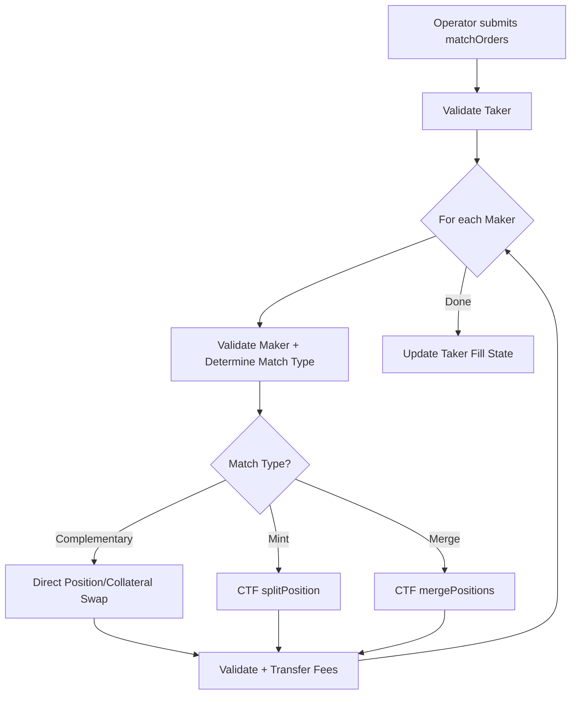
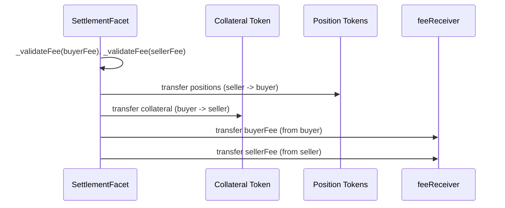
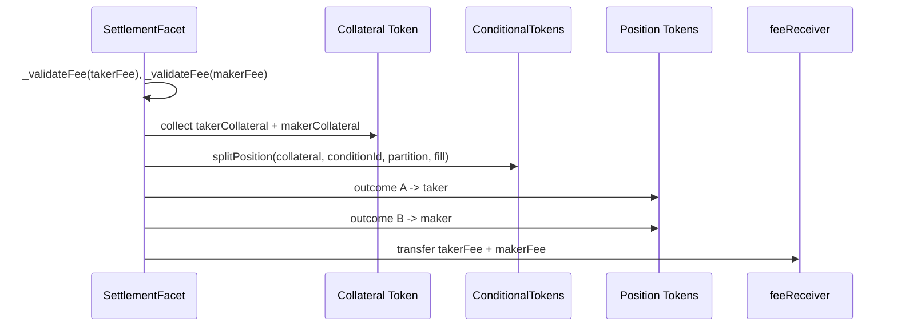
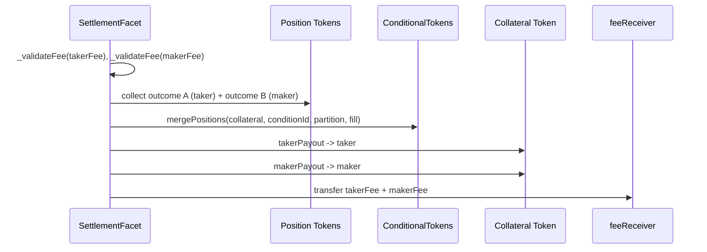

# Settlement Flow

This document explains the on-chain settlement system in Doefin V3. Settlement is the
final exchange of position tokens and collateral when matched orders are executed.

## Overview

Matching happens off-chain (see `MATCHING_MECHANISMS.md`); settlement happens on-chain.
The authorized operator submits matched orders to `SettlementFacet`, which validates and
atomically settles them through one of **three** settlement paths:

1. **Complementary** — direct position transfer between opposite orders on the same outcome.
2. **Mint** — pool collateral and call CTF `splitPosition` to create a complete outcome set.
3. **Merge** — collect a complete outcome set and call CTF `mergePositions` to redeem
   collateral.

There is no cross-currency settlement path — the cross-currency subsystem has been
removed. A single `matchOrders()` call can settle one taker against a **mix** of these
three match types; the match type is determined per maker.



## Settlement Architecture

### Core Components

- **`SettlementFacet`** — the operator-only entry point (`matchOrders`, `fillOrder`).
- **`SignatureVerifierFacet`** / **`LibSignature`** — EIP-712 verification (EOA + EIP-1271).
- **`LibDoefinOrder`** — the `DoefinOrder` struct, EIP-712 hashing, domain separator.
- **`LibOrderValidity`** — shared order-validity checks.
- **`LibCTFCondition`** — CTF `splitPosition` / `mergePositions` operations.
- **`LibERC1155`** — position-token transfers.
- **`LibSettlementStorage`** — isolated v3 storage (operator, paused flag, filled amounts).
- **`LibDoefinStorage`** — admin config (`feeReceiver`, `maxFeeRateBps`, `unitPerPair`).

### Entry Points

```solidity
function matchOrders(
    LibDoefinOrder.DoefinOrder calldata takerOrder,
    bytes calldata takerSignature,
    uint8 takerSignatureType,
    LibDoefinOrder.DoefinOrder[] calldata makerOrders,
    bytes[] calldata makerSignatures,
    uint8[] calldata makerSignatureTypes,
    uint128 takerFillAmount,
    uint128[] calldata makerFillAmounts,
    uint128[] calldata takerFees,
    uint128[] calldata makerFees
) external onlyOperator notPaused nonReentrant;
```

`fillOrder()` settles a single order leg. Both entry points are operator-only,
revert if trading is paused, and are reentrancy-guarded.

### Validation

The taker is validated once; each maker is validated inside the maker loop. Validation
covers signature verification, the order-validity invariants (collateral allow-listed,
non-zero `unit`, `pricePerToken <= unit`, not expired, not cancelled), and the fill cap
(the new fill must not overfill the order's remaining capacity). After the loop, the
contract asserts `sum(makerFillAmounts) == takerFillAmount`.

## Complementary Settlement

### Use Case
Two orders trade the same outcome position on opposite sides (e.g. one BUYs and one SELLs
"Bitcoin Above $100K").

### Flow



The fill price is the maker's `pricePerToken`. The buyer pays
`collateralAmount = maker.pricePerToken * fillAmount / unit` plus their own fee; the seller
delivers positions and receives the collateral minus their own fee.

## Mint Settlement

### Use Case
A BUY of outcome A is matched against a BUY of the complementary outcome B. Neither
counterparty holds position tokens, so the contract mints a complete outcome set from
pooled collateral.

### Example
- Taker: BUY YES at P_t = 606,000
- Maker: BUY NO at P_m = 450,000
- Effective price for the taker = `unit - P_m = 550,000`, which crosses the 606,000 ceiling.

### Flow



### Economics
The maker pays exactly their committed price; the taker pays the effective price:

```solidity
uint256 makerCollateral = (uint256(maker.pricePerToken) * uint256(fillAmount)) / unit;
uint256 takerCollateral = uint256(fillAmount) - makerCollateral;
```

Crossing is enforced by `taker.pricePerToken + maker.pricePerToken >= unit`. The 1-wei
integer-division rounding surplus flows to the taker by construction; this is intentional.

## Merge Settlement

### Use Case
A SELL of outcome A is matched against a SELL of the complementary outcome B. Both
counterparties hold position tokens; the contract collects a complete set and redeems it
back to collateral.

### Flow



### Economics
The maker receives exactly their committed price; the taker receives the remainder:

```solidity
uint256 makerPayout = (uint256(maker.pricePerToken) * uint256(fillAmount)) / unit;
uint256 takerPayout = uint256(fillAmount) - makerPayout;
```

Crossing is enforced by `taker.pricePerToken + maker.pricePerToken <= unit`.

## Fee Management in Settlement

Trading fees are **operator-supplied**. The off-chain operator computes the symmetric
bell-curve fee (`fee ∝ min(price, 1-price) * fillAmount`) and passes the per-leg fee
amounts into `matchOrders()` / `fillOrder()`. The fee is **not** signed by the maker and
**not** computed on-chain.

The contract enforces an admin-set ceiling in `SettlementFacet._validateFee` for every
leg:

```
fee <= cashValue * maxFeeRateBps / 10000
fee <= proceeds
```

where `cashValue` is the contract-derived per-party collateral value of the leg.

- `maxFeeRateBps` is set by the admin via `AdminConfigFacet.setMaxFeeRate`, bounded by the
  hard ceiling constant `MAX_FEE_RATE_BPS_CAP = 1000` (10%).
- The check is **fail-closed**: a `maxFeeRateBps` of 0 forbids any non-zero fee.
- All fees are transferred to the admin-configurable `feeReceiver`
  (`AdminConfigFacet.setFeeReceiver`). The operator never receives fees.

There is no global trading-fee rate in storage, no maker/taker fee split, and no signed
`feeRateBps`. The `MAX_FEE_RATE_BPS` constant from earlier designs no longer exists.

### Resolution Fee (Distinct from Trading Fees)

A separate `resolutionFeeBps` redemption fee is charged in `ConditionalTokensFacet` when
winning positions are redeemed via `redeemPositions()`. It is configured in
`AdminConfigStorage` and is unrelated to the per-trade settlement fees described above.

## State Management

Settlement state lives in `LibSettlementStorage`:

- `operator` — the single authorized settlement caller.
- `tradingPaused` — global pause flag.
- `orderHashToFilledAmount` — per-order cumulative filled amount, the basis of the
  fill-cap check and partial-fill accounting.

After a successful `matchOrders` call, the taker's filled amount is incremented by
`takerFillAmount` and an `OrderSettled` event is emitted.

## Atomicity and Errors

Each `matchOrders` call is atomic — any failing leg reverts the whole transaction. Common
reverts: `TradingIsPaused`, `UnauthorizedOperator`, `MismatchedInputLengths`,
`InvalidOrderSignature`, `OrderCancelled`, `OrderOverfilled`, `InvalidMatch`, `ZeroAmount`,
`FeeExceedsMaxRate`, `FeeExceedsProceeds`.

This settlement system gives reliable, atomic, and trustless execution of all three trade
types while keeping order creation and matching off-chain.
