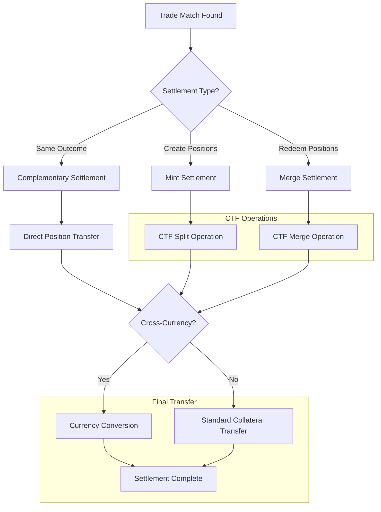
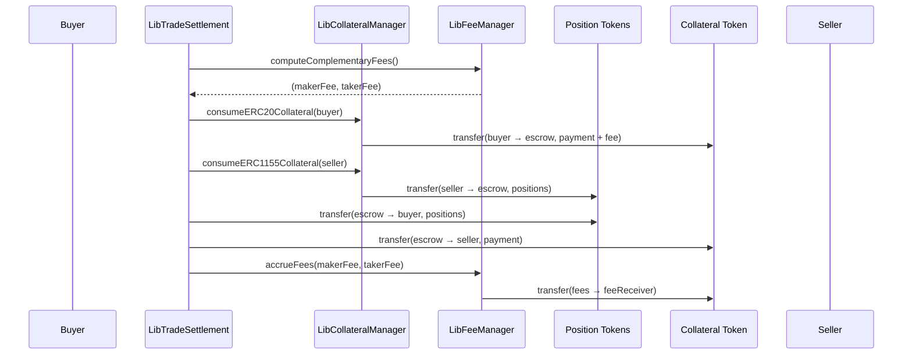
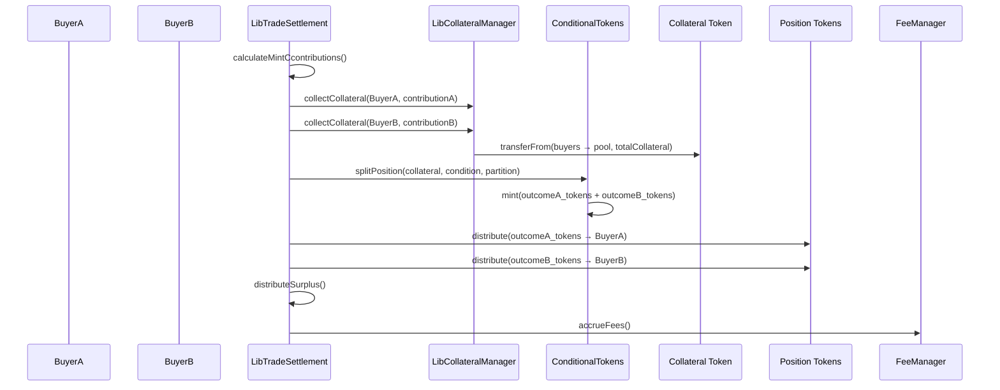
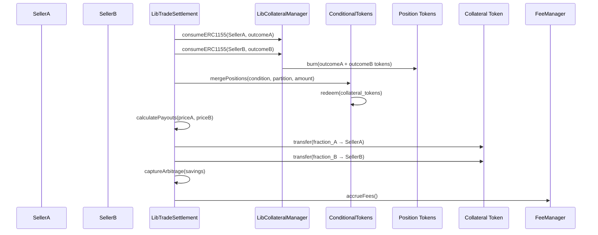
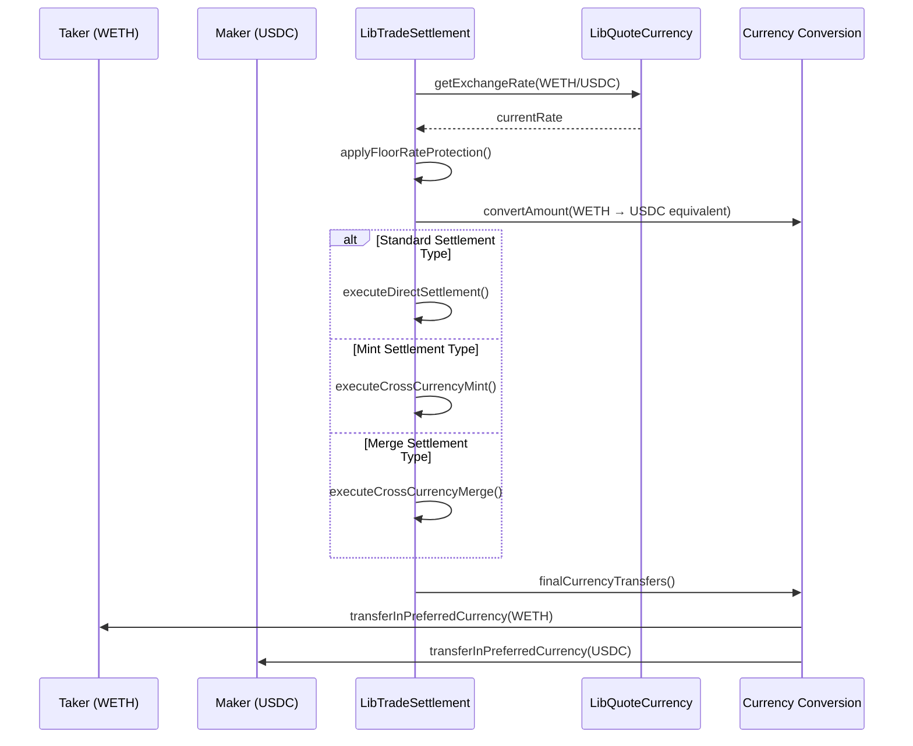
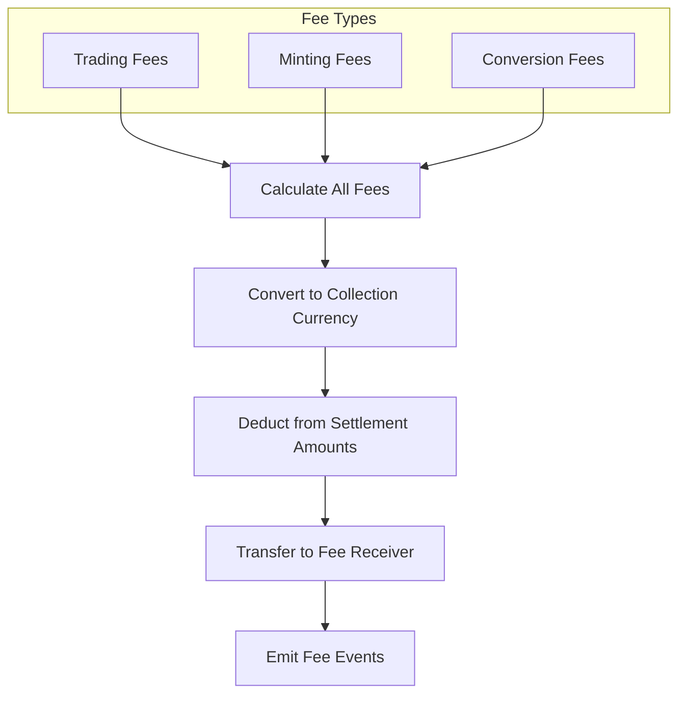

# Settlement Flow

This document explains the comprehensive settlement system in Doefin V2, which handles the transfer of positions and collateral when trades are executed across different match types and currencies.

## Overview

The settlement system coordinates the final exchange of assets between trading parties through multiple settlement types:

1. **Complementary Settlement** - Direct position transfers between opposite orders
2. **Mint Settlement** - Creating new positions via collateral pooling and CTF splitting
3. **Merge Settlement** - Redeeming positions via CTF merging back to collateral
4. **Cross-Currency Settlement** - Handling currency conversions during settlement



## Settlement Architecture

### Core Components

The settlement system is built around several key libraries:

- **[`LibSettlement`](../contracts/libraries/LibSettlement.sol)** - Main settlement coordinator
- **[`LibTradeSettlement`](../contracts/libraries/LibTradeSettlement.sol)** - Settlement execution dispatcher
- **[`LibCollateralManager`](../contracts/libraries/LibCollateralManager.sol)** - Collateral and position transfers
- **[`LibFeeManager`](../contracts/libraries/LibFeeManager.sol)** - Fee calculations and collection
- **[`LibCTFCondition`](../contracts/libraries/LibCTFCondition.sol)** - CTF framework operations

### Settlement Context

All settlements operate within a standardized context:

```solidity
struct SettlementExecutionContext {
    uint256 fillableAmount;     // Amount being traded in this settlement
    Order takerOrder;          // Order that initiated the trade
    Order makerOrder;          // Order being matched against
    MatchType matchType;       // Type of settlement required
    ExecutionType executionType; // Market vs Limit order execution
}
```

## Complementary Settlement

### Use Case
When two orders trade the same outcome position directly (e.g., both buying/selling "Bitcoin Above $100K").

### Process Flow



### Implementation

```solidity
function _handleComplementaryMatch(
    SettlementExecutionContext memory ctx
) internal {
    // Calculate fees based on the trade amount
    (uint256 makerFee, uint256 takerFee) = LibFeeManager.computeComplementaryFees(
        ctx.makerOrder,
        ctx.fillableAmount
    );
    
    // Accrue protocol fees
    LibFeeManager.accrueFees(makerFee, takerFee, ctx);
    
    // Execute the direct position transfer
    _executeComplementaryTransfer(ctx, makerFee, takerFee);
}

function _executeComplementaryTransfer(
    SettlementExecutionContext memory ctx,
    uint256 makerFee,
    uint256 takerFee
) internal {
    // Buyer pays collateral, gets positions
    if (ctx.takerOrder.direction == OrderDirection.Buy) {
        _handleBuyerInComplementary(ctx, takerFee);
        _handleSellerInComplementary(ctx, makerFee);
    } else {
        // Taker is seller
        _handleSellerInComplementary(ctx, takerFee);
        _handleBuyerInComplementary(ctx, makerFee);
    }
}
```

### Fee Structure

Complementary settlements use standard trading fees:

```solidity
function computeComplementaryFees(
    Order memory makerOrder,
    uint256 fillAmount
) internal view returns (uint256 makerFee, uint256 takerFee) {
    
    uint256 tradeValue = (fillAmount * makerOrder.pricePerToken) / 
                         getCollateralUnit(makerOrder.collateralToken);
    
    makerFee = (tradeValue * makerOrder.makerFeeBps) / 10000;
    takerFee = (tradeValue * makerOrder.takerFeeBps) / 10000;  
}
```

## Mint Settlement

### Use Case
When buyers of complementary outcomes can pool their collateral to mint new positions through CTF splitting.

### Example Scenario
- Buyer A: Wants 100 "Bitcoin Above $100K" @ $0.60 each
- Buyer B: Wants 100 "Bitcoin Below $100K" @ $0.45 each  
- **Total Willing**: $1.05 > $1.00 (cost to mint)
- **Result**: Pool $1.00, mint both outcomes, distribute surplus

### Process Flow



### Mint Economics

The system calculates fair contributions based on each buyer's willingness to pay:

```solidity  
function computeMintFees(
    Order memory makerOrder,
    uint256 fillAmount
) internal view returns (
    uint256 makerFee,
    uint256 takerFee, 
    uint256 makerContribution,
    uint256 takerContribution
) {
    uint256 collateralUnit = getCollateralUnit(makerOrder.collateralToken);
    
    // Each party contributes based on their price willingness  
    makerContribution = (fillAmount * makerOrder.pricePerToken) / collateralUnit;
    takerContribution = fillAmount - makerContribution; // Remainder to reach collateralUnit
    
    // Calculate fees on contributions
    makerFee = (makerContribution * makerOrder.makerFeeBps) / 10000;
    takerFee = (takerContribution * makerOrder.takerFeeBps) / 10000;
}
```

### CTF Split Operation

```solidity
function _executeSplitOperation(
    SettlementExecutionContext memory ctx
) internal {
    bytes32 conditionId = LibPositionRegistry.getConditionId(ctx.takerOrder.positionId);
    bytes32 collectionId = LibPositionRegistry.getCollectionId(ctx.takerOrder.positionId);
    
    // Create partition representing the complete outcome set
    uint256[] memory partition = LibCTHelpers.getFullPartition(conditionId);
    
    // Execute the split to mint new position tokens
    LibCTFCondition.splitPosition(
        ctx.makerOrder.collateralToken,
        collectionId,
        conditionId,
        partition,
        ctx.fillableAmount
    );
}
```

### Position Distribution

After minting, positions are distributed to respective buyers:

```solidity
function _distributePositionTokens(
    SettlementExecutionContext memory ctx 
) internal {
    // Determine which position goes to which party
    if (ctx.takerOrder.direction == OrderDirection.Buy) {
        // Taker gets their requested position
        LibERC1155.mintToUser(
            ctx.takerOrder.maker,
            ctx.takerOrder.positionId, 
            ctx.fillableAmount
        );
        
        // Maker gets the complementary position  
        uint256 makerPositionId = LibPositionRegistry.getSiblingPosition(ctx.takerOrder.positionId);
        LibERC1155.mintToUser(
            ctx.makerOrder.maker,
            makerPositionId,
            ctx.fillableAmount
        );
    }
}
```

## Merge Settlement  

### Use Case
When sellers of complementary outcomes can combine their positions to redeem the underlying collateral.

### Example Scenario
- Seller A: Wants to sell 100 "Bitcoin Above $100K" @ $0.65
- Seller B: Wants to sell 100 "Bitcoin Below $100K" @ $0.30
- **Total Asking**: $0.95 < $1.00 (redemption value)
- **Result**: Combine positions, redeem $1.00, distribute proportionally

### Process Flow



### Merge Economics

Sellers receive payouts proportional to their asking prices:

```solidity
function calculateMergePayouts(
    Order memory sellerA,
    Order memory sellerB,
    uint256 fillAmount
) internal pure returns (uint256 payoutA, uint256 payoutB, uint256 arbitrage) {
    
    uint256 totalAsking = sellerA.pricePerToken + sellerB.pricePerToken;
    uint256 collateralUnit = getCollateralUnit(sellerA.collateralToken);
    
    // Proportional distribution based on asking prices
    payoutA = (fillAmount * sellerA.pricePerToken) / collateralUnit;
    payoutB = (fillAmount * sellerB.pricePerToken) / collateralUnit;
    
    // Arbitrage profit = redemption value - total payouts
    arbitrage = fillAmount - payoutA - payoutB;
}
```

### CTF Merge Operation

```solidity  
function _executeMergeOperation(
    SettlementExecutionContext memory ctx
) internal {
    bytes32 conditionId = LibPositionRegistry.getConditionId(ctx.takerOrder.positionId);
    bytes32 collectionId = LibPositionRegistry.getCollectionId(ctx.takerOrder.positionId);
    
    // Create partition for the complete outcome set
    uint256[] memory partition = LibCTHelpers.getFullPartition(conditionId);
    
    // Execute merge to redeem collateral
    LibCTFCondition.mergePositions(
        ctx.makerOrder.collateralToken,
        collectionId, 
        conditionId,
        partition,
        ctx.fillableAmount
    );
}
```

## Cross-Currency Settlement

### Enhanced Settlement Context

Cross-currency settlements require additional exchange rate information:

```solidity
struct CrossCurrencySettlementContext {
    SettlementExecutionContext baseContext;
    uint256 takerExchangeRate;      // Taker's effective exchange rate
    uint256 makerExchangeRate;      // Maker's effective exchange rate  
    address takerQuoteCurrency;     // Taker's preferred currency
    address makerQuoteCurrency;     // Maker's preferred currency
    OrderType takerOrderType;       // Standard/Fixed/Dynamic
    OrderType makerOrderType;       // Standard/Fixed/Dynamic
}
```

### Cross-Currency Flow



### Rate Application

Different order types handle exchange rates differently:

```solidity
function _calculateEffectiveRate(
    Order memory order,
    uint256 oracleRate,
    CrossCurrencyData memory ccData
) internal view returns (uint256 effectiveRate) {
    
    OrderType orderType = _getOrderType(ccData);
    
    if (orderType == OrderType.Fixed) {
        // Fixed orders use current oracle rate
        return oracleRate;
        
    } else if (orderType == OrderType.Dynamic) {
        // Dynamic orders apply floor rate protection
        if (order.direction == OrderDirection.Buy) {
            // Buyer protected against quote currency appreciation
            return Math.min(oracleRate, ccData.floorRate);
        } else {
            // Seller protected against quote currency depreciation
            return Math.max(oracleRate, ccData.floorRate);
        }
    }
    
    // Standard orders don't use cross-currency rates
    revert Errors.InvalidOrderTypeForCrossCurrency();
}
```

### Cross-Currency Mint Settlement

When both orders are cross-currency with different quote currencies:

```solidity
function _executeCrossCurrencyMint(
    CrossCurrencySettlementContext memory ccCtx
) internal {
    // Convert both contributions to a common collateral denomination
    uint256 takerContributionInCollateral = _convertToCollateral(
        ccCtx.baseContext.takerOrder,
        ccCtx.takerExchangeRate
    );
    
    uint256 makerContributionInCollateral = _convertToCollateral(
        ccCtx.baseContext.makerOrder,  
        ccCtx.makerExchangeRate
    );
    
    uint256 totalCollateralForMint = takerContributionInCollateral + makerContributionInCollateral;
    
    // Execute standard mint operation
    _executeSplitOperation(ccCtx.baseContext);
    
    // Handle cross-currency fee collection and surplus distribution
    _distributeCrossCurrencyFees(ccCtx);
}
```

## Fee Management in Settlement

### Fee Types and Calculation

The system supports multiple fee types depending on settlement complexity:

```solidity
enum FeeType {
    TradingFee,     // Standard maker/taker fees
    MintingFee,     // Fee for CTF split operations  
    RedemptionFee,  // Fee for CTF merge operations
    ConversionFee   // Fee for cross-currency conversions
}

struct FeeBreakdown {
    uint256 makerTradingFee;
    uint256 takerTradingFee;
    uint256 mintingFee;
    uint256 conversionFee;
    uint256 totalFeeInCollateral;
    uint256 totalFeeInQuoteCurrency;
}
```

### Fee Collection Process



### Dynamic Fee Adjustment

Fees can be adjusted based on market conditions:

```solidity
function getMarketFees() internal view returns (OrderFeeConfig memory) {
    LibDoefinStorage.AppStorage storage ds = LibDoefinStorage.appStorage();
    
    return OrderFeeConfig({
        makerFeeBps: ds.adminConfigStorage.makerTradingFeeBps,
        takerFeeBps: ds.adminConfigStorage.takerTradingFeeBps
    });
}

function getConversionFee(
    address fromCurrency,
    address toCurrency,
    uint256 amount
) internal view returns (uint256) {
    // Fee based on conversion complexity and liquidity
    uint256 baseFee = (amount * CONVERSION_FEE_BPS) / 10000;
    
    // Adjust for exotic currency pairs
    if (_isExoticPair(fromCurrency, toCurrency)) {
        baseFee = (baseFee * 150) / 100; // 1.5x for exotic pairs
    }
    
    return baseFee;
}
```

## Settlement State Management

### Order State Updates

Settlement requires careful state management to ensure atomic updates:

```solidity
function _updateOrderAfterFill(
    Order storage makerOrderStorage,
    Order memory takerOrder,
    uint256 fillAmount,
    uint256 effectivePrice,
    MatchType matchType
) internal {
    // Update maker order remaining amount
    makerOrderStorage.remainingAmount -= fillAmount;
    
    // Deactivate and remove from orderbook if fully filled
    if (makerOrderStorage.remainingAmount == 0) {
        makerOrderStorage.active = false;
        LibOrderbook.removeFromOrderbook(makerOrderStorage.orderId);
    }
    
    // Update taker order (in-memory, will be updated in storage later)
    takerOrder.remainingAmount -= fillAmount;
    
    // Emit trade completion event
    emit Events.TradeFilled(
        takerOrder.orderId,
        makerOrderStorage.orderId,  
        fillAmount,
        effectivePrice,
        matchType,
        block.timestamp
    );
}
```

### Atomic Settlement Execution

All settlement operations must complete atomically or revert entirely:

```solidity
function _executeAtomicSettlement(
    SettlementExecutionContext memory ctx
) internal {
    // Save checkpoint for potential rollback
    uint256 checkpoint = _saveStateCheckpoint();
    
    try {
        // Execute all settlement operations
        _performCollateralTransfers(ctx);
        _performPositionTransfers(ctx);  
        _performCTFOperations(ctx);
        _performFeeTransfers(ctx);
        
        // Commit all state changes
        _commitStateChanges(checkpoint);
        
    } catch {
        // Rollback all changes on any failure
        _rollbackToCheckpoint(checkpoint);
        revert Errors.SettlementFailed();
    }
}
```

## Error Handling and Recovery

### Settlement Failure Modes

```solidity
enum SettlementError {
    InsufficientCollateral,     // User lacks required collateral
    InsufficientPositions,      // User lacks required position tokens
    CTFOperationFailed,         // CTF split/merge operation failed
    ExchangeRateStale,          // Oracle data too old for cross-currency
    FeeTransferFailed,          // Fee collection failed
    PositionTransferFailed      // ERC1155 transfer failed
}
```

### Recovery Mechanisms

```solidity
function _handleSettlementFailure(
    SettlementExecutionContext memory ctx,
    SettlementError errorType
) internal {
    if (errorType == SettlementError.InsufficientCollateral) {
        // Release any locked collateral back to users
        _releaseLockedCollateral(ctx);
        
    } else if (errorType == SettlementError.ExchangeRateStale) {
        // Retry with fresh oracle data if available
        _retryWithFreshOracle(ctx);
        
    } else {
        // For other errors, mark orders as failed but keep them active
        _markSettlementFailed(ctx);
    }
}
```

## Performance Optimization

### Batch Settlement

Multiple trades can be settled together for gas efficiency:

```solidity
function batchSettle(
    SettlementExecutionContext[] memory contexts
) internal {
    // Group by settlement type for efficiency
    SettlementExecutionContext[] memory complementary;
    SettlementExecutionContext[] memory mints;  
    SettlementExecutionContext[] memory merges;
    
    (complementary, mints, merges) = _groupBySettlementType(contexts);
    
    // Batch execute each type
    if (complementary.length > 0) _batchComplementarySettlement(complementary);
    if (mints.length > 0) _batchMintSettlement(mints);
    if (merges.length > 0) _batchMergeSettlement(merges);
}
```

### Gas-Optimized Transfers

```solidity
function _optimizedBatchTransfer(
    address[] memory recipients,
    uint256[] memory amounts,
    address token
) internal {
    // Use assembly for gas-optimized batch transfers
    assembly {
        let dataPtr := add(recipients, 0x20)
        let amountPtr := add(amounts, 0x20)
        let length := mload(recipients)
        
        for { let i := 0 } lt(i, length) { i := add(i, 1) } {
            let recipient := mload(dataPtr)
            let amount := mload(amountPtr)
            
            // Execute transfer call
            // ... assembly transfer logic ...
            
            dataPtr := add(dataPtr, 0x20)
            amountPtr := add(amountPtr, 0x20)
        }
    }
}
```

This comprehensive settlement system ensures reliable, efficient, and secure execution of all trade types while maintaining flexibility for future enhancements and optimizations.