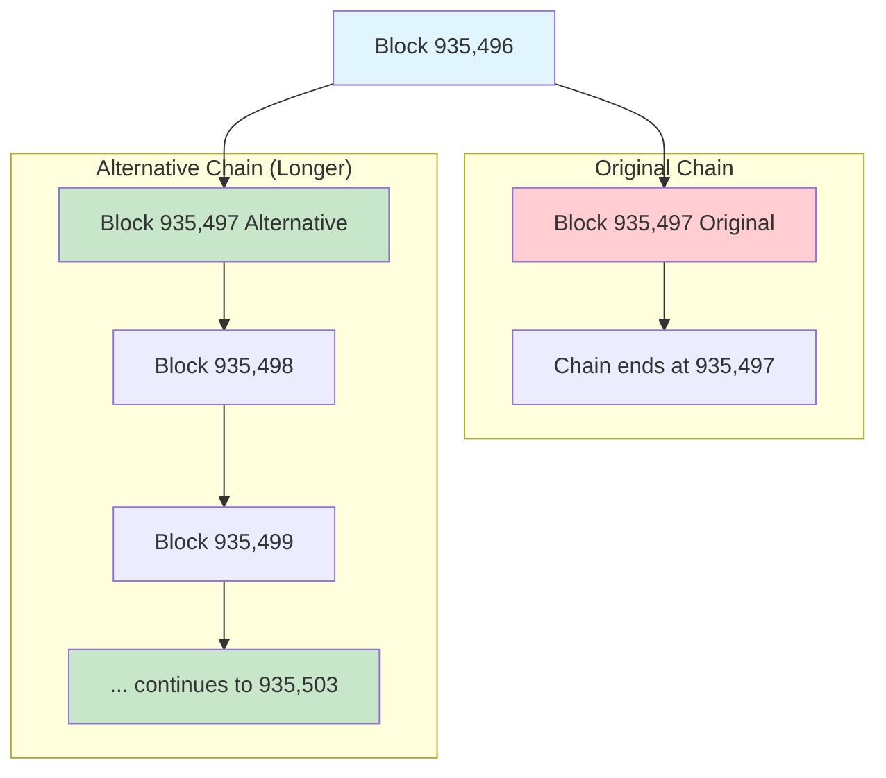

# Bitcoin Blockchain Reorganization Test Data

This directory contains test data files used to verify the Doefin V2 protocol's resilience to Bitcoin blockchain reorganizations.

## Overview

Blockchain reorganizations (reorgs) occur when miners find a longer valid chain that conflicts with the previously accepted chain. The Bitcoin oracle must correctly handle these scenarios to maintain accurate prediction market outcomes.

## Test Data Files

### 1. `blocks-initiation-till-reorged-block.json`

**Purpose**: Contains the original blockchain data before reorganization  
**Block Range**: 935,468 - 935,497 (30 blocks)  
**Description**: This file represents the initial chain that the oracle accepts as valid. Block 935,497 in this file represents the "original" version that will later be replaced during the reorg test.

**Key Properties**:
- Total blocks: 30
- Continuous chain from block 935,468 to 935,497
- Each block properly references its predecessor via `prevBlockHash`
- Contains realistic Bitcoin block data including nonces, timestamps, and merkle roots

### 2. `blocks-reorg-test.json`

**Purpose**: Contains alternative chain data to trigger reorganization  
**Block Range**: 935,496 - 935,503 (8 blocks)  
**Fork Point**: Block 935,497  
**Description**: This file contains an alternative version of the blockchain starting from block 935,497. The alternative chain is longer (extending to 935,503) and has a different block hash for 935,497, creating the reorg scenario.

**Key Properties**:
- Total blocks: 8  
- Fork point at block 935,497 (different hash than original chain)
- Block 935,496 matches the original chain (common ancestor)
- Extends to block 935,503, making it longer than the original chain
- Contains valid block progression with proper hash chaining

## Reorg Test Scenario

The reorganization test simulates this scenario:



## Test Implementation

The reorg test is implemented in `/test/integration/ComprehensiveReorgTest.test.js` and follows these phases:

### Phase 1: Oracle Initialization
- Deploy the Block Header Oracle
- Initialize with the first 17 blocks (935,468 - 935,484)
- Verify proper chain initialization and continuity

### Phase 2: Sequential Submission  
- Submit blocks 935,485 - 935,497 from the original chain
- Verify each block is accepted and chained correctly
- Oracle state: Contains original chain ending at block 935,497

### Phase 3: Reorg Execution
- Submit the alternative chain (blocks 935,497 - 935,503) as a batch
- Oracle detects the longer chain and reorganizes
- Block 935,497 is replaced with the alternative version
- Chain extends to block 935,503

### Phase 4: Post-Reorg Verification
- Verify oracle now reports height 935,503
- Confirm block 935,497 returns the alternative hash
- Validate complete chain continuity in the new active chain
- Ensure the oracle correctly switched to the longer chain

## Test Validations

The test verifies several critical behaviors:

1. **Reorg Detection**: Oracle recognizes when a longer valid chain is submitted
2. **Chain Switching**: Oracle correctly adopts the longer chain as the canonical one  
3. **State Consistency**: All block queries return data from the active chain
4. **Invalid Reorg Rejection**: Oracle rejects shorter or invalid reorg attempts
5. **Chain Continuity**: Block hash chaining remains valid after reorganization

## Security Implications

This test ensures the oracle handles real-world Bitcoin scenarios where:
- Miners may find competing valid chains
- Network partitions can cause temporary forks
- The longest valid chain always becomes canonical (Bitcoin's consensus rule)
- Prediction market outcomes depend on the correct chain being followed

The 6-block confirmation requirement (defined as `SETTLEMENT_DELAY`) provides additional protection against shallow reorgs that commonly occur in Bitcoin.

## Usage in CI/CD

This test data enables automated verification that protocol updates don't break reorg handling. The test can be run with:

```bash
npx hardhat test test/integration/ComprehensiveReorgTest.test.js
```

The test provides detailed console output showing each phase of the reorg process for debugging and verification purposes.